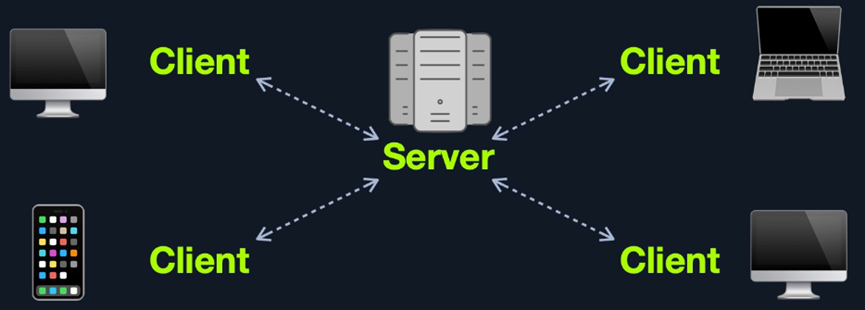
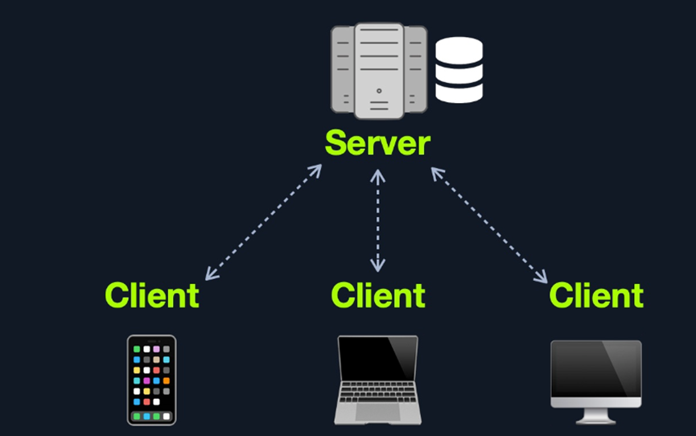
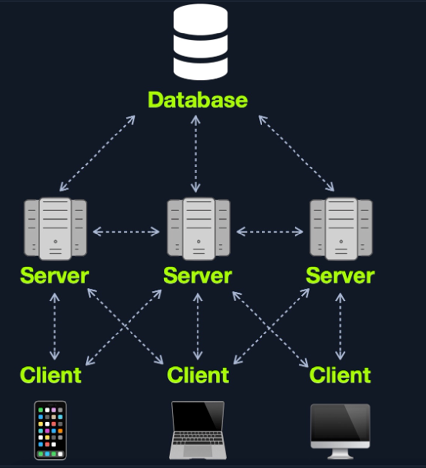
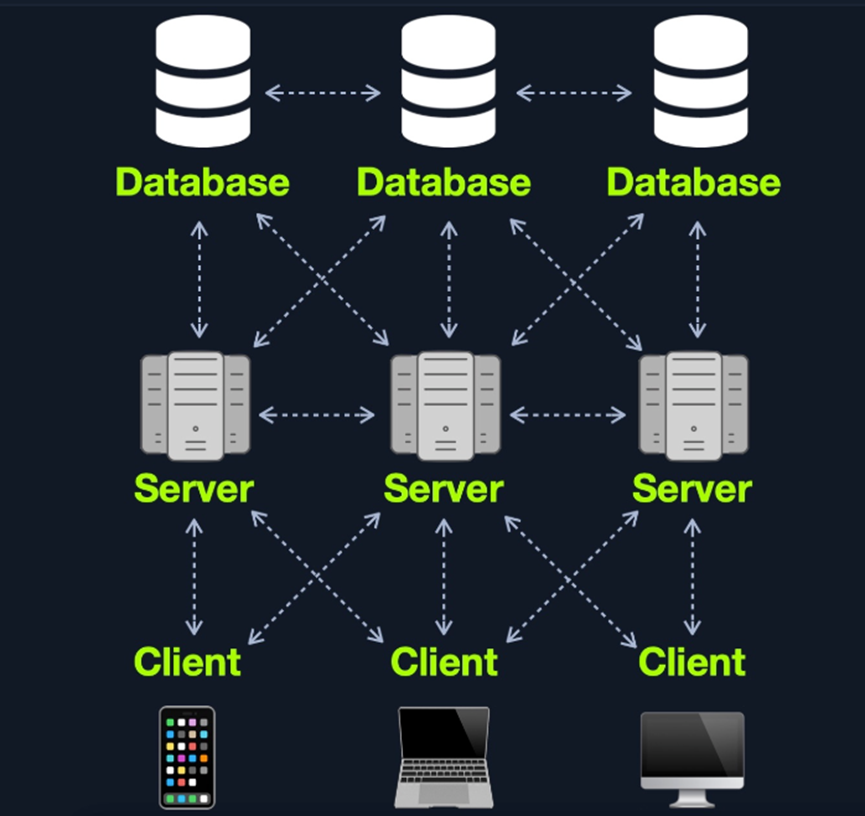
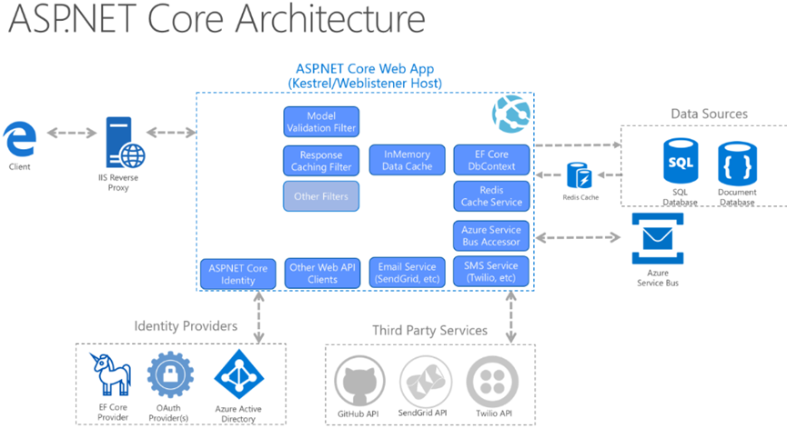

# htb academy笔记-module-Introduction to Web Applications（一）

> 原创 已于 2025-03-12 10:00:34 修改 · 790 阅读 · 16 · 12 · CC 4.0 BY-SA版权 版权声明：本文为博主原创文章，遵循 CC 4.0 BY-SA 版权协议，转载请附上原文出处链接和本声明。
> 文章链接：https://blog.csdn.net/weixin_51439723/article/details/145877992

上一篇：
[htb academy笔记-module-web requests（三）](https://editor.csdn.net/md/?articleId=145733412) 

## 一、Introduction

#### 1. Websites vs. WebApplications

即web 1.0 vs. web 2.0
前者是简单的静态页面没有交互，所有用户显示的一样；后者相反，是现代网页

除此2.0还有模块化、适应任何屏幕尺寸、能直接适应不同平台这三个特点

#### 2. Web Applications vs. os app

Web app上版本统一用户无需自行更新，当然在效率方面是劣势。 不过近来也有一些web app可以调用本地资源去提高效率，缓解了这个问题

#### 3. Web Application Distribution

常见开源web applications：
WordPress
OpenCart
Joomla
常见闭源web application，通常需付费：
Wix
Shopify
DotNetNuke

#### 4. Security Risks of Web Applications

一般来说web测试先测前端如Sensitive Data Exposure 或者XSS漏洞，然后通过web app的核心功能和交互来列举出使用的技术，以此来寻找漏洞，且通常会从已登录和未登录两种状态来覆盖尽可能多的场景

#### 5. Attacking Web Applications

① 一般来说被公开的漏洞不能被直接利用，但是因为web app是动态的所以可能因为一个小的变动导致一连串的漏洞。同时也很少可以直接用类似文件上传等直接就能达到执行代码的效果。
② 广泛存在的是sql注入，可以导致敏感信息泄露、读写数据库server上的文件，甚至rce(remote code execution)
如用AD(active directory)认证的web app经常有sql注入， 一般无法直接拿到密码但可能可以拿到AD用户的邮箱，很可能也是用户名，这时可用password spray攻击，常见的实例如vpn或Microsoft Outlook Web Access/Microsoft O365
③
Web app的基础掌握对发现漏洞也非常重要
以下是一些漏洞和对应的场景：
· Sql注入 拿到AD username然后password spray攻击
· File inclusion 通过源码找到隐藏的page或direcotry，发现可以rce的功能
· Unrestricted File Upload：如profile上传头像的地方可以上传任意文件
· Insecure Direct Object Referencing (IDOR)：和broken access control漏洞一起可导致权限横向移动，如用/user/701/edit-profile访问特定用户，则可能可更改701来访问其他用户
· Broken Access Control：另一个例子是注册新用户时，如用POST提交如下数据：

```c
username=bjones&password=Welcome1&email=bjones@inlanefreight.local&roleid=3
```

把roleid改成0或1可能导致注册的新用户有admin的权限，这种情况在实际场景中发生过

## 二、Web Application Layout

主要分为三种：Web Application Infrastructure、Web ApplicationComponents和Web Application Architecture

#### 1. Infrastructure

也叫models，通常分为四种：
①Client-Server
 

最常用的一种model，通常分为前后端
② One Server
 

整个甚至好几个web app包括components如数据库都在同一个server，简易但不安全，多个web app存在时“一损俱损”
③ ManyServers- One Database
可同时看作many-servers to one-database和one-server to one-database
 

该modle可以让几台server公用一个database里的数据且不用同步，他们可以是主备web app，也可以是用着同样数据的不同web app

该model的主要优势是web app的components分段（segmentation），这样一个server（包括database server）被攻陷不会影响其他serve。资产分段后仍需做访问控制，如让web app只访问预期里需要的数据。
④ Many Servers - Many Databases
基于”Many Servers, One Database” model
 

经常用来做冗余(redundancy)，即正式环境异常则让backup顶替。

除上述model，还有如serverless web app或者用microservices的web app

#### 2. Components

① Client
② Server
· Webserver
· Web application logic
· Database
③ Services(microservices)
· 第三方集成(integrations)
· Web app集成
Microservices可以看成web app独立的component且一般只处理一个task，下面以online store举例，其可由以下tasks构成：
• 注册
• 查找
• 支付
• 评分
• 评论
因为存储的数据和各个microservices分隔开，这些components互相并且也和client进行的是stateless通信，即request和response都独立。microservices 是一种service-oriented architecture（SOA），由不同自动的functions组成用来实现某个business goal，但同时这些microservices 也互相依赖

microservice 的另一个优势是它们可以用不同语言开发并能互相正常通信，易拓展和快速开发的特点让microservice 可以有更多innovation 并且加快新功能的上市

以下是其优势：
• 敏捷
• 易拓展
• 易部署
• 可复用代码
• 弹性
这个AWS 白皮书很好地做了对microservice 执行的概述：
https://d1.awsstatic.com/whitepapers/microservices-on-aws.pdf

④ Functions(serverless)
云服务提供商如AWS, GCP, Azure等可提供serverless architectures，它们能给出app 框架用来开发web app，这样用户不需要考虑server本身硬件的问题。Web app运行在stateless computing containers（如docker）

#### 3. Architecture

分为三层
① Presentation Layer
由可以和app和系统通讯的ui进程组成，可用浏览器访问并返回html, js, css
② Application Layer
确保所有requests能被正确处理，会检查如authorization, 特权、数据等相关的不同标准
③ Data Layer
和app layter共同决定数据存储在哪以及是否可被访问

实例：
 

此外，一些web servers可以运行os的calls和programs，如IIS ISAPI 和 PHP-CGI

#### 4. Architecture Security

很多时候可能是Architecture的设计导致web app漏洞而不是programming error。如一个web app里核心功能都无安全风险，都是如果没有做好访问控制，如Role-Based Access Control(RBAC)，可能导致user可以使用一些admin功能或者访问其他user的信息。如果需要解决这个问题，所做的变更会比较大。
再举一个例子，如果拿到一个服务器但是无法使用database可以意味着database在另一个server上，但如果仍可以获得部分数据则说明有database正在被使用。这就是为什么需要在开发的每个阶段考虑安全问题，而且pen test需要贯穿整个web app的生命周期

（有问题随时在评论区或私信留言，两天内回复）

下一篇：
[htb academy笔记-module-Introduction to Web Applications（二）](https://blog.csdn.net/weixin_51439723/article/details/146033086) 