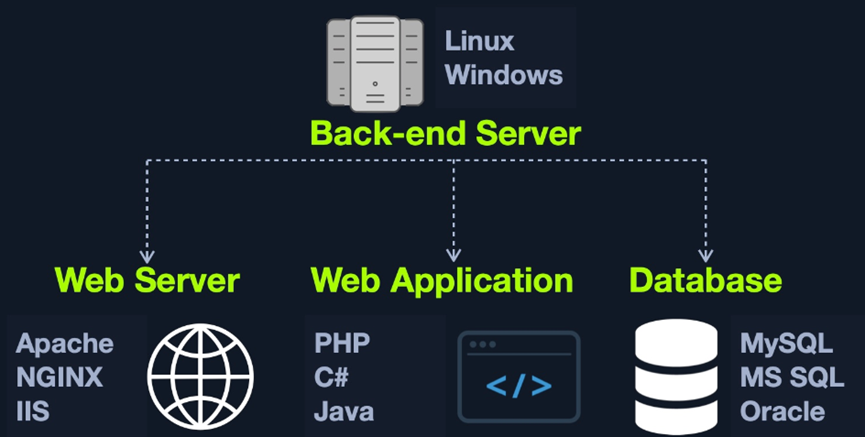
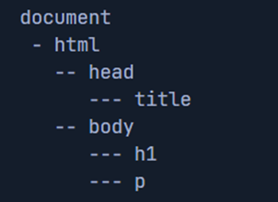
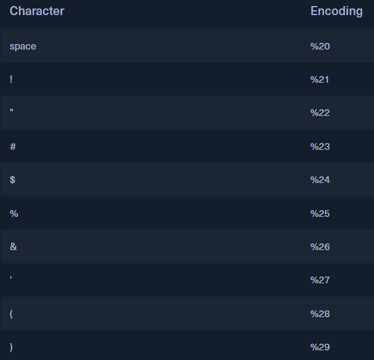
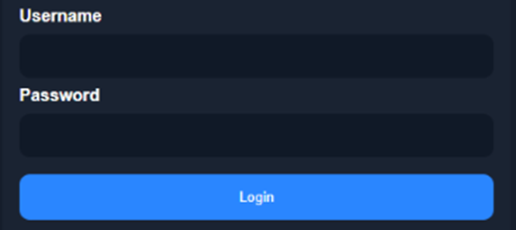
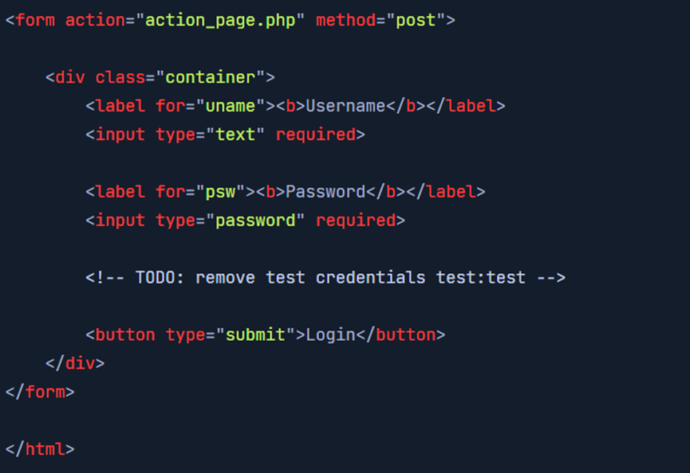
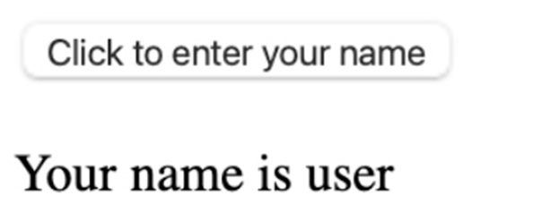
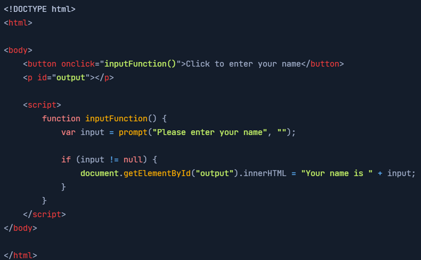

# htb academy笔记-module-Introduction to Web Applications（二）

> 原创 已于 2025-03-13 14:54:14 修改 · 公开 · 998 阅读 · 20 · 23 · CC 4.0 BY-SA版权 版权声明：本文为博主原创文章，遵循 CC 4.0 BY-SA 版权协议，转载请附上原文出处链接和本声明。
> 文章链接：https://blog.csdn.net/weixin_51439723/article/details/146033086

上一篇：
[htb academy笔记-module-Introduction to Web Applications（一）](https://blog.csdn.net/weixin_51439723/article/details/145877992) 

## 一、Front End vs. Back End

Fullstackweb开发就是包括前端和后端；一般前端可以自适应屏幕和平台，而后端是在特定的os或平台

#### 1. Front End

① 如果一个appweb的前端没有优化好那打开会很卡，这时user可能会觉得是网络或者server问题
② 除了前端代码开发，还有一些tasks和前端开发相关：
· Visual Concept Web Design
· User Interface (UI) design
· User Experience (UX) design

#### 2. Back End

① components
· Back end Servers：存放所有其他components，一般是os如linux, windwos，也可以是 containers
· WebServer：处理http的requests和connections，如Apache, NGINX, and IIS
· Databases：关系型数据库如mysql, mssql, oracle, postgreSql，非关系型数据库如NoSql, MongoDB
· Develepment frameworks：如Laravel(PHP), ASP .NET(C#), Spring(Java), Django(Python) , Express(NodeJS JavaScript)等等
 

② 也可通过如docker这样的services把上述componen放到单独的server，这样一个被攻破就不容易转移到另一个component。当然也可以用专门的server，这样可以资源更集中同时也会需要更多的维护，具体用哪种要根据情况判断。
③ Back end做的事情：
· 开发app web的重要logic和services
· 开发web app的主要code和功能
· 开发并维护back end的数据库
· 开发并执行web app的函数库（libraries）
· 执行web app的technical/business需求
· 执行front end component通讯的APIs
· 把远程servers和云服务聚合到web app

#### 3. Securing Front/Back End

① 以下是web开发中20个最容易发生的mistakes：
· 非法数据进入数据库
· 过于关注system整体
· 用个人开发的security method
· 把安全当作最后一步
· 密码明文存储
· 使用弱口令
· 数据库数据未加密
· 过分依赖client
· 过于乐观
· 允许url传递变量
· 信任第三方代码
· Hard-coding backdoor accounts
· 未校验的sql注入
· Remote file inclusions
· 处理不安全的数据
· 未合理加密数据
· 未使用安全的加密系统
· 忽略layer 8
· 重放user操作
· Web app的防火墙未正确配置
② OWASP Top 10 for web app
· 访问控制失效
· 加密问题
· 注入
· 设计不安全
· 安全配置有误
· Components有漏洞或已outdated
· 身份识别和认证
· 软件和数据完整
· 安全日志和监控
· Server-side request forgery(SSRF)

## 二、HTML

和xml很像
elements结构：
 

每个element都可以包含其他elements，其中html tag应该包含其他所有elements

#### 1. URL Encoding

编码用%后面加上该字符ascii码的hex形式
以下是常用编码：
 

其中space也可用+替代

#### 2. Usage

① 这些elements也是DOM(Document Object Model)，它的定义：
让程序和脚本能动态访问、更新一个document内容、structure和style的平台\与语言无关的接口
② DOM标准分为三部分：
· Core DOM：对所有类型文件
· XML DOM：对XML文件
· HTML DOM：对HTML文件
使用方法如document.head或document.h1

## 三、JS

#### 1. 介绍

可用来网页和mobile开发，网页开发时更多用于前端，也可用于后端来开发整个web app如NodeJS，也可用来自动化发送http requests和后端交互，如Ajax；还有前文提到的css动画也需要js
主流浏览器都可以直接运行js

#### 2. Frameworks

可以用js作为开发语言，也可以用implementation 把code编译成js
常用的如下：
• Angular
• React
• Vue
• jQuery

## 四、Sensitive Data Exposure

前端漏洞危害没有后端那么大且一般测试后端更多，但是很多时候也会让使用的用户有风险，且被利用攻击admin账号也会导致越权、敏感信息泄露、服务中断等。

#### 1. Sensitive Data Exposure

就是敏感信息暴露给了end-user，通常在源码里找到。如登录credentials, hashes，或者在注释里、外部导入js的敏感信息。这些敏感信息可能是有用的links、directories、用户信息、debugging parameters或隐藏的功能，这些信息可以进一步利用到访问web app甚至web app的供应商信息。
因此访问web app的第一件事是看源码看有没有敏感信息

#### 2. 举例

乍一看是普通的登录页面：
 

如果看源码：
 

可以看到注释里有测试用户的credentials，可能可以利用这个登录

#### 3. Prevention

① 检查源码没有多余的信息
② 把数据分类并做访问控制
③ 对于js，把js packing或obfuscation （混淆），减少通过js暴露的信息

## 五、HTML Injection

另一个前端的安全问题就是对user input验证和过滤。如虽然更多时候user input被发去后端，但也有一些情况是完全在前端的，如果只在后端过滤就会有问题

#### 1. HTML Injection

就是unfilterd user input在page直接显示这个input可以从数据库来或是前端input直接通过js显示

例如，显示的内容可以是被构造的登录页面，而后输入的数据会被指定到攻击者想去的地方；或者只是恶搞，让该公司的信誉受损

#### 2. 实例

以下页面把名字输入后直接display：
 

看源码：
 

确实没有过滤
然后用以下代码测试：

```c
<style> body { background-image: url('https://academy.hackthebox.com/images/logo.svg'); } </style>
```

可以看到背景换了
 

（有问题随时在评论区或私信留言，两天内回复）

下一篇：
[htb academy笔记-module-Introduction to Web Applications（三）](https://blog.csdn.net/weixin_51439723/article/details/146230419) 