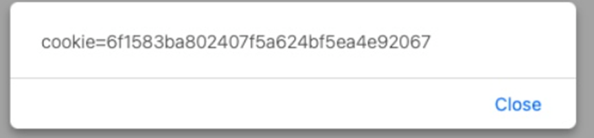
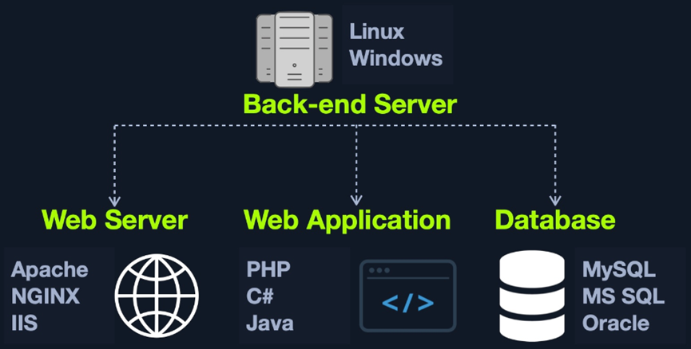
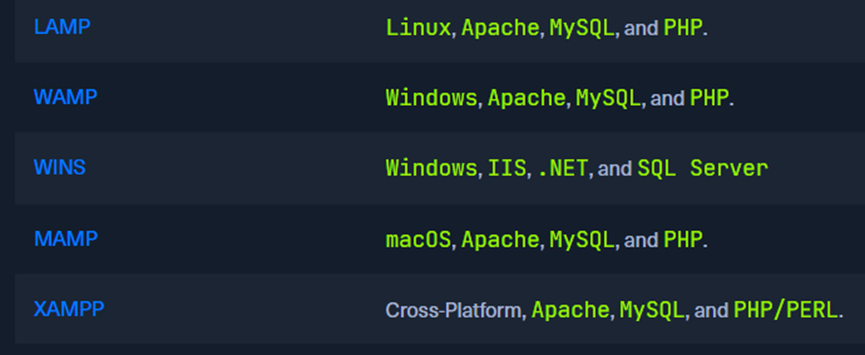
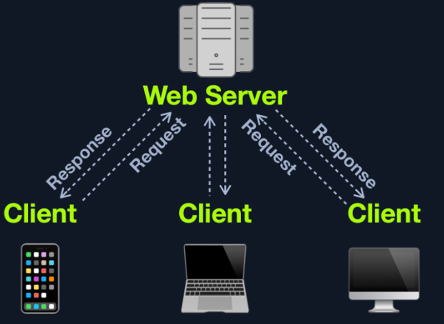
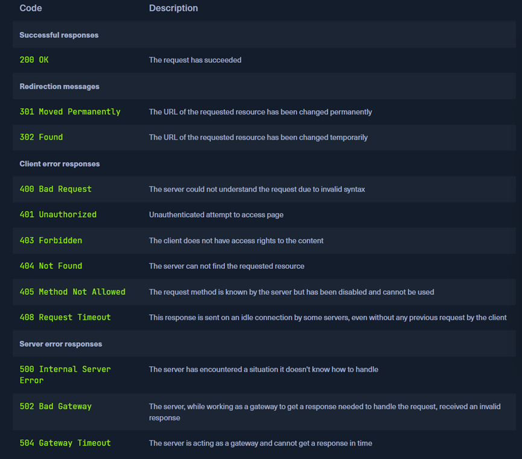

# htb academy笔记-module-Introduction to Web Applications（三）

> 原创 已于 2025-03-14 17:52:44 修改 · 公开 · 599 阅读 · 27 · 23 · CC 4.0 BY-SA版权 版权声明：本文为博主原创文章，遵循 CC 4.0 BY-SA 版权协议，转载请附上原文出处链接和本声明。
> 文章链接：https://blog.csdn.net/weixin_51439723/article/details/146230419

上一篇：
[htb academy笔记-module-Introduction to Web Applications（二）](https://blog.csdn.net/weixin_51439723/article/details/146033086) 

## 一、Cross-Site Scripting (XSS)

Htmlinjection经常用来执行xss，xss和Html injection很像。但是xss用js在client-side来执行more advanced attack，而不是只有html

#### 1. 分类

① Reflected XSS
User input直接输出在page上时
② Stored XSS
User input存储在database然后请求该数据
③DOMXSS
user input直接在浏览器里显示且被写在html DOM object里

上文的例子中没有过滤，所以可以使用xss攻击：

```c
#">
```

该payload可以访问html document tree并且检索cookie object的值。浏览器处理我们数据时会把它当作新的DOM，然后执行js弹出cookie：
 

## 二、Cross-Site Request Forgery (CSRF)

第三种因为unfilterd user input导致的前端漏洞是csrf。它可能在user已经认证的webapp上用其身份利用xss来执行特定queries、调用api。也可能用其他漏洞做这种事，如http的parameters

#### 1.

常见的用csrf提权方式是做一个可以改victim密码的js payload，一旦victim访问相关网页它就会自动执行，因为这时候已经有了victim的logged-in session

如果是对admin，危害会更大甚至可能控制后端server

#### 2. 举例

用一个remote js：

```c
"><script src=//www.example.com/exploit.js></script>
```

该js里有改变user密码的js code，不过要先了解该wab app修改密码的机制和相关APIs

#### 3. Prevention

① Sanitization：过滤，即删除一些特定的字符等等
② Validation：确保输入符合特定格式，如邮箱格式

如果进一步，在数据displayed前也需要sanitization，因为可能user input绕过了前面的防护到达了数据库

也有工具如WAF可以自动防护，但是同样有被绕过的风险，不应只依赖工具而是在coding时严格遵守coding best practices

#### 4.

常用的浏览器一般都有防护csrf的措施，可以阻止js自动执行。很多web app也有防scrf措施，包括专门的httpheaders和flag（如anti-CSRF token, http-only/X-XSS-Protection）。也有从功能层面的防护，如修改密码前需要输入旧密码。

上述方法其实都可能被绕过，所以最重要的其实还是在coding时把防护做好

## 三、Back End Servers

放所有东西的server，在数据访问层（data access layer）

#### 1. Software

由三个components组成：
① Web Server
② Database
③ Development Framework
 

也可能有其他components如hypervisors, containers, WAFs等。
以下是常见的组成，即combinations of “stacks” for back-end-servers：
 

#### 2. Hardware

很多大型web app是分布式结构，即不同的back-end server运行完全一样的东西共同给user提供服务，这时可能会有数据中心并和云虚拟主机

## 四、Web Servers

web server是一种将所有从client来的http traffic(流量)导到requested page然后最终response发给client的应用。一般运行在80或443端口，除了处理response，其他的都由它做，如将requests导到web app的各个部分，其中requests很多时候附带的有数据，如text, json, binary data。

#### 1. Workflow

 

 

#### 2. Apache

我们可以用python, js, php等自己开发web server，也有成熟的web server可以直接拿来用
① 介绍
也叫httpd，作为最常见的web server占比40%，一般在linux会预装。

通常和php网页配合使用，当然也支持其他语言如.Net, Python, Perl甚至OS语言如bash。可以安装不同的modules去拓展功能和语言。
② 特点
开源，持续在维护和更新。同时，技术文档丰富，便于安装和配置
③ 使用
因为安装简易被小公司普遍使用，当然也有大公司如apple, adobe, baidu。

#### 3. NGINX

占比30%，排第二
① 介绍
通过使用async architecture(异步架构)降低memory和cpu加载以便并行处理requests，使得在高流量的大型web app里很流行，最大的10w个网站里有60%使用nginx
② 使用
同样开源，使用厂商有goole, facebook, twitter, cisco, intel, netflix, hackthebox等。

#### 4. IIS

即微软的Internet Information Services，占比15%排第三。

① 介绍
主要在windows servers上使用，一般host为微软.NET框架开发的web app，当然也可以host其他如php的web app，或者host其他services如FTP。

② 此外
IIS和Active Directory Integration适配度极高且有windows auth的功能，可以让使用Active Directory的user认证并自动登录web app
③ 使用
Microsoft, skype, stack overflow, dell

除上述三种web server，还有适配java web app的apache tomcat，后端用js的web app的Node.JS

---

该module大纲：
 

（有问题随时在评论区或私信留言，两天内回复）

下一篇：
[htb academy笔记-module-Introduction to Web Applications（四）](https://blog.csdn.net/weixin_51439723/article/details/146263109) 