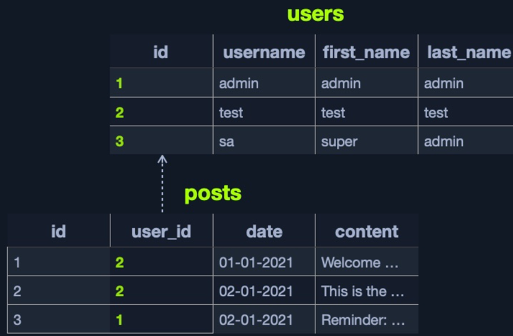
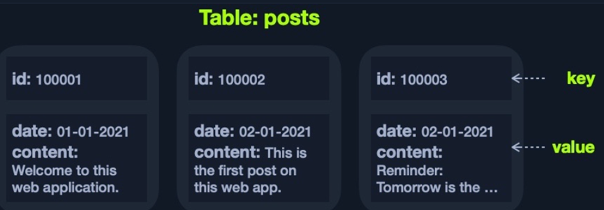
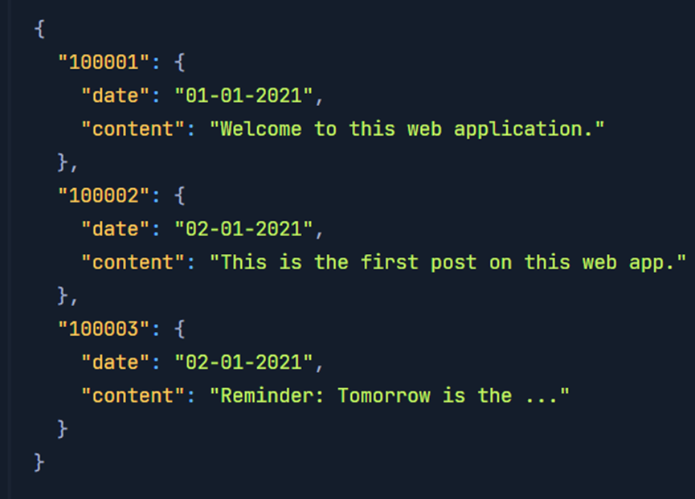
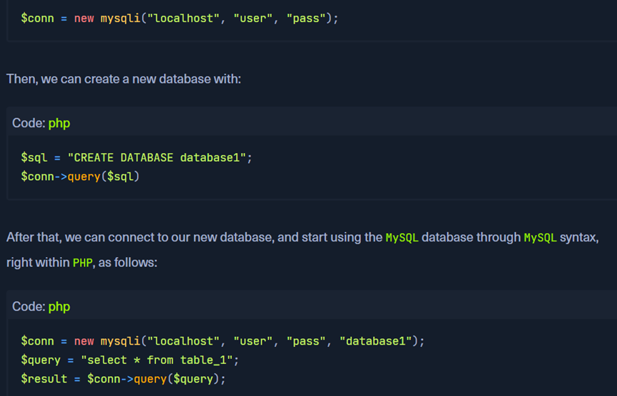
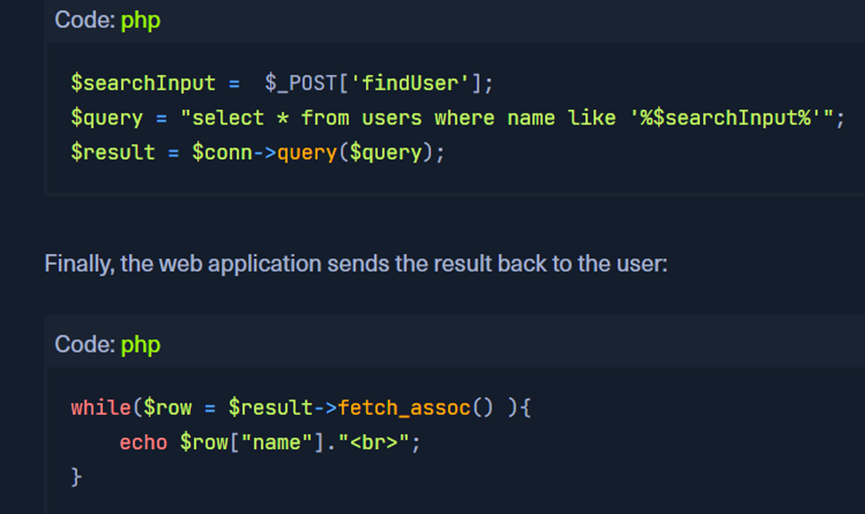
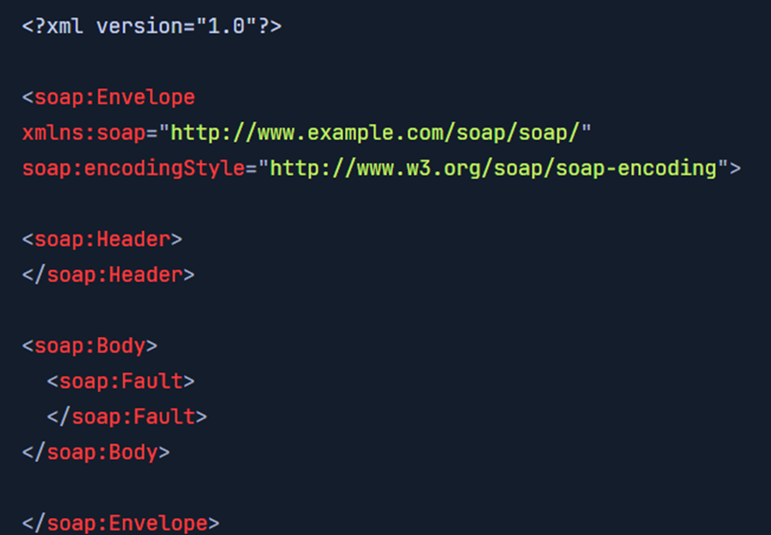

# htb academy笔记-module-Introduction to Web Applications（四）

> 原创 已于 2025-03-18 17:11:48 修改 · 公开 · 795 阅读 · 17 · 26 · CC 4.0 BY-SA版权 版权声明：本文为博主原创文章，遵循 CC 4.0 BY-SA 版权协议，转载请附上原文出处链接和本声明。
> 文章链接：https://blog.csdn.net/weixin_51439723/article/details/146263109

上一篇：
[htb academy笔记-module-Introduction to Web Applications（三）](https://blog.csdn.net/weixin_51439723/article/details/146230419) 

## 一、Databases

有不同类型的数据库用于不同环境，开发人员可以根据不同特定来选择，如存储、检索数据的速度、存储大数据时的size、web app的拓展性、花费等等

#### 1. Relational (SQL)

通过tables, rows, columns存储数据，不同的tables可以用每个table对应的link或者建立关系
① 举例
 

users表的id和posts的user_id是互通的，这样将两张表link起来。可以从posts出发检索出user的name，且不需要在posts中存放user的name。

一个表可以有多个key，如有第三张表包含评论的字段，里面用posts的id作为key连接post表，这样可以将三张表连在一起显示users表的name、posts的如时间、第三张表的评论字段

注：在数据库不同tables的关系叫schema

② 特点
所以关系型数据库可以很快从所有数据库检索出特定的element的所有数据，如用一句query从所有tables检索某个user相关的所有details。所以数据量很大时非常适用，数据管理也很高效
③ 厂商
常见realational databases:
· mysql：用得最多，开源免费
· mssql：在windows servers和IIS web servers里用得多
· oracle：大公司用得多，效率高更新迅速售后响应及时，但是很贵
· postgreSQL：开源免费，易拓展
其他还有sqLite, MariaDB, Amazon, Azure SQL等

#### 2. Non-relational (NoSQL)

① 定义
不用tables, rows, columns, primary keys, relationships, schemas，而是根据数据存储的类型用不同存储modles。

NoSQL没有defined struction，所以易拓展。当数据是not very welled defined and stuctured时，适合使用NoSQL

② 常见四种models
· key-value
· Document-Based
· wide-column
· graph
上述每个models都可以有不同的数据存储方式，如key-value model可以用json或xml存储数据
 

用json格式如下：
 

这个很像python或php里的dictionary/map/key-value pair如{‘key’ : ‘value’}，其中key一般是string而value可以是string, dictionary或者其他class

而Document-Based的数据存储在json objects集里且每个object有meta-date(元数据)，然后其余部分相当于key-value modle
③ 常见厂商
· MongoDB：最常见NoSQL 数据库，开源免费，用Document-based model且存储格式为json objects
· ElasticSearch：开源免费，适用很大的数据集，而且像它的名字一样search非常快
· apache cassandra：开源免费，易拓展且很会处理faulty values（错误值）

其他还有如Redis, Neo4j, CouchDB, Amazon, DynamoDB

#### 3. Use in Web Applications

back end server安装数据库后webapp就可以直接使用，以php使用mysql举例：
 

搜索时：
 

可以看出过程很简单，但是coding时也需要注意安全问题，不然可能导致漏洞

## 二、Development Frameworks & APIs

为了提高效率现在大部分web app用web框架开发。且一些功能是通用的如注册功能，使用框架能更快开发完成。

#### 1. 常见的框架如下：

① Laravel(PHP)：小公司用得多，功能强大且易使用
② Express(Node.JS)：PayPal, Yahoo, Uber, IBM, MySpace使用
③ Django(Python)：Google, YouTube, Instagram, Mozilla, Pinterst使用
④ Rails(Ruby)：Github, Hulu, Twich, Airbnb，甚至以前的Twitter使用

注：大规模的web app一般对框架和web server使用不止一种

#### 2. APIs

① 即Application Programming Interface
APIs和HTTP request parameters是web app开发中的一个重要概念，它可以连接前后端并互发data来执行web app中的不同功能

② Query Parameters(查询参数)
即用来查询的parameters
其实parameter可以理解为形参，argument可以理解为parameter具体化的实参

#### 3. Web APIs

web APIs一般通过http协议并被web servers处理和转换
使用GET, POST

开发人员需要在后端开发此功能，API标准有SOAP或REST

#### 4. SOAP

即Simple Objects Access，request和response的数据都以XML格式传输。
例：
 

① 优点
SOAP擅长传输stuctured data如class object，也擅长传输二进制数据，且经常和serialized objects一起用。上述数据格式能在前后端传输复杂数据，在分享stateful objects(即sharing/changing网页的状态)方面也很有用，这在现代web app里越来越多
② 缺点
对初学者有点难，而且比较简单的需求也需要复杂的语句query。所以REST更实用

#### 5. REST

即Representationl State Tranfer，用url传输数据且一般返回json

① 特点
和Query Parameters不一样，REST让某个page通过url只传输特定格式数据，这样不需要指定它的type和name，这样很适用search, sort, filter等功能。

所以用REST经常会将一些功能拆分成小的APIs并且用这些小APIs执行more advanced行为，这也让web app更模块化、可拓展性。

② response数据
除了json也有xml, x-ww-form-urlencoded甚至raw data
③ 使用的method
· GET: retrieve data
· POST: create data(non-idempotent)
· PUT: create or update data(idempotent)
· DELETE: remove data

该module大纲：
 

（有问题随时在评论区或私信留言，两天内回复）

下一篇：
[htb academy笔记-module-Introduction to Web Applications（五）](https://blog.csdn.net/weixin_51439723/article/details/146306834) 