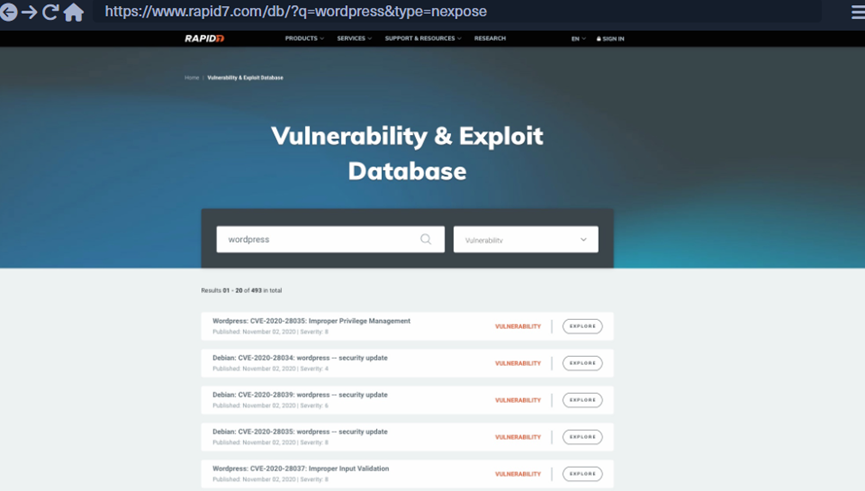
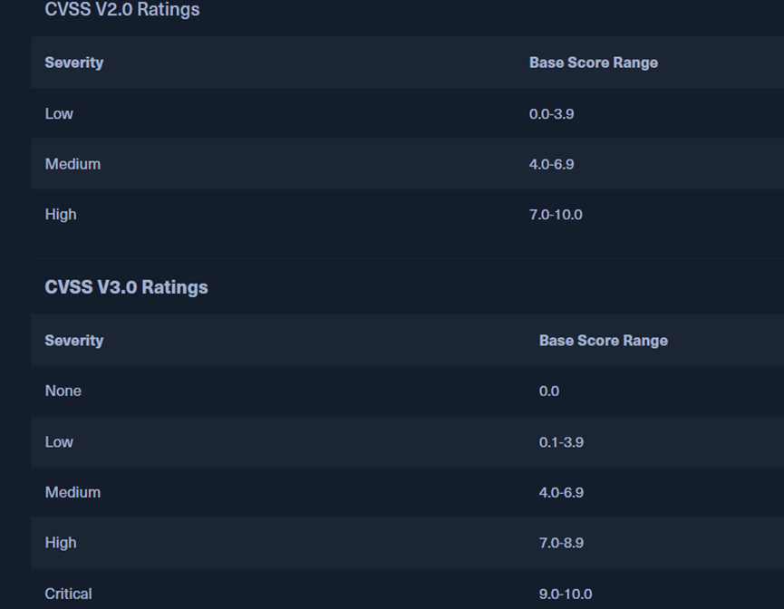
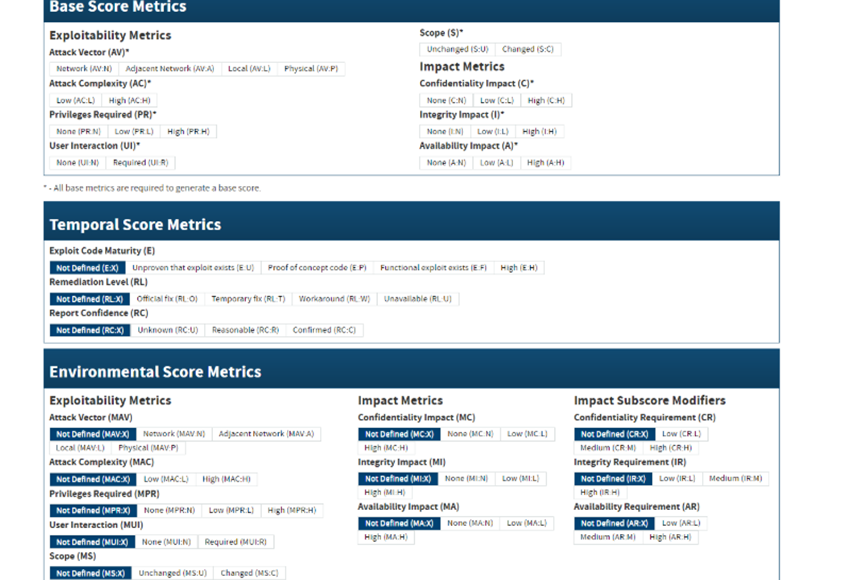
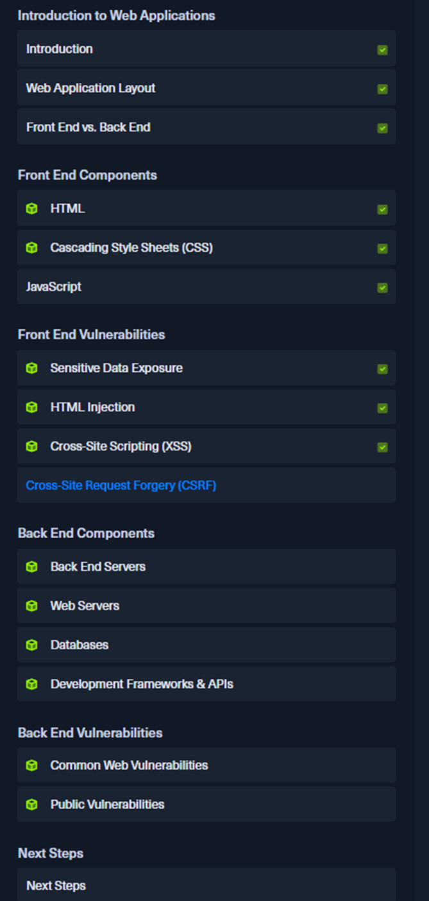

# htb academy笔记-module-Introduction to Web Applications（五）

> 原创 已于 2025-04-11 15:47:34 修改 · 967 阅读 · 17 · 24 · CC 4.0 BY-SA版权 版权声明：本文为博主原创文章，遵循 CC 4.0 BY-SA 版权协议，转载请附上原文出处链接和本声明。
> 文章链接：https://blog.csdn.net/weixin_51439723/article/details/146306834

上一篇：
[htb academy笔记-module-Introduction to Web Applications（四）](https://blog.csdn.net/weixin_51439723/article/details/146263109) 

## 一、Common Web Vulnerabilities

如果做pen test未发现public exploits或对象是内部开发的web app，我们就需要人工找到漏洞，这些漏洞可能是因为misconfigurations等原因，下面介绍几种常见漏洞

#### 1. Broken Authentication/Access Control

最常见且危害最大。
Broken Authentication 就是绕过auth功能，如无需认证就可登录或普通用户突然变成admin
Broken Access Control 是使用了不该使用的功能如普通用户访问admin页面

真实案例，College Management System 1.2 有一个auth bypass漏洞：如果在email field输入

```c
' or 0=0 #
```

然后密码随便输，可以让我们不需要真实的account登录

#### 2. Malicious File Upload

真实案例，WordPress的插件 Responsive Thumbnail Slider 1.0可以操作后上传任意文件，且被metasploit收录

#### 3. Command Injection

很多web app的功能需要执行os的命令，如下载某个xxx插件的os命令，如果被巧妙利用如把xxx改成恶意命令，可以让该命令执行我们想做的事情。

开发人员可能不会充分做好过滤和防护，这样就有机可乘

真实案例，WordPress的插件 Plainview Activity Monitor 20161228可以在ip字段输入

```c
[ip] | COMMAND... 
```

注入命令

#### 4. SQL injection(SQLi)

## 二、Public Vulnerabilities

最危险的back 漏洞可以不需要本地访问server而可以从外部入侵甚至控制back end server。这些漏洞通常由于开发时产生的coding mistakes`

#### 1. Public CVE

① 一般来说第一件事就是确定web app的版本，在源码里可以找到。对于开源项目，可以check repository找到版本号在哪，然后在实例中在对应的地方找。

再之后，搜索看是否有相关已知漏洞。可以google，也可以查Exploit DB, Rapid7 DB, Vulnerability Lab这样的exploit databases。

以Rapid7 DB举例：
 

② 可以着重关注能做rce的cve 8-10分exploits，没有这些再考虑其他的。

③ 另外也可以从web app使用的component如plugin入手

#### 2. Common Vulnerability Scoring System (CVSS)

① 介绍
评估漏洞的严重程度，其评分系统被广泛使用。

评分公式中有三个变量：Base, Temporal, Enviromental。先给base为0-10，然后通过Temporal和Enviromental调整。

评分体系分为CVSS v2和CVSS v3，区别不大，主要是Base和Enviromental方面。
Base的方面如下：
 

② NVD

National Vulnerability Database (NVD)有常见漏洞的CVSS分数，但是只给出base，因为其他两个会根据时间和环境有变化。

NVD提供两个版本的计算器，用户可以根据需求微调Temporal和Enviromental：
 

可以调整到给定的分数，也可以试着把不同的CVEs调整到相同的分数

#### 3. Back-end Server Vulnerabilities

除了上述漏洞，也可以考虑其他back end compenents，如back end server或webserver的漏洞

① Web server里
因为通过tcp被广泛使用，web servers的漏洞是back end components里最重要的。如知名web server漏洞Sell-Shock，在apache 2014及之前版本里存在，可以用http requests远程控制back-end server。

② back-end server或database 里
这里的漏洞通常是在通过外部漏洞连到 back-end server或back-end network之后，或者直接是内部pen test时才开始找。找到后可以提权甚至控制同一个网络的其他servers。

## 三、Next Steps

#### 1. 简易实操巩固一下：

① 装一个有web server的VM
② 建一个html网页
③ 用css修饰
④ 加一些js功能
⑤ 编一个简单的web app
⑥ 让web app连上数据库
⑦ 用APIs
⑧ 用不同漏洞测试自己写的web app
⑨ 尝试给自己的漏洞打补丁

该module大纲：

 

（有问题随时在评论区或私信留言，两天内回复）

下一篇：
[htb academy笔记-module-Using Web Proxies（一）](https://blog.csdn.net/weixin_51439723/article/details/147144268) 