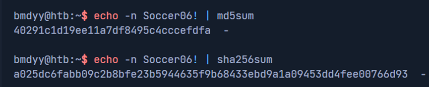
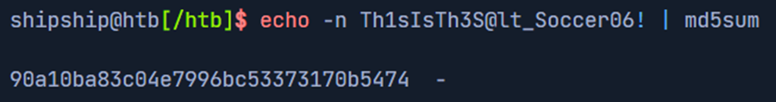
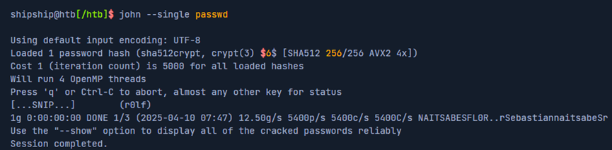
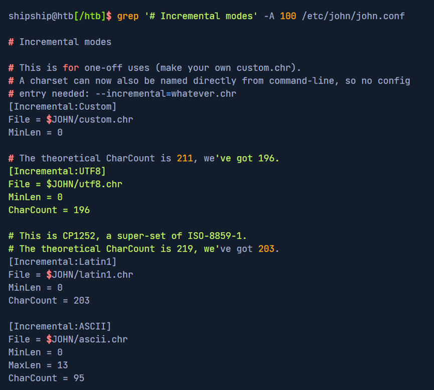
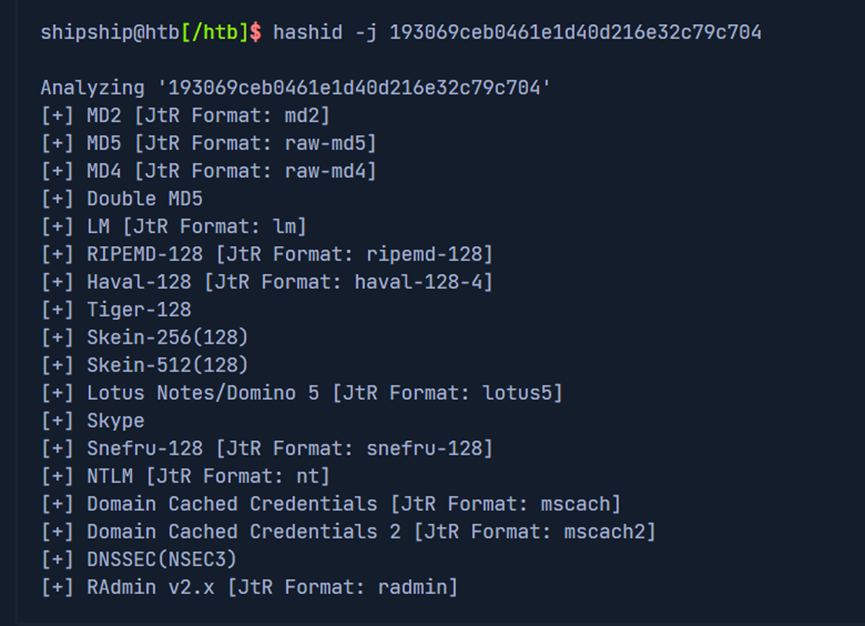
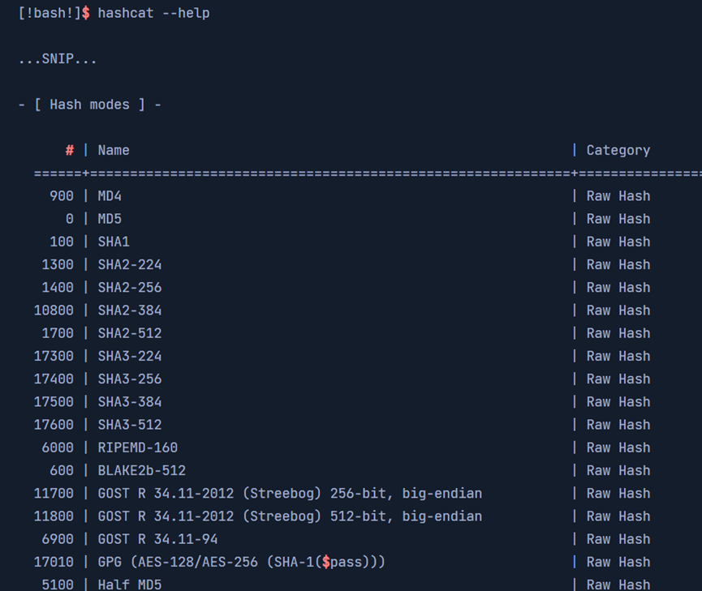
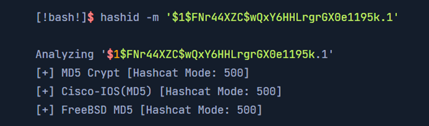
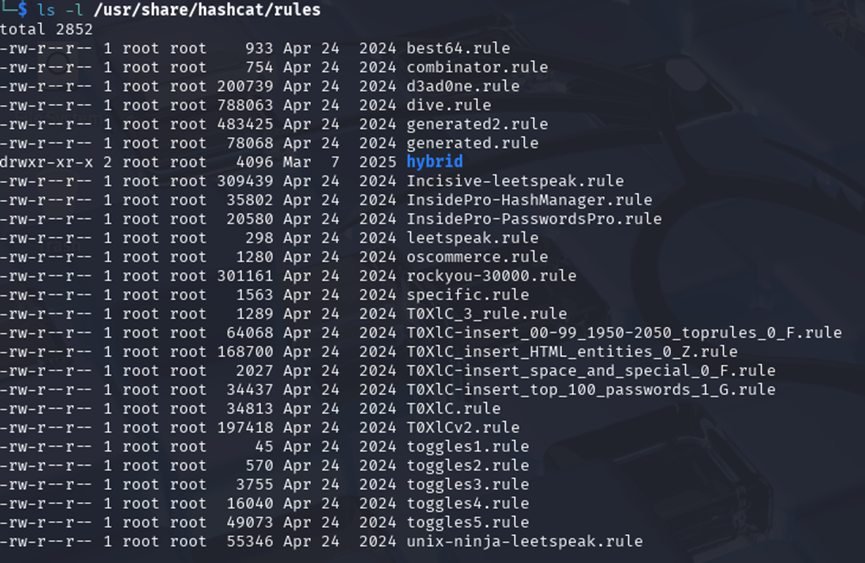
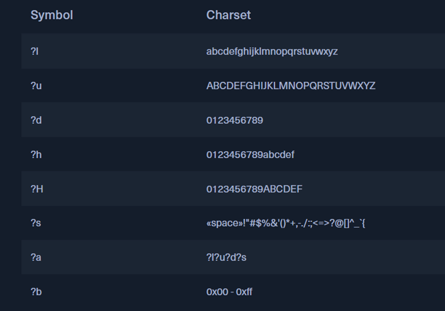
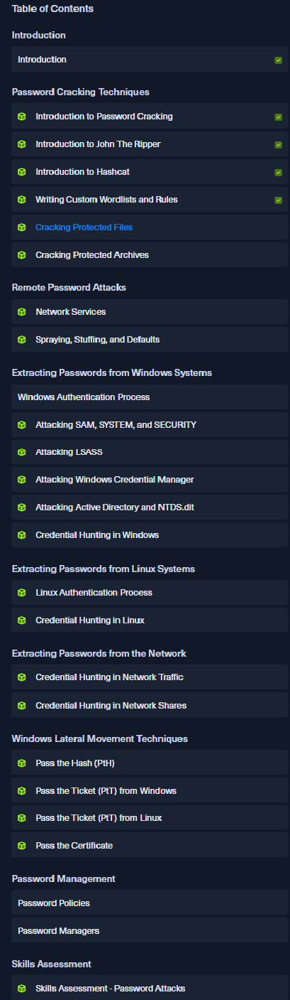

# htb academy笔记-module-Password Attacks（一）

> 原创 已于 2025-09-20 10:32:23 修改 · 853 阅读 · 30 · 14 · CC 4.0 BY-SA版权 版权声明：本文为博主原创文章，遵循 CC 4.0 BY-SA 版权协议，转载请附上原文出处链接和本声明。
> 文章链接：https://blog.csdn.net/weixin_51439723/article/details/151792431

## 一、Introduction

Confidentiality, integrity, and availability 是信安数据三要素，maintain 他们balance的办法是：
① 在environment中的每个文件、object和host进行审计和记录（audit and account）;
② Authorization
确定用户有权限访问对应的资源
③ Authentication
访问前验证用户的身份

很多时候authorization在authentication通过的时候就被执行了，如密码正确后马上可以访问很多新的页面

大部分breaches都可以追溯到上述三种principle的breakdown，该module通过compromise用户的密码来绕过各种os, app和加密methods

#### 1. Authentication

即通过验证机制中的四要素来验明身份：
①Something you know
a password, passcode, pin, etc.
②Something you have
ID Card, security key, 或其他MFA工具（Multi-Factor Authentication）
③Something you are
physical self, username, emailaddress等
④ Somewhere you are
定位, IP address等

具体需要上述中的几种factor要视情况而定，如系统的成熟度、重要程度等

#### 2. The use of passwords

Password仍然是兼顾安全和便利后使用最多的方式。统计表明，很多人在密码泄露后仍不修改密码，我们可以在HaveIBeenPwned这个网站上输入自己的id如email，来查看是否在公开的数据泄露中有自己的id

## 二、Introduction to Password Cracking

password通常用hash存储，可以用以下命令把 Soccer06! 转成hash：
 

根据password的hash值获得password叫password cracking，常见的办法是用rainbow table、dicitonary attacks，实在没办法才会做brute-force attacks(字典攻击)

#### 1. Rainbow tables

即password-hash的maps，通过直接搜索hash然后查出password。
为了应对这种攻击，可以加salt，但在同一数据库不要重复使用。若salt是前置Th1sIsTh3S@lt_，那么hash过程就是：
 

Salt可以不那么保密，一般和hash(salt+passwpord)存放在一起，方便取用。系统做authentication时需取对应的salt，然后把salt和用户request的password放在一起hash。因为salt随机性强，单个byte就有15billion种可能，攻击者不可能更新如此数据量的rawibow tables，知道salt也没用

换句话说，只是用户输入的password系统不能保证其hash的多样性，但是加salt后可以。

#### 2. Brute-force attack

暴力破解速度与硬件和算法有关系，一台普通笔记本用hashcat来遍历md5速度是5百万/秒，对DCC2 hash的遍历速度是1w/秒

#### 3. Dictionary attack

字典攻击，即wordlist，知名的有rockyou.txt
注：rockyou.txt是2009年RockYou这个网址泄露的1400w真实passwords，当时居然用明文存储

## 三、Introduction to John The Ripper

John the Ripper（也叫JtR或john）是知名的开源密码cracking工具，攻击方式包括brute-force和dicitonary，可以转换不同文件和hash的格式。
它的变种"jumbo"也很有用，有multilingual word lists、支持64位架构等新功能，crack速度和准确度更好。

该工具在持续更新

#### 1. Cracking modes

① Single crack mode
对Linux credentials最有用的crack方法，它会根据victim的username、根目录和GECOS值（全名、room号、手机号等）来生成password，如全名是Bob Smith，会生成密码Smith1
若我们一个文件passwd中内容如下：

```bash
r0lf:$6$ues25dIanlctrWxg$nZHVz2z4kCy1760Ee28M1xtHdGoy0C2cYzZ8l2sVa1kIa8K9gAcdBP.GI6ng/qA4oaMrgElZ1Cb9OeXO4Fvy3/:0:0:Rolf Sebastian:/home/r0lf:/bin/bash
```

我们可以推断出username是r0lf , real name是Rolf Sebastian，根目录是/home/r0lf。我们就可以用如下命令：

```bash
john --single passwd
```

 

可以看到crack到了
② Wordlist mode
即字典，语法如下：

```bash
john --wordlist=<wordlist_file> <hash_file>
```

wordlis_file必须明文，若有多个可用逗号隔开；
还有–rules这个参数，可以制定规则如在每个word末尾添加字符。
③ Incremental mode
使用统计模型（Markov chains）的暴力破解，比传统暴力破解更智能。
基于训练数据用指定的字符来生成所有组合，不过这种mode攻击能力强但同样很耗时。
语法：

```bash
john --incremental <hash_file>
```

在john.conf里可以根据需求修改character sets, password lengths等默认配置，可以改善攻击的效果和速度：
 

#### 2. Identifying hash formats

有时候我们和JtR都不知道hash的类型，如：
193069ceb0461e1d40d216e32c79c704
一个办法是查阅文档，JtR或PentestMonkey的hash实例文档，他们也都会列出在JtR中对应的格式。另一个办法是用工具hashID，用flag -j即可给出它认为的hash类型以及在JtR种的格式：

```bash
hashid -j 193069ceb0461e1d40d216e32c79c704
```

 

不过上述命令没能确定号hash类型，这很正常。很多时候根据context可以判断出来，上述例子其实是RIPEMD-128类型。
下面列出一些JtR支持的格式：

```bash
Hash format	Example command	Description
afs	john --format=afs [...] <hash_file>	AFS (Andrew File System) password hashes
bfegg	john --format=bfegg [...] <hash_file>	bfegg hashes used in Eggdrop IRC bots
bf	john --format=bf [...] <hash_file>	Blowfish-based crypt(3) hashes
bsdi	john --format=bsdi [...] <hash_file>	BSDi crypt(3) hashes
crypt(3)	john --format=crypt [...] <hash_file>	Traditional Unix crypt(3) hashes
des	john --format=des [...] <hash_file>	Traditional DES-based crypt(3) hashes
dmd5	john --format=dmd5 [...] <hash_file>	DMD5 (Dragonfly BSD MD5) password hashes
dominosec	john --format=dominosec [...] <hash_file>	IBM Lotus Domino 6/7 password hashes
EPiServer SID hashes	john --format=episerver [...] <hash_file>	EPiServer SID (Security Identifier) password hashes
hdaa	john --format=hdaa [...] <hash_file>	hdaa password hashes used in Openwall GNU/Linux
hmac-md5	john --format=hmac-md5 [...] <hash_file>	hmac-md5 password hashes
hmailserver	john --format=hmailserver [...] <hash_file>	hmailserver password hashes
ipb2	john --format=ipb2 [...] <hash_file>	Invision Power Board 2 password hashes
krb4	john --format=krb4 [...] <hash_file>	Kerberos 4 password hashes
krb5	john --format=krb5 [...] <hash_file>	Kerberos 5 password hashes
LM	john --format=LM [...] <hash_file>	LM (Lan Manager) password hashes
lotus5	john --format=lotus5 [...] <hash_file>	Lotus Notes/Domino 5 password hashes
mscash	john --format=mscash [...] <hash_file>	MS Cache password hashes
mscash2	john --format=mscash2 [...] <hash_file>	MS Cache v2 password hashes
mschapv2	john --format=mschapv2 [...] <hash_file>	MS CHAP v2 password hashes
mskrb5	john --format=mskrb5 [...] <hash_file>	MS Kerberos 5 password hashes
mssql05	john --format=mssql05 [...] <hash_file>	MS SQL 2005 password hashes
mssql	john --format=mssql [...] <hash_file>	MS SQL password hashes
mysql-fast	john --format=mysql-fast [...] <hash_file>	MySQL fast password hashes
mysql	john --format=mysql [...] <hash_file>	MySQL password hashes
mysql-sha1	john --format=mysql-sha1 [...] <hash_file>	MySQL SHA1 password hashes
NETLM	john --format=netlm [...] <hash_file>	NETLM (NT LAN Manager) password hashes
NETLMv2	john --format=netlmv2 [...] <hash_file>	NETLMv2 (NT LAN Manager version 2) password hashes
NETNTLM	john --format=netntlm [...] <hash_file>	NETNTLM (NT LAN Manager) password hashes
NETNTLMv2	john --format=netntlmv2 [...] <hash_file>	NETNTLMv2 (NT LAN Manager version 2) password hashes
NEThalfLM	john --format=nethalflm [...] <hash_file>	NEThalfLM (NT LAN Manager) password hashes
md5ns	john --format=md5ns [...] <hash_file>	md5ns (MD5 namespace) password hashes
nsldap	john --format=nsldap [...] <hash_file>	nsldap (OpenLDAP SHA) password hashes
ssha	john --format=ssha [...] <hash_file>	ssha (Salted SHA) password hashes
NT	john --format=nt [...] <hash_file>	NT (Windows NT) password hashes
openssha	john --format=openssha [...] <hash_file>	OPENSSH private key password hashes
oracle11	john --format=oracle11 [...] <hash_file>	Oracle 11 password hashes
oracle	john --format=oracle [...] <hash_file>	Oracle password hashes
pdf	john --format=pdf [...] <hash_file>	PDF (Portable Document Format) password hashes
phpass-md5	john --format=phpass-md5 [...] <hash_file>	PHPass-MD5 (Portable PHP password hashing framework) password hashes
phps	john --format=phps [...] <hash_file>	PHPS password hashes
pix-md5	john --format=pix-md5 [...] <hash_file>	Cisco PIX MD5 password hashes
po	john --format=po [...] <hash_file>	Po (Sybase SQL Anywhere) password hashes
rar	john --format=rar [...] <hash_file>	RAR (WinRAR) password hashes
raw-md4	john --format=raw-md4 [...] <hash_file>	Raw MD4 password hashes
raw-md5	john --format=raw-md5 [...] <hash_file>	Raw MD5 password hashes
raw-md5-unicode	john --format=raw-md5-unicode [...] <hash_file>	Raw MD5 Unicode password hashes
raw-sha1	john --format=raw-sha1 [...] <hash_file>	Raw SHA1 password hashes
raw-sha224	john --format=raw-sha224 [...] <hash_file>	Raw SHA224 password hashes
raw-sha256	john --format=raw-sha256 [...] <hash_file>	Raw SHA256 password hashes
raw-sha384	john --format=raw-sha384 [...] <hash_file>	Raw SHA384 password hashes
raw-sha512	john --format=raw-sha512 [...] <hash_file>	Raw SHA512 password hashes
salted-sha	john --format=salted-sha [...] <hash_file>	Salted SHA password hashes
sapb	john --format=sapb [...] <hash_file>	SAP CODVN B (BCODE) password hashes
sapg	john --format=sapg [...] <hash_file>	SAP CODVN G (PASSCODE) password hashes
sha1-gen	john --format=sha1-gen [...] <hash_file>	Generic SHA1 password hashes
skey	john --format=skey [...] <hash_file>	S/Key (One-time password) hashes
ssh	john --format=ssh [...] <hash_file>	SSH (Secure Shell) password hashes
sybasease	john --format=sybasease [...] <hash_file>	Sybase ASE password hashes
xsha	john --format=xsha [...] <hash_file>	xsha (Extended SHA) password hashes
zip	john --format=zip [...] <hash_file>	ZIP (WinZip) password hashes
```

#### 3. Cracking files

也可以用JtR的衍生工具来crack有密码或被加密的文件，语法：

```bash
<tool> <file_to_crack> > file.hash
```

工具如下：

```bash
Tool	Description
pdf2john	Converts PDF documents for John
ssh2john	Converts SSH private keys for John
mscash2john	Converts MS Cash hashes for John
keychain2john	Converts OS X keychain files for John
rar2john	Converts RAR archives for John
pfx2john	Converts PKCS#12 files for John
truecrypt_volume2john	Converts TrueCrypt volumes for John
keepass2john	Converts KeePass databases for John
vncpcap2john	Converts VNC PCAP files for John
putty2john	Converts PuTTY private keys for John
zip2john	Converts ZIP archives for John
hccap2john	Converts WPA/WPA2 handshake captures for John
office2john	Converts MS Office documents for John
wpa2john	Converts WPA/WPA2 handshakes for John
```

## 四、Introduction to Hashcat

Hashcat是知名的password cracking开源工具，因其出色的GPU使用，效率很高，和JtR一样也有不同mode。基本语法如下：

```bash
hashcat -a 0 -m 0 <hashes> [wordlist, rule, mask, ...]
```

其中-a是attack方式, -m是hash的mode，是string或同类型的hash值文件

#### 1. Hash types

即-m后面的数字，可用hashcat –help来查看每种hash对应的id：
 

反过来，也可以用-m来确定hash的type：
 

#### 2. Attack modes

如dictionary, mask, combinator, association等，本文介绍前两种用得最多的
① Dictionary attack
即-a 0，也就是wordlist，用md5举例：

```bash
hashcat -a 0 -m 0 e3e3ec5831ad5e7288241960e5d4fdb8 /usr/share/wordlists/rockyou.txt
```

不过很多时候只是这样不足以成功crack，我们需要一些rules如在末尾添加数字任何再crack等，kali里面就有现成的：
 

如果我们现在有一个sql数据库中泄露的md5:
1b0556a75770563578569ae21392630c
我们可以用rockyou.txt加上一些基础rules的来crack，如best64.rule，这个包括64中标准密码修改，如添加数字、“leet”风格的字符替换（即a换成@, o换成0等等）。Cmd如下：

```bash
hashcat -a 0 -m 0 1b0556a75770563578569ae21392630c /usr/share/wordlists/rockyou.txt -r /usr/share/hashcat/rules/best64.rule
```

② Mask attack
即-a 3，定制的暴力破解。如我们知道一个密码的长度是7个char，同时又知道它依次由1个大写字母、四个小写字母、一个数字、一个symbol组成，这时我们就可以用一串symbols来指定，以下是默认symbols代表的含义：
 

也支持用-1, -2, -3等arguments来自定义，使用时对应用?1, ?2, ?3即可。
对上述密码构成我们可以用以下命令：

```bash
hashcat -a 3 -m 0 1e293d6912d074c0fd15844d803400dd '?u?l?l?l?l?d?s'
```

大纲：
 

（有问题随时在评论区或私信留言，两天内回复）

下一篇：
[htb academy笔记-module-Password Attacks（二）](https://blog.csdn.net/weixin_51439723/article/details/151792823) 