# htb academy笔记-module-Password Attacks（二）

> 原创 已于 2025-11-14 16:25:15 修改 · 636 阅读 · 11 · 27 · CC 4.0 BY-SA版权 版权声明：本文为博主原创文章，遵循 CC 4.0 BY-SA 版权协议，转载请附上原文出处链接和本声明。
> 文章链接：https://blog.csdn.net/weixin_51439723/article/details/151792823

上一篇：
[htb academy笔记-module-Password Attacks（一）](https://blog.csdn.net/weixin_51439723/article/details/151792431) 

## 一、Writing Custom Wordlists and Rules

现代系统越来越多地应用policy需要user输入带特殊字符、大小写、大于特定长度的密码，这样密码就没那么简单了。但是仍然有一些规律，如公司员工在密码里加入公司名字，个人会根据自己的偏好如宠物、运动、爱好等放到密码中，OSINT（Open Source Intelligence）技术就可以帮助猜到这些信息。

以下是user应对平台设置密码policy的常用办法：
 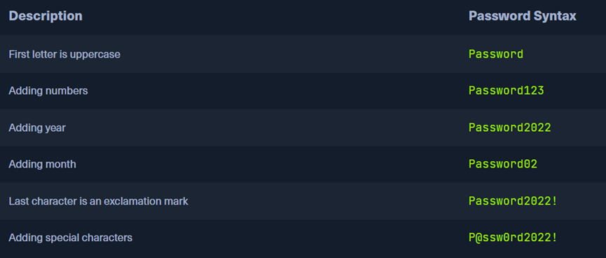

数据显示，大部分密码不会超过十个char，所以一些要求10位以上的可能就是简单密码加上如年份、特殊字符等，并且由于很多机构的密码需要定期修改，所以很多用户会在每次只修改月份或加个数字。

接下来我们看怎么写hashcat的rules，以下是常用的语法：
 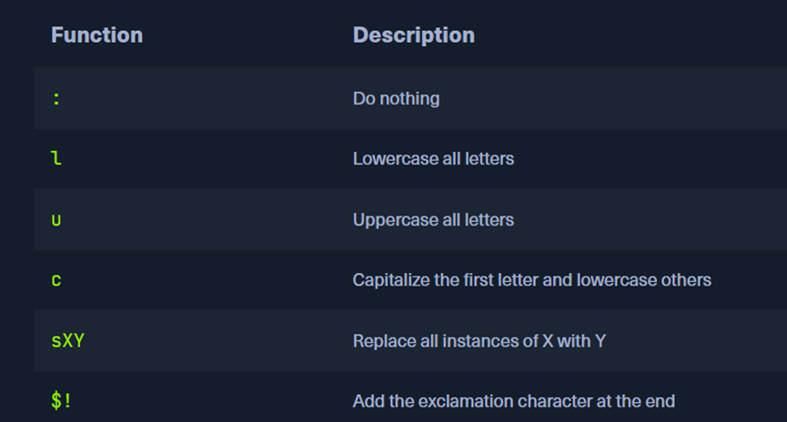

如果我们有一个文件：
 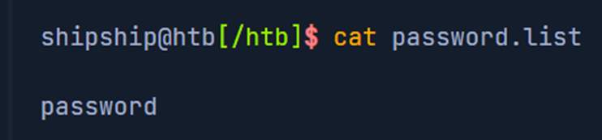

且我们的规则是这样的：
 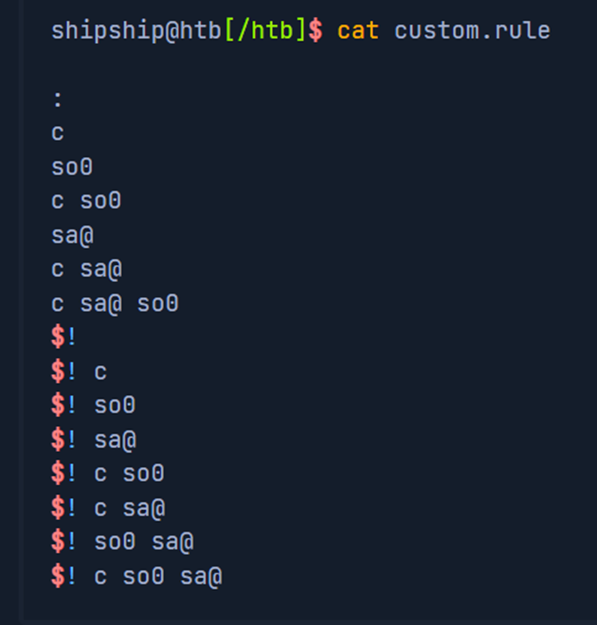

可以看到有15行，那么新生成的密码就会*15，执行命令如下：

```bash
hashcat --force password.list -r custom.rule --stdout | sort -u > mut_password.list
```

然后新的文件如下：
 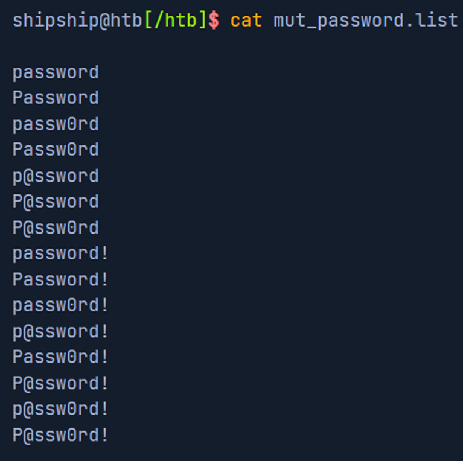

#### 1. Generating wordlists using CeWL

上面介绍了根据简单密码/word得出可能为真实密码的变种，而CeWL是一个可以从目标官网扫描来得到potenial words再提取出来的工具。该工具参数包括-d即spider的深度，-m即word的最小长度，–lowercase即把word用小写保存，-w即保存路径。如下：

```bash
cewl https://www.inlanefreight.com -d 4 -m 6 --lowercase -w inlane.wordlist
```

#### 2. Exercise

① 题干：
我们compromise到了Mark White的work email密码hash值：
97268a8ae45ac7d15c3cea4ce6ea550b
做了一些OSINT后，发现以下信息：
出生日期：August 5, 1998
工作公司：Nexura, Ltd.
该公司的密码policy：最小长度为12个char，且至少一个大写一个小写字母，一个数字、一个符号
居住地点：SanFrancisco, CA, USA
宠物：Bella
妻子：Maria
儿子：Alex
喜欢的运动：baseball
② Wp
Ⅰ.
先用cewl提取关键词，因为该工具需要输入url，这里我们把原文直接放到一个网页里：
 

然后用命令提取：

```bash
cewl http://localhost/test01.html -d 1 -m 2  -w word.wordlist --with-numbers
```

其-d为1因为该网页里面没有任何链接，-m为2以免遗漏什么，另外加上–with-numbers因为上面有年份月份
Ⅱ.
得到word.wordlis后我们再把一些明显不会是keyword的词去掉，得到：
 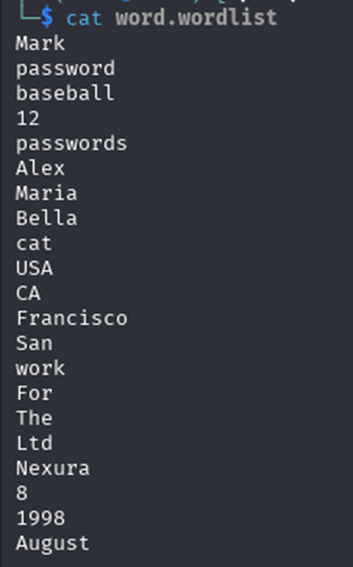

可以看到单个keyword明显不满足12个最小char的要求，所以我们猜测该user需要使用两个keyword。
这里我们用hashcat可以实现两两组合：

```bash
hashcat --stdout -a 1 word.wordlist word.wordlist  > word_combine.wordlist
```

其中—stdout是只输出而不crack，-a 1是实现组合，后面接两个文件，再后面就是新产生的文件。
 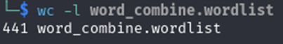

可以看到新的文件有441行，我们再筛掉小于12char的(后被人指正最好不要直接删掉小于12的，因为如长度为10在mutating后也可以大于12，所以删掉小于8左右的比较合适)

```bash
awk 'length($0) >= 12' word_combine.wordlist > word_combine12.wordlist
```

 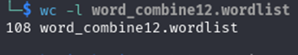

只有108行了
Ⅲ.
最后我们再用hashcat的常规操作：

```bash
hashcat -a 0 -m 0 97268a8ae45ac7d15c3cea4ce6ea550b  word_combine12.wordlist -r best64_update.rule
```

最后crack到了
 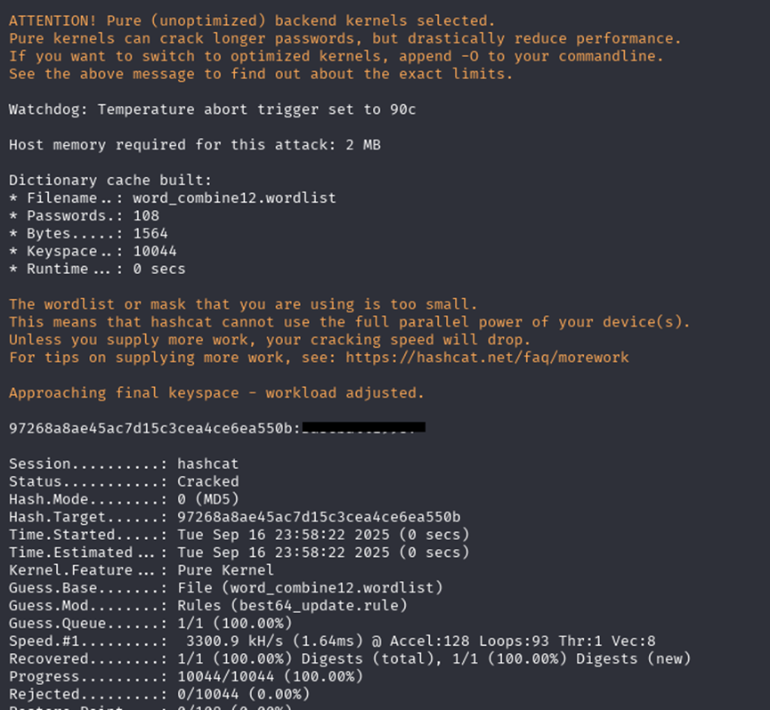

## 二、Cracking Protected Files

前面crack hash，以下两节crack files和archives。
在欧盟，个人数据在传送和其他时候都要求加密，近年大家对文件的加密随着安全意识的提高也有所增加。很多时候加密用对称加密如AES-256，而在传输过程中非对称加密更常见。

#### 1. Hunting for Encrypted Files

很多不同拓展名的文件对应着不同加密/编码方式，如常见的.xls, .doc, pdf等

#### 2. Hunting for SSH keys

有些文件如ssh keys没有拓展名，这时可以通过标准头或尾来辨别文件如ssh私钥以

```bash
-----BEGIN [...SNIP...] PRIVATE KEY-----
```

开头，我们可以用grep来查找文件内容，一般在post-exploitation阶段需要这么做：
 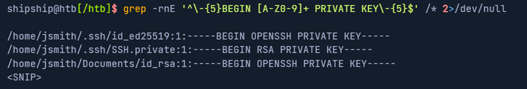

一些ssh keys会用结合口令(passphrase)加密，以前的PEM格式可以直接通过header判断key是否加密，但是现代的ssh key不管是否加密看起来是一样的：
 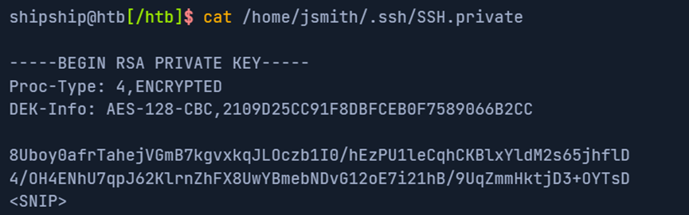

不过可以用ssh-keygen来尝试读key：

```bash
ssh-keygen -yf ~/.ssh/id_ed25519
```

 

下面可以看到，读加密的ssh key会让你输入口令passphrase:
 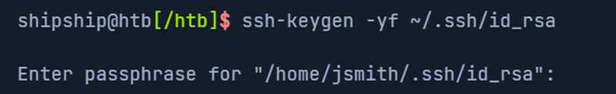

#### 3. Cracking encrypted SSH keys

前面提过JtR有很多不同scripts从文件中提取hash，我们用找一下：

```bash
locate *2john*
```

 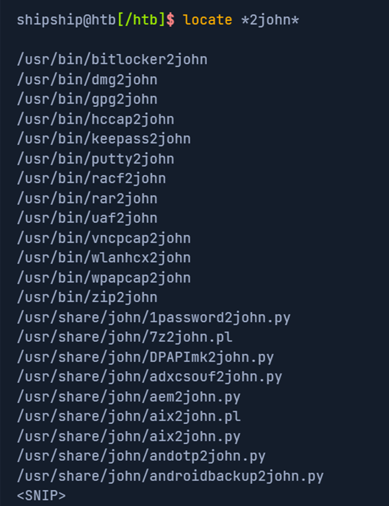

这里我们用ssh2john.py获得然后crack明文：

```bash
ssh2john.py SSH.private > ssh.hash
john --wordlist=rockyou.txt ssh.hash
```

 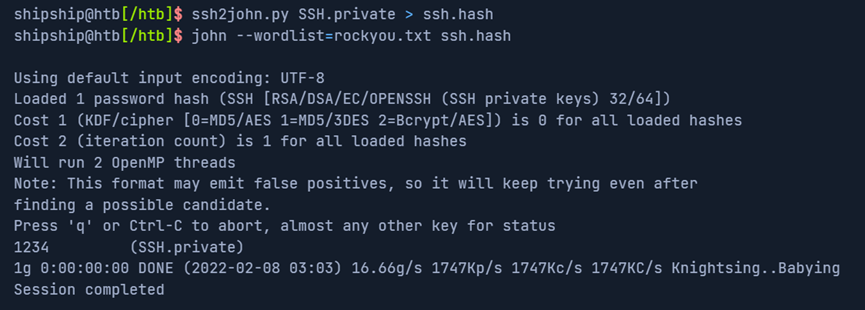

查看crack到的明文：

```bash
john ssh.hash --show
```

 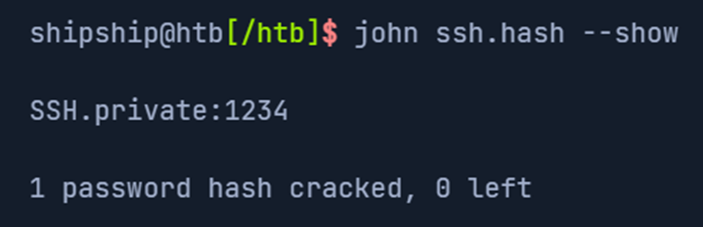

#### 4. Cracking password-protected documents

现在文件格式大多是微软office或pdf，JtR也有针对office的脚步叫office2john.py，可以提取所有offcie格式文件中的hash然后我们再offline破解，流程和上述类似如下：
 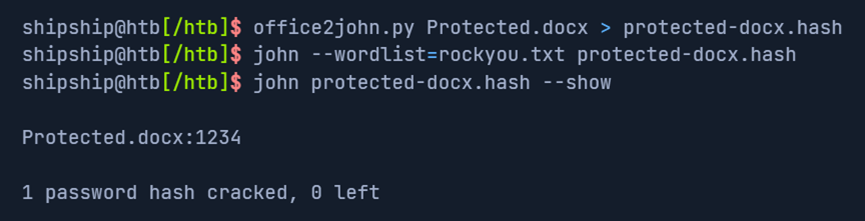

Pdf同样如此：
 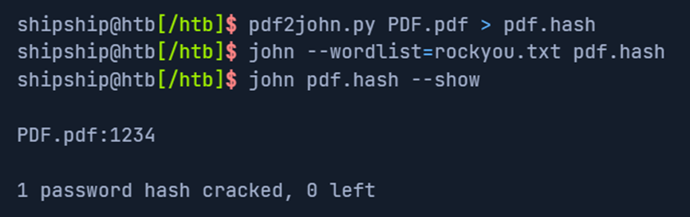

上述过程一大重点在于list的内容，因为像rock.txt这样公开的List很多时候可能被系统内部安装机制ban掉了，同时这些list也有时效性不一定现在还管用。不过crack文件依然很可能带来重要信息。

## 三、Cracking Protected Archives

和前文中的单个file不同，archives或者compressed files是多个files的合集，如zip, tar, gz, rar, vmdb/vmx, cpt, truecrypt,bitlocker, kdbx, deb, 7z, gzip等。同样我们可以在
https://fileinfo.com/filetypes/compressed
找到archive的各种类型。
需要注意的是不是所有archive都支持密码保护，也有一些是用工具来加密的，如tar用openssl或gpg来加密。

本节只介绍一些archive类型的一些crack办法，对于密码保护的archive，办法和前文一样先提取hash然后offline crack

#### 1. Cracking ZIP files

和上节office一样，唯一区别是offce2john换成zip2john

#### 2. Cracking OpenSSL encrypted GZIP files

一个文件是否有秘密保护不总是很明显，尤其是这个文件格式本来不支持密码保护时。前文说过openssl可以加密GZIP, 我们可以先用file这个命令来查看文件的一些信息，然后判断其格式：

```bash
file GZIP.gzip
```

 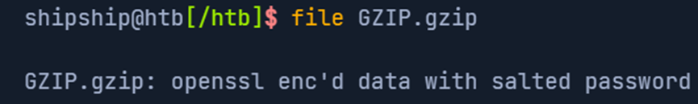

crack openssl加密的文件密码时可以会遇到不少false positives或全是failure，这时更好的办法是用for循环直接提取文件，如果提取成功那么就是密码正确了。
命令如下：

```bash
for i in $(cat rockyou.txt);do openssl enc -aes-256-cbc -d -in GZIP.gzip -k $i 2>/dev/null| tar xz;done
```

 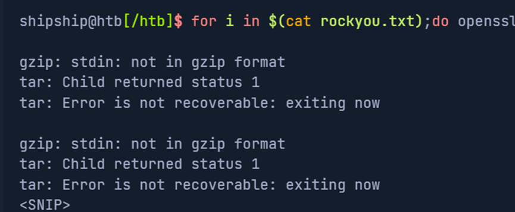

最后用ls看是否有文件被提取出来

#### 3. Cracking BitLocker-encrypted drives

BitLocker是full-disk加密功能，自从windwos Vista版本被微软开发并应用，使用128/256bits的AES加密，如果其密码忘记了可以用setup过程中产生48-digit的recovery key。
在公司里virtual drives经常用来存储个人信息、文档以确保安全，我们可以用bitlocker2john来crack BitLocker encrypted dirve。其中到四个hashes，前两个对应BitLocker密码，后两个 对应recovery key，但recovery key过于随机且很长，所以一般crack密码。
使用如下：

```bash
bitlocker2john -i Backup.vhd > backup.hashes
grep "bitlocker\$0" backup.hashes > backup.hash
```

可以看到：
 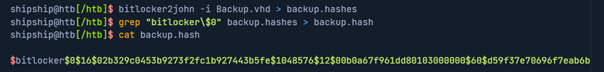

找到了hash，而后是常规的用hashcat或john来crack：
 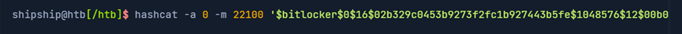

这里还是用rock.txt字典，其中-m 22100是bitlocker对应的编号，不过改hash算法耗时较常，吃硬件

#### 4. 增加 BitLocker-encrypted drives

① Windows
双击.vhd文件
② Linux/Mac
安装工具：

```bash
sudo apt-get install dislocker
```

建文件夹：

```bash
sudo mkdir -p /media/bitlocker
sudo mkdir -p /media/bitlockermount
```

用loseup把VHD当loop device来配置，用disclocker解密drive，然后增加decrypted volume:

```bash
sudo losetup -f -P Backup.vhd
sudo dislocker /dev/loop0p2 -u1234qwer -- /media/bitlocker
sudo mount -o loop /media/bitlocker/dislocker-file /media/bitlockermount
```

然后可以浏览文件：

```bash
cd /media/bitlockermount/
ls -la
```

在mounted drive里分析完文件后可以这样unmount:

```bash
sudo umount /media/bitlockermount
sudo umount /media/bitlocker
```

大纲：
 

（有问题随时在评论区或私信留言，两天内回复）

下一篇：
[htb academy笔记-module-Password Attacks（三）](https://blog.csdn.net/weixin_51439723/article/details/153312795) 