# htb academy笔记-module-Password Attacks（三）

> 原创 已于 2025-11-27 15:16:46 修改 · 公开 · 799 阅读 · 12 · 21 · CC 4.0 BY-SA版权 版权声明：本文为博主原创文章，遵循 CC 4.0 BY-SA 版权协议，转载请附上原文出处链接和本声明。
> 文章链接：https://blog.csdn.net/weixin_51439723/article/details/153312795

上一篇： [htb academy笔记-module-Password Attacks（二）](https://blog.csdn.net/weixin_51439723/article/details/151792823?) 

## 一、Network Services

包括但不限于FTP,SMB, NFS, IMAP/POP3,SSH, MySQL/MSSQL, DRP, WinRM,VNC, Telnet, SMTP, LDAP等。
如我们需要在network上管理windowsserver，要能访问系统、执行命令通过GUI或terminal，这时可以用RDP, WinRM, SSH，其中SSH在linux上非常常见
他们都有id, pw的验证机制，而有时候会有配置错误。

#### 1. WinRM

##### a. 介绍

即Windows Remote Management, 是微软Web Services Management Protocol（WS-Management）的执行版本，基于XML web services，使用SOAP(Simple Object Access Protocol)新协议，用来远程管理windows系统，强调WBEM和WMI之间的联动，且可以调用DCOM。

基于安全考虑win10/11上WinRM必须手动开启配置，多于情况下如果使用WinRM，管理员会用证书或特定验证机制来增强安全性。WinRM默认使用TCP端口5985（HTTP）和5986(HTTPS)

可以攻击上述的工具是NetExec，当然可以攻击其他协议如SMB, LDAP, MSSQL等。

##### b. NetExec

① Help
-h是常规手册；
也可以指定协议来获得攻击该协议的全部手册，如：

```undefined
netexec smb -h
```

② 使用
一般格式：

```cobol
netexec <proto> <target-IP> -u <user or userlist> -p <password or passwordlist>
```

如：
 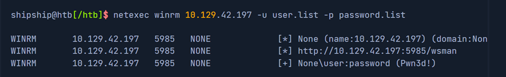

exercise时netexec用不了，换成了crackmapexec，和上面这句话语法一模一样。

其中“Pwn3d!”表明该组user-pw很可能可以执行系统命令

##### c. Evil-WinRM

这是一个和WinRM交互的工具
① 使用

```cobol
evil-winrm -i <target-IP> -u <username> -p <password>
```

如：
 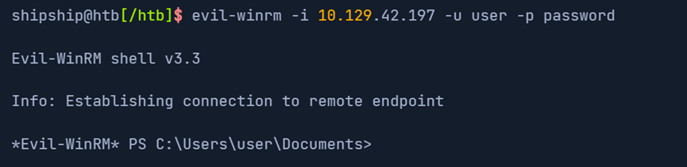

如果成功登录，会有一个使用MS-PSRP(Powershell Remoting Protocol)的session被初始化，这样可以简化操作和命令

#### 2. SSH

##### a. 介绍

前身是telnet（23端口），但ssh更安全（在22端口），ssh会使用三种不同密码算法：对称、非对称和hash

① Symmetric Encryption
用来加密私钥，方法如AES, Blowfish, 3DES等
② Asymmetric Encryption
Server用公钥加密初始化和验证
③ Hash
SSH用hash来确定message的authenticity

##### b. Hydra - SSH

Brute force ssh的工具，在 Login Brute Forcing这个module里有详细说明
使用如下：

```cobol
hydra -L user.list -P password.list ssh://10.129.42.197
```

 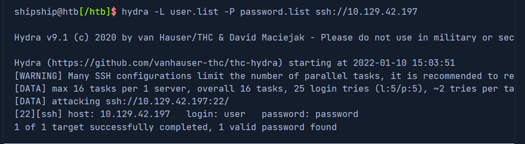

因为linux系统一般都有，我们可以用OpenSSHclient来登录支持ssh 协议的系统，

#### 3. Remote Desktop Protocol (RDP)

##### a. 介绍

微软的RDP（Remote Desktop Protocol）是能远程连接windows系统的网络协议，默认是tcp端口3389，users和administrators都支持。它定义了连接的两种participants：一个是terminalserver，上面运行实际网络；另一个是terminal client，上面控制terminal server。除了传输image, sound , keyboard, pointing device（如鼠标、触控板），RDP还可以在连到terminal client的打印机上打印terminal server的文档，或允许访问terminal client那边可以访问的存储资源。从层级关系看，RDP是在ip stack(即分层机构)的应用层协议，可以用TCP和UDP来传输数据。很多微软官方apps使用该协议，第三方也会用。

##### b. Hydra – RDP

 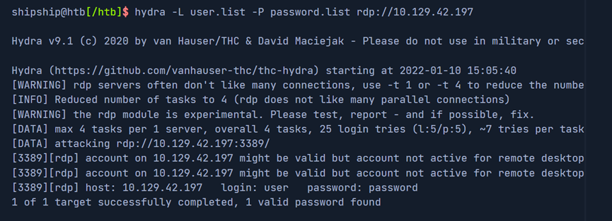

Linux有针对RDP的不同client如Remmina, xfreerdp等，我们用xfreerdp

##### c. xFreeRDP

语法：

```cobol
xfreerdp /v:<target-IP> /u:<username> /p:<password>
```

如：
 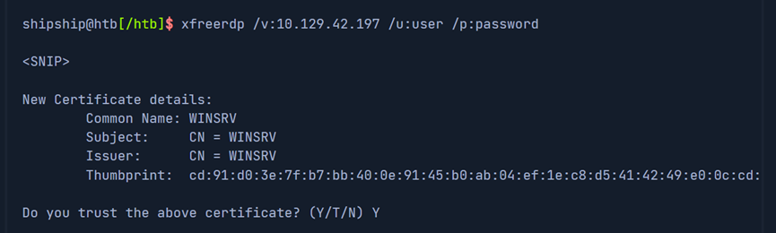

 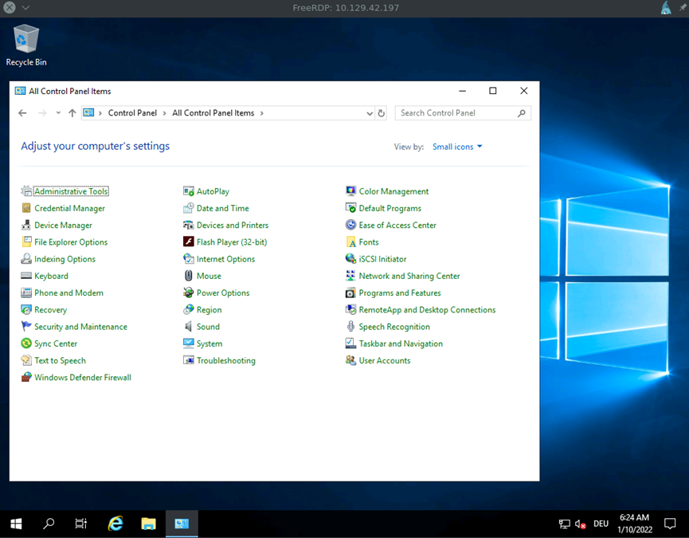

#### 4. SMB

##### a. 介绍

即Server Message Block，是本地网络在client和server间传输数据的协议，windows网络中常用于文件或目录共享、打印服务。SMB常被认为是文件系统，其实不是。在unix或linux中对应的是NFS。

SMB中的CIFS(Common Internet File System)因可提供跨平台（windows, linux, macOS）远程连接而知名，而Samba作为上述功能的一个开源版本也很有名。

##### b. Hydra - SMB

同上：

```cobol
hydra -L user.list -P password.list smb://10.129.42.197
```

但是有时候会报错：
 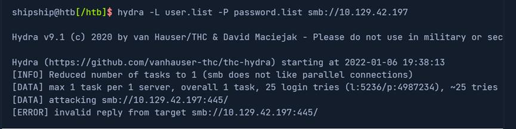

可能是需要更新hydra版本

##### c. Metasploit Framework

用这个模块

```cobol
use auxiliary/scanner/smb/smb_login
```

user.list和password.list添加的位置：
 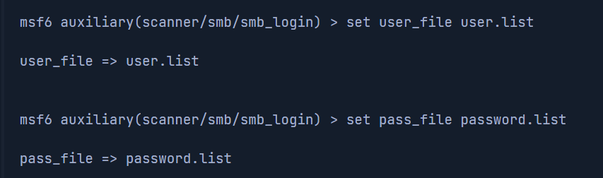

##### d. NetExec

可以用这个看available shares以及我们有什么权限：

```sql
netexec smb 10.129.42.197 -u "user" -p "password" --shares
```

 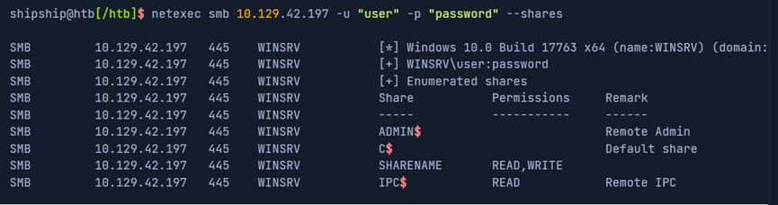

##### e. Smbclient

连接的工具

```sql
smbclient -U user \\\\10.129.42.197\\SHARENAME
```

 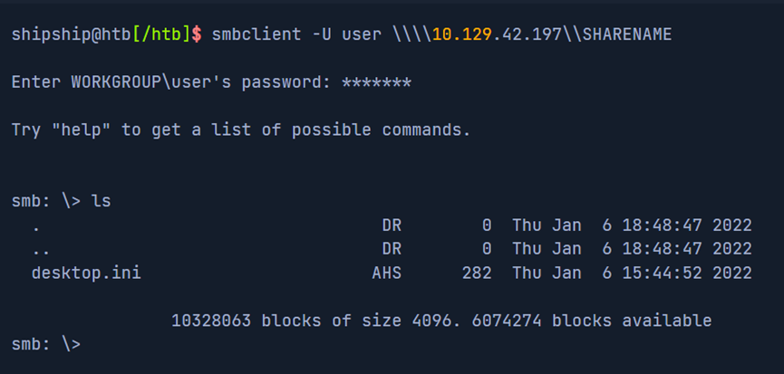

##  **二、Spraying, Stuffing, and Defaults** 

###  **1. Password spraying** 

即用相同的一个密码但是不同的username去bruteforce，应用场景如一个公司系统注册后会有默认密码，如果我们有这个默认密码成功概率会很大。

工具：Web app中常用bp，而AD环境下常用NetExec或Kerbrute

<span style="color:#565a6e">netexec smb</span><span style="color:#485e30">10.100</span><span style="color:#343b58">.</span><span style="color:#485e30">38.0</span><span style="color:#343b58">/</span><span style="color:#485e30">24</span><span style="color:#343b58">-</span><span style="color:#565a6e">u</span><span style="color:#343b58"><</span><span style="color:#565a6e">usernames</span><span style="color:#343b58">.</span><span style="color:#565a6e">list</span><span style="color:#343b58">></span><span style="color:#343b58">-</span><span style="color:#565a6e">p</span><span style="color:#34548a">'ChangeMe123!'</span>


###  **2. Credential stuffing** 

即撞库，因为很多人会重复使用密码。如我们得到一个平台泄露的用户名密码数据库，且以userame:password形式保存，那我们可以直接这样用到另一个平台：


<span style="color:#565a6e">hydra</span><span style="color:#343b58">-</span><span style="color:#565a6e">C user_pass</span><span style="color:#343b58">.</span><span style="color:#565a6e">list ssh</span><span style="color:#343b58">:</span><span style="color:#485e30">//10.100.38.23</span>


###  **3. Default credentials** 

即一些系统包括防火墙等的初始密码，我们有专门的工具： [Default Credentials Cheat Sheet](https://github.com/ihebski/DefaultCreds-cheat-sheet) 。安装后使用：

<span style="color:#565a6e">creds search linksys</span>


 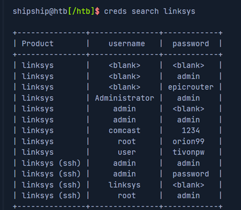

就可以搜索到linksys这个品牌的很多默认账户密码。

除了网上公开的，很多时候手册里也可以找到默认密码

##  **三、Windows Authentication Process** 

Windows的client验证过程包括登录、credential获取、验证这几个模块，各种authentication机制中Kerberos是使用最广泛也最复杂的。LSA(Local Security Authority)是一个受保护的子系统，可以authenticate用户、管理本地登录、监控本地安全的各个方面、为user names与security identifiers（SID）间的转换提供服务。

该安全子系统包括电脑系统上的security policies和accounts，在Domain Controller这些accounts应用在整个domain并存储在AD。此外，LSA子系统提供access control, permission checks, 产生安全授权信息的服务。

###  **1. Windows authentication process diagram** 

本地logon被几个部分处理：WinLogon, LogonUI(user interface), credential提供者, LSA Subsystem Service, 至少一个的authentication packages, SAM(Security Accounts Manager)或者AD。其中Authentication packages在本文中是DLLs(Dynamic-Link Libraries)，如non-domain-joined的login，常用的authentication package是Msv1-0.dll。


WinLogin是受信任的系统，用来管理安全相关的user interactions如：

- Login时启动LogonUI来提示user输入credentials

- 修改密码

- 锁定或解锁worksation（如win+L）

WinLogon 通过COM对象、以DLLs为形态的credential providers获得id和密码。


在logon，它马上启动Logon UI，这时只有WinLogon可以从键盘获得输入，它通过Win32k.sys中的RPC messeages发送。一旦credential provider获得输入，会马上传到LSASS来验证

 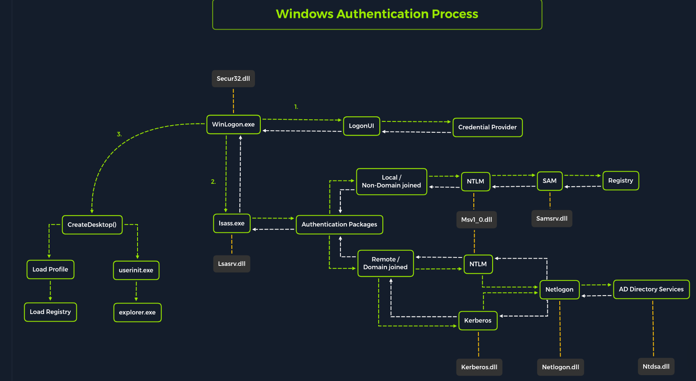

###  **2. LSASS** 

即Local Security Authority Subsystem Service，负责所有authentication，在

<span style="color:#343b58">%</span><span style="color:#34548a">SystemRoot</span><span style="color:#343b58">%</span><span style="color:#565a6e">\System32\Lsass</span><span style="color:#343b58">.</span><span style="color:#565a6e">exe</span>


还负责执行安全policy、发送安全日志到Event Log，LSASS相当于win系统中的门卫。

Authentication包：

- Lsasrv.dll:LSA server，执行安全policy、作为LSA里security package管理者。LSA有决策功能，如判断NTLM或Kerberos协议哪个更合适。

- Msv1_0.dll:仅负责本地machine的authentication而不是custom的

- Samsrv.dll:存储本地安全账户，执行本地存储的policies、提供APIs支持

- Kerberos.dll：用来做基于Kerberos的authentication

- Netlogon.dll：基于网络的logon

- Ntdsa.dll：在windows 注册表中创建新的records和文件夹

每个可交互logon session都会创建独立的 WinLogon instance。GINA(Graphical Identification and Authentication)会被WinLogon load然后接受、处理credentials，然后通过LSALogonUser功能显示authentication页面


###  **3. SAM database** 

存储用户credentials，包括本地和非本地，加密保护，用户密码在注册表中以hash存储，通常是LM或NTLM的hash。SAM文件在

<span style="color:#343b58">%</span><span style="color:#34548a">SystemRoot</span><span style="color:#343b58">%</span><span style="color:#565a6e">\system32\config\SAM</span>


挂载在注册表项HKLM\SAM下，view或access需要SYSTEM级别权限。

Windows安装时系统可通过workgroup或domain来分组。如果通过workgroup，它将在本地使用SAM数据库然后把所有users存储在这个db。然后通过domain，DC(Domain Controller)必须从AD数据库验证credentials，这个数据库在

<span style="color:#343b58">%</span><span style="color:#34548a">SystemRoot</span><span style="color:#343b58">%</span><span style="color:#565a6e">\ntds</span><span style="color:#343b58">.</span><span style="color:#565a6e">dit</span>


为了抵挡对SAM数据库的离线crack，微软在Windwos NT 4.0中引入了SYSKEY(syskey.exe)。该功能启动后，SYSKEY会加密部分SAM文件，保证所有本地用户的密码hashes都被系统生成的key加密。


###  **4. Credential Manager** 

 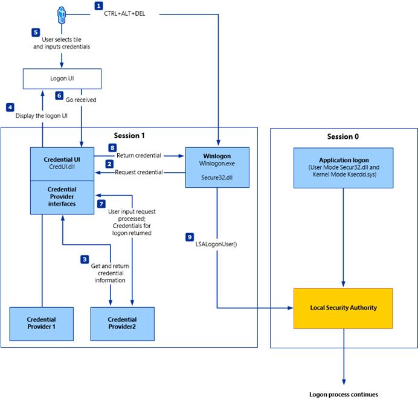

Credential Manager是windows内置的功能，如用户存储、管理credentials来访问各种资源，这些credentials保存在用户的Credential Locker，位置在

<span style="color:#565a6e">C</span><span style="color:#343b58">:</span><span style="color:#565a6e">\Users\[</span><span style="color:#34548a">Username</span><span style="color:#343b58">]</span><span style="color:#565a6e">\AppData\Local\Microsoft\[</span><span style="color:#34548a">Vault</span><span style="color:#343b58">/</span><span style="color:#34548a">Credentials</span><span style="color:#343b58">]</span><span style="color:#565a6e">\</span>


###  **5. NTDS** 

Windows系统加入一个domain是很常见的，这可以简化管理，让administrators高效管理组织，这时logon requests会被传到同一个AD 树下的DC(Domain Controller)。而每个DC有一个文件叫NTDS.dit，用来通过RODCs(Read-Only Domain Controllers)同步所有DC。


NTDS.dit是存储AD数据的数据库文件，至少包括：

- 用户account(账户&密码 hash)

- Group 账户

- 计算机账户

- 组policy 对象

大纲：
 

（有问题随时在评论区或私信留言，两天内回复）

下一篇： [htb academy笔记-module-Password Attacks（四）](https://blog.csdn.net/weixin_51439723/article/details/154847678) 