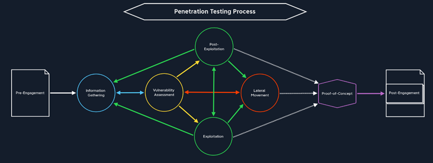
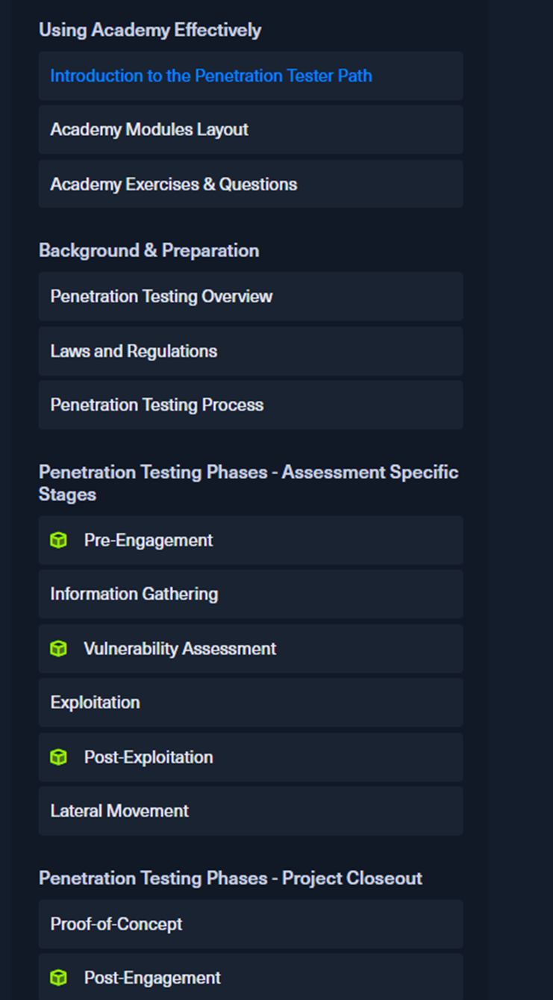

# htb academy笔记-module-Penetration Testing Process（一）

> 原创 已于 2025-08-29 14:53:08 修改 · 436 阅读 · 18 · 5 · CC 4.0 BY-SA版权 版权声明：本文为博主原创文章，遵循 CC 4.0 BY-SA 版权协议，转载请附上原文出处链接和本声明。
> 文章链接：https://blog.csdn.net/weixin_51439723/article/details/150986017

## 一、Introduction to the Penetration Tester Path

该module是大纲性质，后面的module学完后可再回来看，利于理解整个Penetration Tester
path。
内容大体包括External Penetration Tests, Internal Penetration Tests (both network and Active Directory)和 Web Application Security Assessments。每个module深入到能做好pentest的特定techniques, methodologies和tools。

#### 1. HTB Academy Learning Philosophy

鼓励我们建立自己的体系，这个体系可复用、能应用到任何测试类型、任何environment或industry。我们在无数个实例中、每个module中的skills assessments中去加强理解这些概念并形成操作的肌肉记忆。如果可以把基础的步骤做好，就可以进一步深挖。后面module展示的漏洞或misconfiguration会讨论背后的flaw，这样帮助理解how things wrok, 为什么某个工具会失效并提供client适合他们环境和risk appetite的更精确补救建议。

#### 2. Ethical and Legal Considerations

公共信息搜集是合法的如public DB和搜索引擎，但是prob公司的外部infra不可以。其他更主动的扫描、测试就都是非法的

①以后我们可能会去src平台，到时候要注意大部分项目不能自动扫描，刚好可以锻炼手动的信息搜集和测试能力。

②但是要注意委托公司的合法性，因为有较小的可能不法分子做伪装让人来攻击目标，最后就算你不知情也是犯罪。所以要确保有书面signed文件并写着测试scope包括URLs, individual IP addresses, CIDR network ranges, wireless SSIDs, facilities for a physical assessment, or lists of email or phone numbers for social engineering engagements。
③测试时要一直在scope内，就算看到了其他更有意思的ip或子域名。如果有疑问，找人问，因为也有可能client忘记把有些域名或ip放进scope了。但是注意，client需书面确认后续加的确实是他们的资产，不能只是打个电话。
④使用一些工具或PoC前要思考其造成的破坏，如果不能确定则需要问相关人员，

## 二、Academy Modules Layout

 

#### 1. Pre-Engagement

pre-engagement就是书面确认主要的commitments, tasks, scope, limitations和相关的协议，该阶段根据accessment类型client和我们交换上述信息。

#### 2. Information Gathering

Time, patience和personal commitment 在该阶段都非常重要，一些人为了节省时间会跳过直接exploit，但又发现需要回过头来做信息搜集，这样会浪费更多时间，我们应该避免

#### 3. Vulnerability Assessment

该阶段分为两块，一是扫描公开漏洞，但要注意漏洞库的日期和全面性；二是分析可能的未公开漏洞。分析时更强调的是thinking outside the box，我们要想办法找出gaps和opportunities来绕过系统/应用的预期功能，以此获得非预期的access或权限，这需要creativity以及扎实的相关基础知识，同时也要把搜集到的信息理解并联系起来。

#### 3.5 next step

根据情况下一步有四种选择：
①	Exploitation
还没有权限访问系统或app时，以及有至少一个gap可以尝试exploit
②	Post-Exploitation
一般是提权，此时一定程度上可以访问并和系统交互
③	Lateral Movement
通过exploited的系统来攻击其他系统，是否需要提权取决于现在的权限能不能访问其他系统或网络
④	Information Gathering
没有足够信息时，需要再次搜集

分析能力需要多年的经验，但是同时也需要训练才能培养。因为优秀的分析能力可以关联起不同的points和info，将目标网络/系统的信息和我们的经验结合往往可以识别出特定的pattern。就像看书一样，当一个词词见得足够多时扫一眼就知道什么意思

#### 4. Exploitation

Exploitation就是使用前面搜集到的信息和可能的漏洞来攻击系统/app，可以这么做的原因是，比如很多时候同一个app被不同公司使用在不同场景，然后改变一些config。

这个阶段综合性很强，可以分为两部分。
①	常用的网络协议，对潜在或存在漏洞的利用基于不同的网络协议，并且我们需要构建一个现在网络的框架来理解其各个组件。而一般来说web server和app里有非常多有用的信息，所以它很重要。同时因为一些公开的services可能有能充分利用的mis config或公开漏洞，所以也需要注意这一块。最后，系统的users也在整个网络中扮演重要角色。
②	Web exploitation
很多web app里不同的技术、优化、功能等在过去这些年不断发展，所以一个web app里经常会有很多不同的组件，比如需要不同语法交互的数据库。 因为不同公司的网页里组件繁多且不太一样，所以这些需要分开专门研究。web app有着巨大的攻击面且通常可以被外部pen tester访问，所以强大的web enumeration和利用功能是至关重要的

#### 4.5 next step

①	info gathering
一旦可以访问target不论权限多高、后面需要做的是提权、横向移动还是拉数据，我们都需要信息搜集，然后是漏洞评估。

②	 post-exploitation
主要是未取得最高权限时的越权行为，因为一般权限越高能做的操作越多。具体的步骤同样是信息搜集、漏洞评估、利用和侧信道攻击，区别是从内部开始这些步骤。当然有时会直接开始post-exploitation，只是比较少见。如果已经获得最高权限，那么要进一步攻击的话需要再从信息搜集开始。
③	 Lateral Movement
如果取得了dual-homed系统中其中一个网络的最高权限，当然可以直接用这个host来攻击其他hosts

④	Proof-of-Concept
获得一个系统的最高权限后我们就可以做这最后一步了，当然也不一定需要我们接管所有大大小小的系统。但是比如，若在 Active Directory里获得了Domain Admin的权限，我们几乎可以做任何事情。这样我们就可以把前面的过程整理好，最好做自动化实现脚本最后提交给管technical department

#### 5. Post-Exploitation

一般来说利用某个service来获取访问时不会是最高权限，因为service通常以某种隔离的方式配置以此防止攻击，那我们下一步就是绕过这个限制。当然这并不容易，在深入学习os的功能后，我们还要把我们的技术适配到对应的os然后再仔细研究linux和windows的提权。

能访问一个系统后我们一定要尝试更进一步，实战时客户也会经常想了解attacker可以在他们的网络里走多远。系统有不同的版本，如windows XP, 7, 8, 10, 11和windows server 2008, 2012, 2016, 2019；linux也有很多不同的发行版如Ubuntu, Debian, Parrot OS, Arch, Deepin, Redhat, Pop! OS等。不管我们进去的是哪个，我们都要理清情况然后试着理解内部的weak point。

#### 5.5 next step

①	Information Gathering / Pillaging
提权前需要先对目标系统内部工作原理有了解，毕竟我们还不知道系统里有什么用户、我们能做什么。该步骤也叫Pillaging，必须且关键，而后自然又会进入漏洞评估阶段。

②	Exploitation
假设我们已经找到了系统的敏感信息，那我们可以用来exploit有更高权限的本地app或services。

③	Lateral Movement
和上文的情况一样

④	Proof-of-Concept
和上文的情况一样

#### 6. Lateral Movement

横向移动是在corporate网络中移动的重要动作，这样可以链接其其他内部hosts然后进一步在子网或网络中的另一部分里提权。但是像Pillaging一样，横向移动需要能访问corporate网络中的一个系统。而之后的exploitation阶段，前面的系统的权限很多时候没有那么重要，因为没有administator的权限也可以在网络中移动

#### 6.5 next step

①	Vulnerability Assessment
如果pen test未完成那可以直接跳到这个步骤，前面pillaging获得的信息可以用来访问有认证机制的services或app，然后我们再exploit。

②	Information Gathering / Pillaging
成功横行移动后也可以再次pillaging，即在目标系统上搜集local info

③	Proof-of-Concept
上述步骤完成后可以总结验证漏洞，如果可以的话实现自动化

#### 7. Proof-Of-Concept

POC即验证漏洞是否真的存在。
我们给管理员提交检测报告后，他们会复现漏洞来验证，毕竟没有管理员会在不验证漏洞就改变程序代码。因为大系统里可能会涉及到很多组件和依赖，在修复即程序修改后都需要功能测试、且让其他正常的功能是不受影响，这些事费钱费力。所以他们需要验证该漏洞确实存在才会做相应的修复。所以POC是高质量pen test报告的重要部分

#### 7.5 Next step

Post-Engagement
这是唯一next step步骤，即改善我们的文档

#### 8. Post-Engagement

这个阶段也包括清理痕迹，如前面我们可能会留一个无需验证可直接访问的shell以方便操作，但是记得最后要删掉。所以要删除所有痕迹让它和我们测试前一样。我们也要报告最后附上标注系统的变化、 成功的exploitation attempts、拿到的credentials和上传的文件，这样客户可以对着alerts check，知道是我们的测试而不是真的入侵者。

同时，也需要在文档里整理好笔记，以确保不会漏掉任何步骤，任何给出清晰的报告。

## 三、

大纲：
 

（有问题随时在评论区或私信留言，两天内回复）