# htb academy笔记-module-Using Web Proxies（一）

> 原创 于 2025-04-11 15:46:43 发布 · 1.2k 阅读 · 28 · 13 · CC 4.0 BY-SA版权 版权声明：本文为博主原创文章，遵循 CC 4.0 BY-SA 版权协议，转载请附上原文出处链接和本声明。
> 文章链接：https://blog.csdn.net/weixin_51439723/article/details/147144268

上一篇：
[htb academy笔记-module-Introduction to Web Applications（五）](https://blog.csdn.net/weixin_51439723/article/details/146306834) 

## 一、Intro to Web Proxies

web app和mobile都需要实时交互数据，测试requeststo server成了它们pen test的主题。所以需要使用Web Proxies

#### 1. What Are Web Proxies

Web Proxies主要工作在80或443端口，当然也可以是其他端口。

#### 2. Uses of Web Proxies

主要功能：
· vulnerability scanning
· webfuzzing
· web crawling(爬虫)
· web app mapping
· request analysis
· config testing
· code reviews

以下是两个最常用工具

#### 3.BurpSuite

专业版独有的功能：
· Active web app scanner
· Intruder的高速模式
· 一些拓展

#### 4. OWASP Zed Attack Proxy (ZAP)

由OWASP开发维护的免费开源工具，也用于web的pentest，近来发展迅猛。

## 二、Setting Up

省略

## 三、Proxy Setup

#### 1. Pre-Configured Browser

两个工具中都有内置浏览器，可以直接使用
① burp中…
② ZAP中在这：
 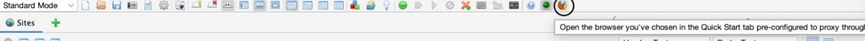

#### 2. Proxy Setup

若在正常浏览器中使用，需设置。
如firefox，在设置proxy，把listening port设为8080（burp和ZAP默认都是这个）。如果要设置其他端口，在burp中是Proxy>Options，ZAP中是Tools>Options>Local Proxies。

#### 3. 拓展

火狐中的 Foxy Proxy 拓展可以更方便地切换proxy：
 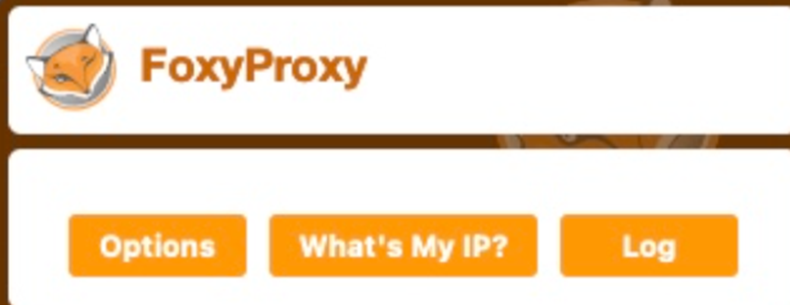

点击options，然后设置：
 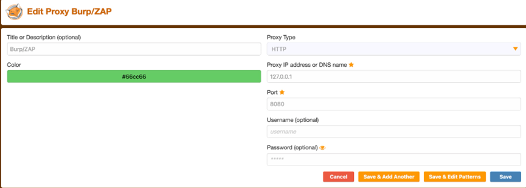

最后就可以快速切换：
 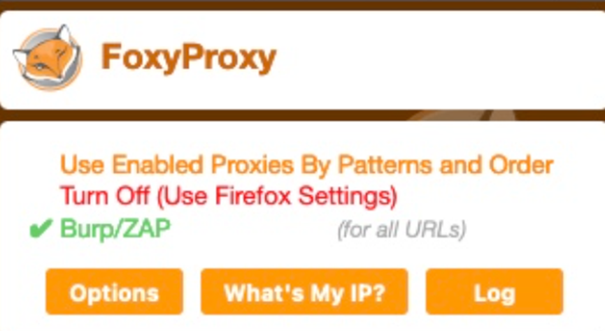

#### 4.CA Certificate

最后重要的一步是安装proxy的CA Certificate，相当于让所有的traffic信任proxy。如果不安装，一些httpstraffic可能无法拦截或者每次发送https request时都需要手动点击accept按钮。

使用burp proxy的时候在浏览器输入http://burp即使下载其证书；而ZAP的证书在Tools>Options>Dynamic SSL Certificate，然后点save，或者点generate生成一个新的。

最后再firefox导入证书：
先view certificates:
 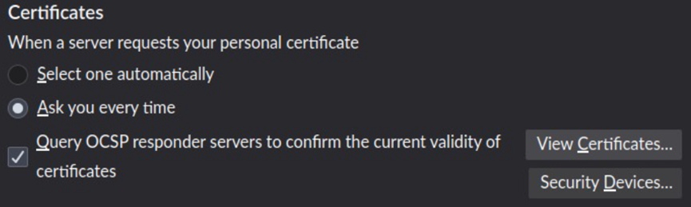

然后在Authorities点Import：
 

最后勾选下列两个options：
 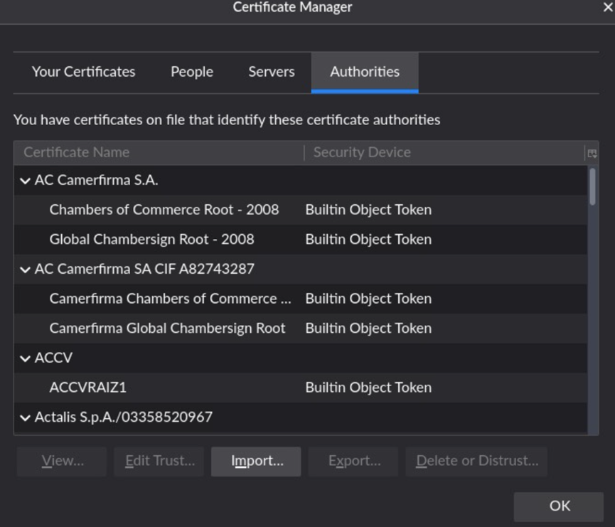

完成

## 四、Intercepting Web Requests

#### 1. Intercepting Requests

①
ZAPinterception开关在这：
 

绿色表示流量正常通行不拦截，或者用shortcut: [CTRL+B]，默认不开启拦截

② Heads Up Display (HUD)
ZAP的一个可以在内置浏览器插入不同button的功能，开关如下：
 

开启后内置浏览器如下：
 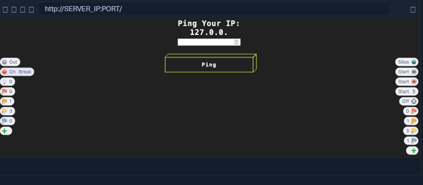

左边第二个是interception开关，开启后刷新网页：
 

可以直接显示traffic并修改，其中Step只发送当前request然后返回response，而Continue发送所有的requests，可根据不同需求使用

注：第一次使用内置浏览器会有HUD tutorial，如果没有可以在右下角的configuration里选"Take the HUD tutorial"

## 五、Intercepting Responses

一些情况需要在response抵达浏览器前拦截，可能可以显示隐藏的字段。
以这个网页为例：
 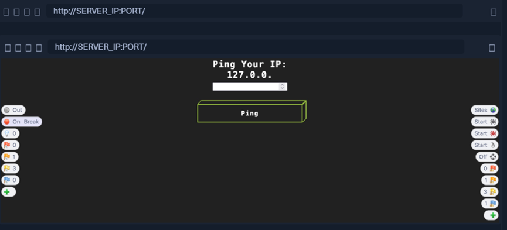

框里只能输入数字，但是拦截response并修改允许的数据类型，可能可以输入我们的payload

#### 1. Burp

在Proxy>Options下的Intercept Server Responses勾选Intercept Response：
 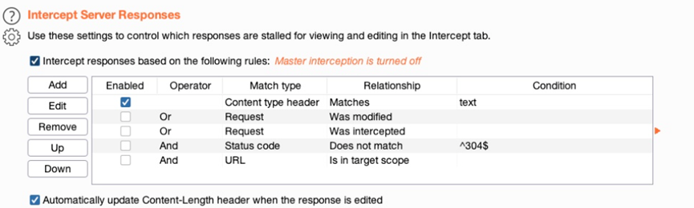

然后刷新，在forward拦截的request后可以看到拦截的response：
 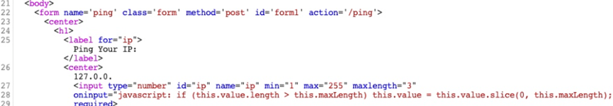

这里我们尝试把27行的type="number"修改成type="text"即可，同时也可以把maxlength="3"修改成maxlength=“100”：
 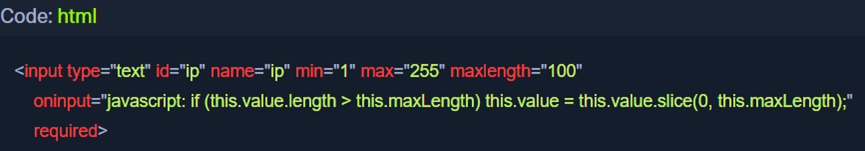

然后点forward，即可输入：
 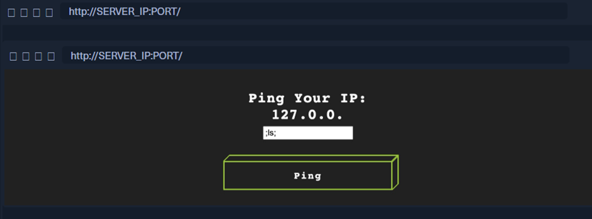

不止如此，也可能照此启动别禁用的html buttons

#### 2. ZAP

①在以下页面：
 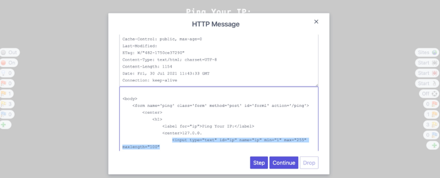

点step后就会拦截response并编辑

②除此，HUD左侧第三个按钮，可以不需要拦截response，一键启动被禁用的或者显示隐藏的 输入字段
如：
 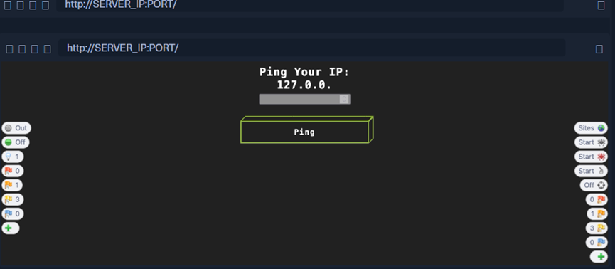

不能输入
这时候我们点Show/Enable即可：
 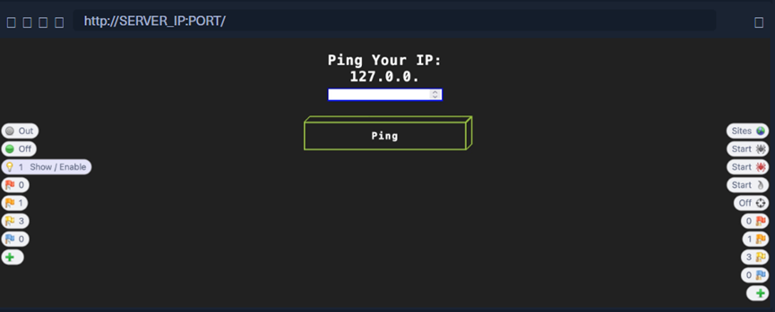

注：Burp也有类似功能，在Proxy>Options>Response Modification，然后选择一个选项如Unhide hidden form fields.
③ HUD的Comments 功能
一键在页面显示源码的注释
可以点左下角的+号加上这个功能：
 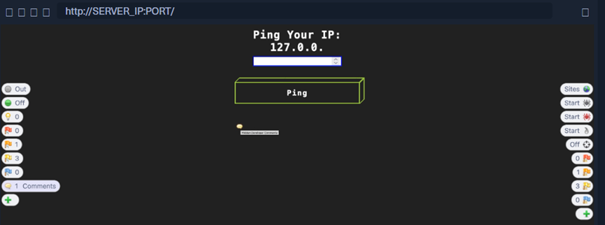

从response改变page的外观有些时候让我们做pen test更便捷，而不是只能在拦截的request里修改

module大纲：
 

（有问题随时在评论区或私信留言，两天内回复）