# htb academy笔记-module-Using Web Proxies（二）

> 原创 已于 2025-06-17 09:40:53 修改 · 公开 · 1.1k 阅读 · 12 · 24 · CC 4.0 BY-SA版权 版权声明：本文为博主原创文章，遵循 CC 4.0 BY-SA 版权协议，转载请附上原文出处链接和本声明。
> 文章链接：https://blog.csdn.net/weixin_51439723/article/details/147557820

上一篇：
[htb academy笔记-module-Using Web Proxies（一）](https://blog.csdn.net/weixin_51439723/article/details/147144268) 

## 一、Automatic Modification

#### 1. AutomaticRequestModification

这里用User-Agent举例，假设服务器会检测它的值，我们需要批量将其修改
①BurpMatch and Replace
在Proxy>Options>Match and Replace里点Add，然后如下设置：
 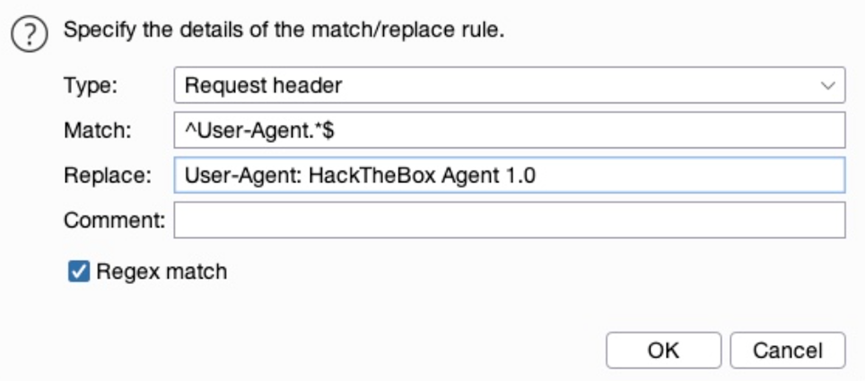

其中：
Type:Request header是我们想在header而不是body里修改
Match: ^User-Agent.*$是正则表达式（regex），代表含有User-Agent的那一行
Replace: User-Agent: HackTheBox Agent 1.0为替换上面匹配到那行的值
Regex match: True 表示启用正则
最后点ok，后面request里的UA就会替换成我们想要的
 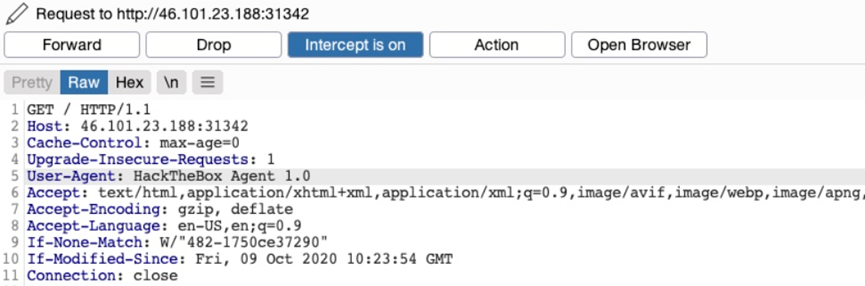

#### 2. ZAP Replacer

点replacer模块或者快捷键[CTRL+R]:
 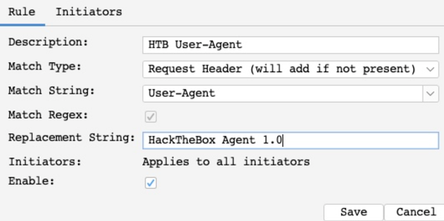

大部分与上述类似，但
Match String: User-Agent.这里可以选择具体的header
而且还有initiator（粗糙翻译是：起爆器）的功能，在其他窗口的tab上可以打开，功能是设置在哪应用这个replace，默认是所有
 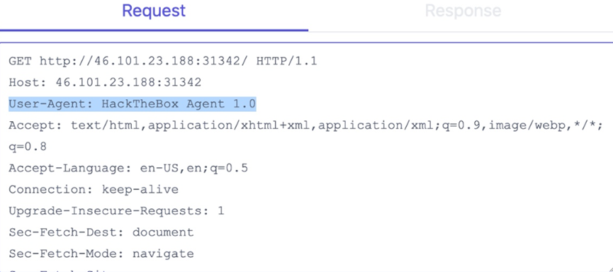

#### 3. Automatic Response Modification

应用场景：如我们需要修改response但是每次refresh之后都会回到原来状态
Response操作同理
这里用上篇ip字段不能输入的页面举例：
 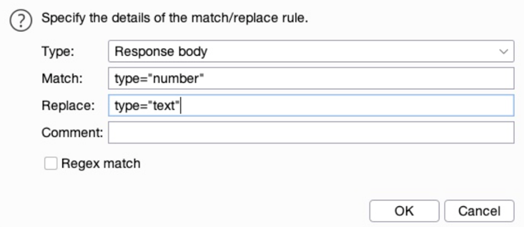

然后对于以下页面：
 

就算刷新也一直可以输入

## 二、Repeating Requests

#### 1. Proxy History

在HUD有个History pane或ZAP的主页面里也有这个选项：
 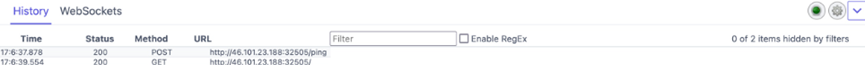

注：WebSockets是关于连接的一些流量，在advanced pen test里很有用，本module暂不涉及

在该模块中Burp可以看原始(应该是有个Original Request)和修改后的request，而ZAP只能看修改后的request

#### 2. Repeating Requests

① Burp：
[CTRL+R]：可以发送消息去repeater，
[CTRL+SHIFT+R]：可以直接打开repeater
注：可右键消息然后Change Request Method改变http method为POST/GET，这样比手写方便
② ZAP
· 主页面
选中request后右键再Open/Resend with Request Editor：
 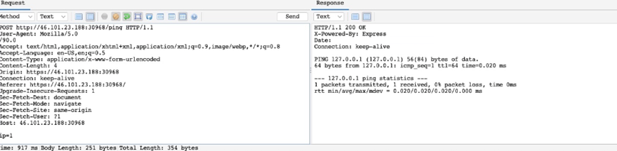

可以看到也有method button来修改http method
注：默认request和response在不同tabs，要像上述图片这样需要选相同的display options
· HUD
在History button定位具体的request，点击然后会显示 Request Editor：
 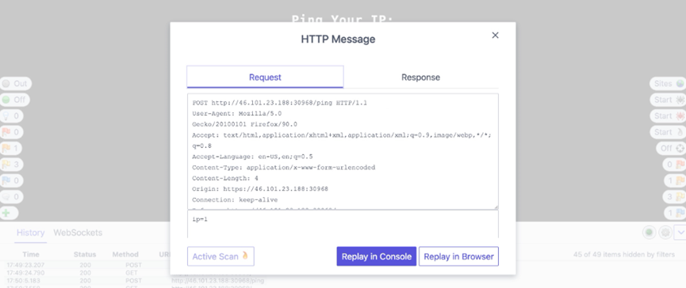

Replay in Console可让response在该窗口，或Replay in Browser让response在浏览器显示

## 三、Encoding/Decoding

#### 1. URL Encoding

① 一些若未encoding引起不好后果的关键字符：
Spaces：会标明是request数据的结束
&：会被interpreted为parameter delimiter（参数定义符）
#：会被interpreted为fragment identifier（片段标识符）
② Burp选中text然后右键Convert Selection>URL>URL encode key characters，或者快捷键 [CTRL+U]，同时可以在type的时候启动这个选项然后type的时候会encode。
③ ZAP会自动在发送前后台url-encode所有数据
④ 还有其他种类的url-encoding如Full URL-Encoding或Unicode URL encoding

#### 2. Decoding

以下是其他编码方式：
• HTML
• Unicode
• Base64
• ASCII hex
① burp完整的encoder在Decoder tab：
 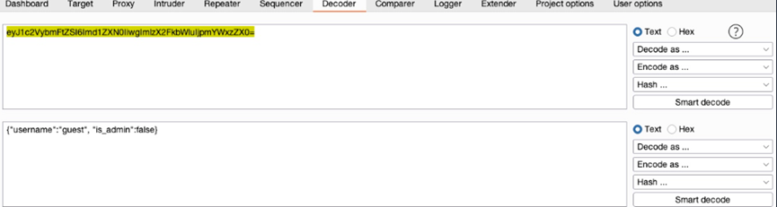

较新版本的Burp里有Inspector 工具可以编码解码，在Proxy 和Repeater里面会有：

 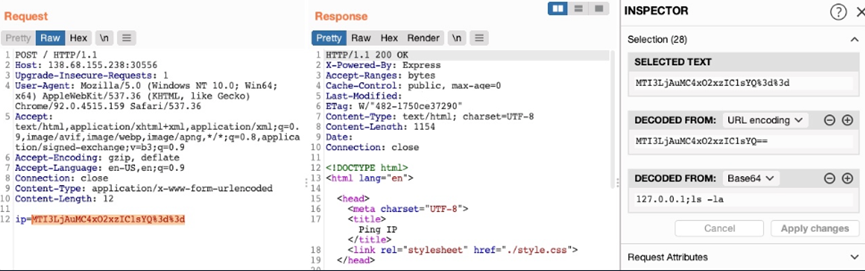

② ZAP里通过快捷键 [CTRL+E]来使用Encoder/Decoder/Hash工具，

在ZAP使用的Encoder/Decoder/Hash可以自动解码：
 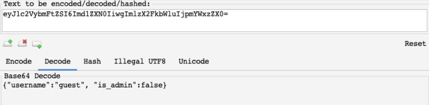

注：在 “Add New Tab” button可以在Encoder/Decoder/Hash里添加定制tabs，以此加入不同类型的encoder/decoder

#### 3. Encoding

上述解码后的值是
{“username”:“guest”, “is_admin”:false}
若这是cookie值，那么我们可以把guest改成admin，把false改成true，然后用相同的方式编码：
 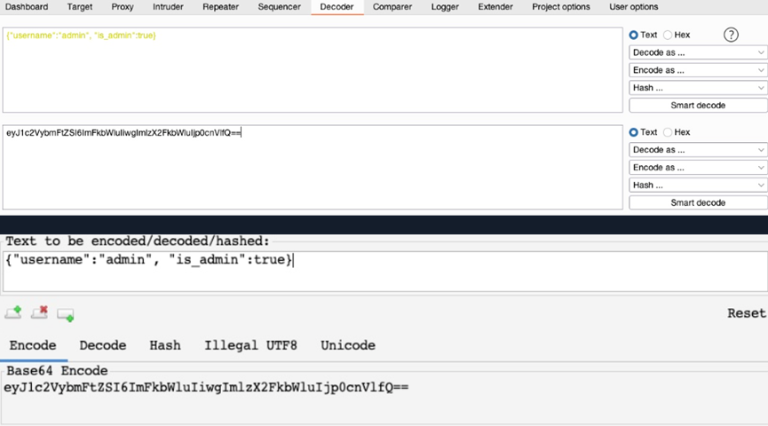

这样可能会以admin的身份通过认证
注：Burp Decoder的output可以直接被另一个encoder编码/解码，在底部的output pane选一个新的encoder method即可。而ZAP需要手动copy

## 四、Proxying Tools

很多时候需要用Web proxies拦截不同工具的traffic并观察利用它们，小到命令行大到复杂的client app。下面介绍如何配置然后开始

注：代理工具通常会使得traffic正常运行变慢，所以只在需要的时候使用

#### 1. Proxychains

Linux里的proxychain可以toute所有命令行工具的traffic到指定的proxy，它给所有命令行工具加一个proxy。

先编辑 /etc/proxychains.conf，注释掉第一行，然后添加下面两行：
 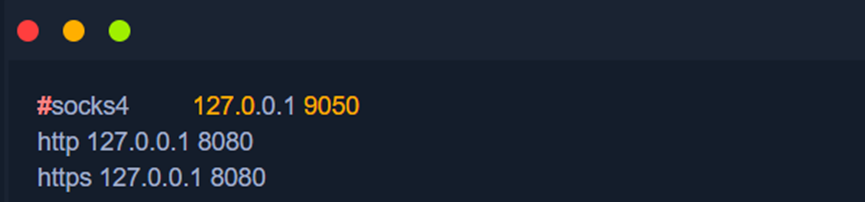

同时也可以去掉quiet_mode的注释，启动Quiet Mode以减少noise。
用curl举例，我们在正常的命令前加上proxychains即可：
 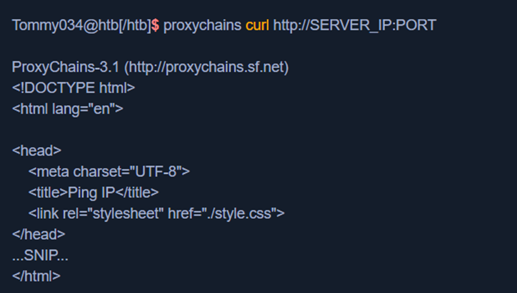

唯一的区别是会多一行ProxyChains-3.1xxx，然后其traffic就到proxy里了：
 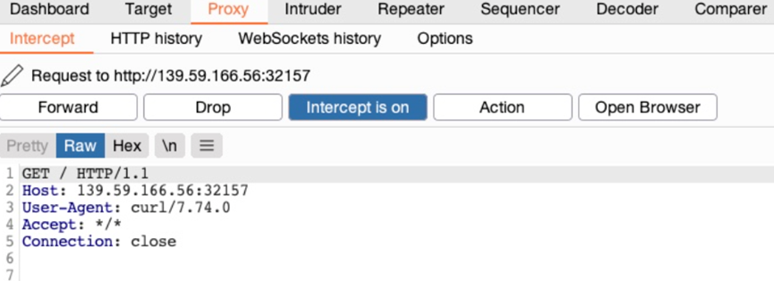

#### 2. Nmap

可以在manual里搜：
 

其中管道符|把前面的输出当中后面的输入，grep是搜索文本的工具，-i表示insensitive case，然后prox是要搜索的文本
举例：
 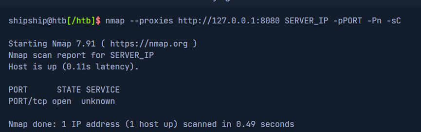

然后就可以在proxy里看到traffic：
 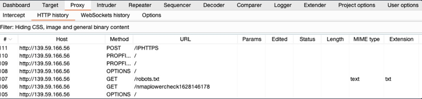

注：nmap手册里有说过它自带的proxy功能有欠缺，所以最好还是用proxychains

#### 3. Metasploit

这里以robots_txt scanner举例：
 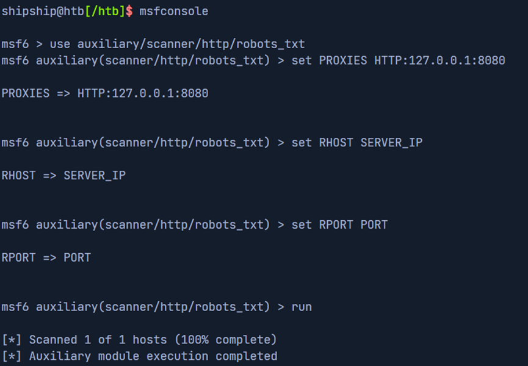

然后可以在proxy里看到：
 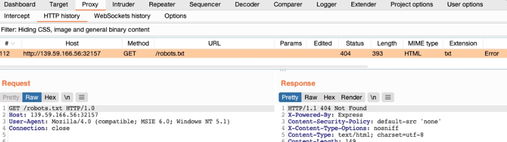

其他scanners, exploits, and other features也可以这样

## 五、Burp Intruder

Burp和ZAP最重要的两个功能是web fuzzers和web scanners，它们可以做fuzz, enumeration和brute-force，也可以用命令行工具代替如ffuf, dirbuster, gobuster, wfuzz等。

Burp的fuzzer叫Burp Inturder，可以fuzz pages, directories, sub-domains, pararmeters, parameters values等，且比大部分命令行工具好用。但是社区版只能单线程非常慢，不像命令行的速度可以10k request per second，专业版就没有限制。

以下讲Burp Intruder的web fuzzing和enumeration

#### 1. Target

可以右键选择Send to Intruder或用快捷键[CTRL+I]，然后通过点击Intruder 或者快捷键[CTRL+SHIFT+I]来到该模块：
 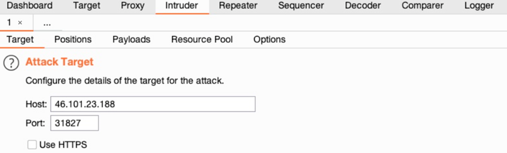

然后在target看到details：
 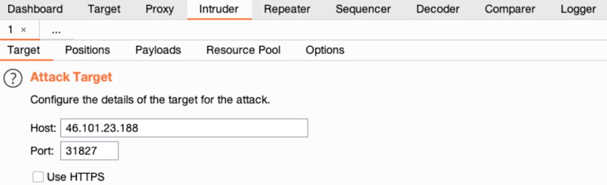

#### 2. Positions

 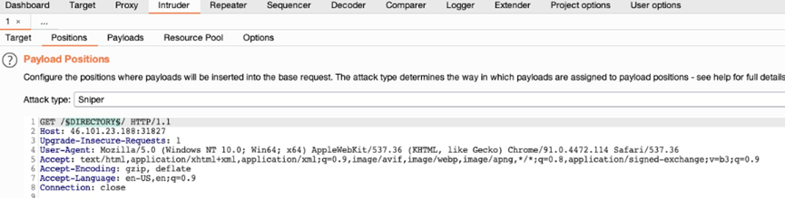

Attack type里第一个Sniper是单点，即像图片里这样只设置一个position。查看更多type可点击窗口上方的?
注：request最下面要有多于两行的空格，不然会报错

#### 3. Payloads

有四个地方需要设置：PayloadSets, Payload Options, Payload Processing, Payload Encoding
① Payload Sets
 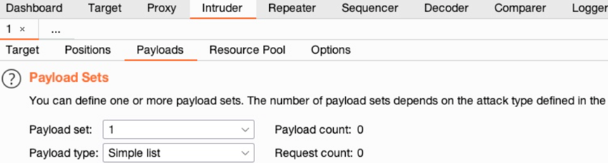

这里我们使用Sniper所以只需要一个Payload Sets，若attack type是Cluster Bomb则需要多个Payload Sets对应每个position。

然后是 Payload Type，这里介绍常用的：
· Simple List：基础，便利每一行
· Runtime file：和Simple List的区别是逐行加载，避免一次加载过多占用内存太大；wordlist过大时可以用这个
· Character Substitutio：可以指定characters 和对应replacements的list，然后Burp尝试所有可能的排列
其他的type可点击?查看
② Payload Options
若是Simple List，则需要创建或者导入wordlist：
 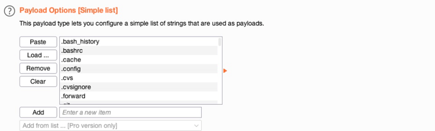

这时候如果继续导入文件或者手动输入，新加的数据会加在这个list后面。
Burp Pro的 Add from list里内置有list
③ Payload Processing
可以修改fuzz的规则，如在payload后面加extension、筛选wordlist等。
 

上述wordlist中遇到.开头就会跳过
然后启用：
 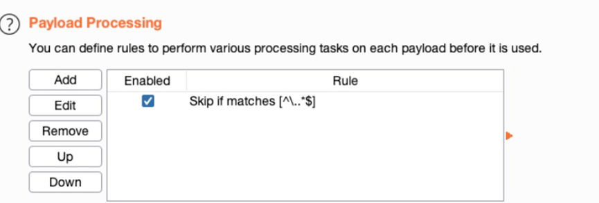

④ Payload Encoding
一般是启用的：
 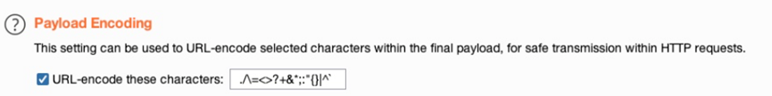

#### 4. Options

① 可以customize attack，如attack失败后retry的次数、retry前pause的次数等。
② Grep – Match：可以flag response，比如我们需要状态码是200的response：
 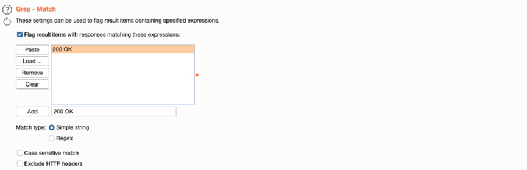

上图也禁用了Exclude HTTP Headers，这样可以在 http headers里查看信息
③ Grep – Extract：response比较长时选取特定的字段来显示
注：Resource Pool可以指定Intruder使用多少network resources，对大型attacks很有用，在我们的例子中默认值就可以了。其他信息同样可以点击旁边的?查看

#### 5. Attack

在社区版attack比较慢，结果中可以点击‘200 OK’这列来筛选
 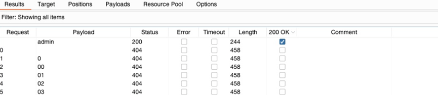

从结果中看到，payload是admin时为200的response code，然后我们可以手动登录确认。

类似的，可以用此方法做任何web fuzzing和brute-forcing，如针对password的brute-forcing、对特定php parameters的fuzzing等。还可以用Intruder做对使用 Active Directory (AD) authentication 的app的password spraying，这些authentication 包括 Outlook Web Access (OWA), SSL VPN portals, Remote Desktop Services (RDS), Citrix, custom web applications等。

但是Burp社区版没那么好用，下一section用ZAP举例

module大纲：
 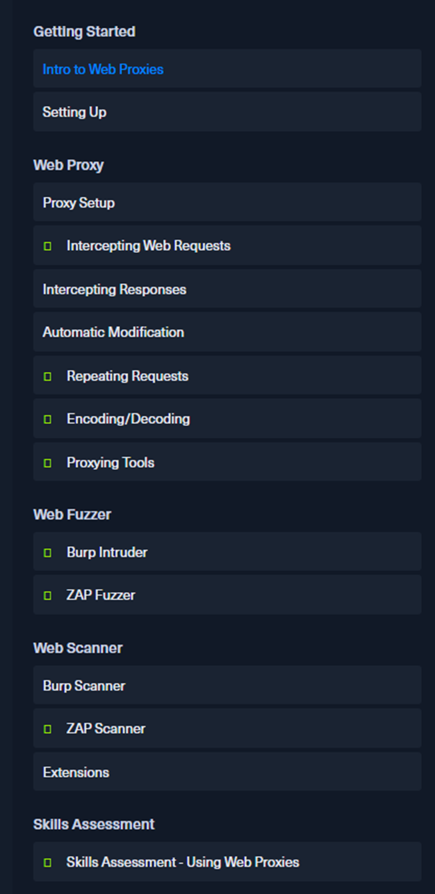

（有问题随时在评论区或私信留言，两天内回复）

下一篇：
[htb academy笔记-module-Using Web Proxies（三）](https://blog.csdn.net/weixin_51439723/article/details/148469811) 