# htb academy笔记-module-Using Web Proxies（三）

> 原创 于 2025-06-17 09:40:03 发布 · 公开 · 719 阅读 · 27 · 13 · CC 4.0 BY-SA版权 版权声明：本文为博主原创文章，遵循 CC 4.0 BY-SA 版权协议，转载请附上原文出处链接和本声明。
> 文章链接：https://blog.csdn.net/weixin_51439723/article/details/148469811

上一篇：
[htb academy笔记-module-Using Web Proxies（二）](https://blog.csdn.net/weixin_51439723/article/details/147557820) 

## 一、ZAPFuzzer

和bp相比少了一些功能，但是不像社区版bp限制速度
这节的fuzzer和bp做对比

#### 1. Fuzz

以fuzz目录为例，我们访问

```c
http://SERVER_IP:PORT/test/
```

并替换里面的 test
对request右键，然后Attack>Fuzz，就会打开fuzzer窗口：
 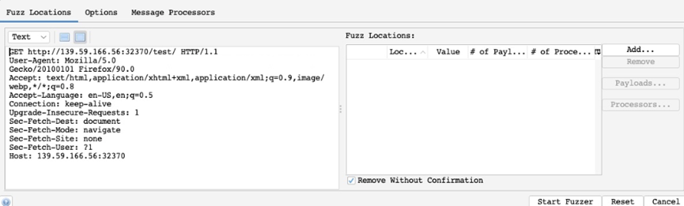

主要需要配置的options是：
• Fuzz Location
• Payloads
• Processors
• Options

#### 2. Locations

类似bp里的position，在fuzz里的操作是选中要fuzz的值如test然后点击右边的Add：
 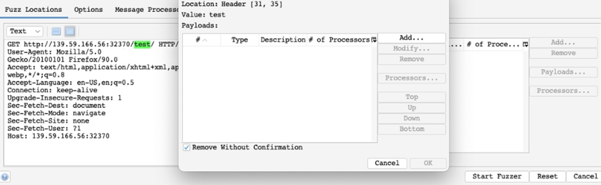

可以看到test变绿了而且出现payloads窗口

#### 3. Payloads

点击Add来添加payloads并选择类型，以下是常见类型：
File: 上传文件
File Fuzzers：从内置list里面选择（ZAP的特点，且可从ZAP Marketplace下载）
Numberzz：以指定方式生成数字队列
如用File Fuzzers然后从dirbuster选择第一个wordlist：
 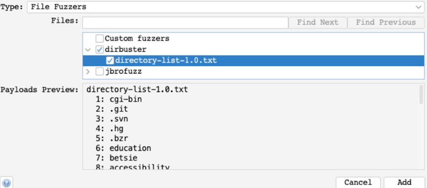

然后点Add

#### 4. Processors

有时候需要对list做一些操作，以下是常见的processors ：
• Base64 Decode/Encode
• MD5 Hash
• Postfix String
• Prefix String
• SHA-1/256/512 Hash
• URL Decode/Encode
• Script
可以选择不同类型，如通过做定制化的前缀或后缀，或用script来定义等等
这里以URL Encode为例，可以点击 Generate Preview来查看预览：
 

#### 5. Options

① 和bp类似，如 Concurrent threads per scan to 20，加快扫描：
 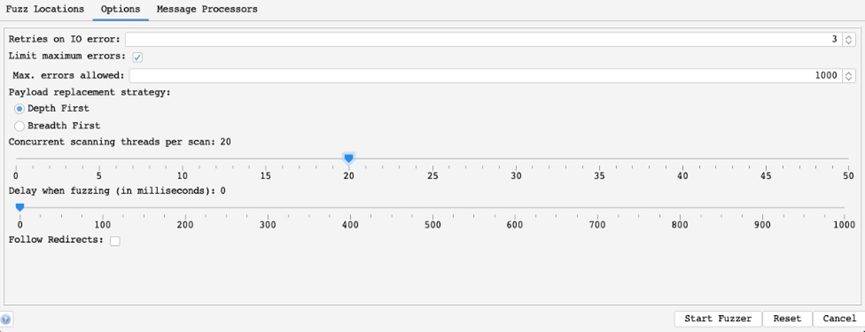

线程的数量可能被电脑的处理能力或服务器允许的连接所限制
②
若选 Depth first,选项，会先把前一个position用所有payloads攻击才会移动到下一个position；Breadth first则相反

#### 6. Start

点击Start Fuzzer开始攻击，可以从结果中根据response code, Size Resp. Body(即respose body的大小)来排序并选择需要的response。

## 二、BurpScanner

即web scanner
在bp里叫Burp Scanner，能扫描各种web漏洞，用Crawler（爬虫）来建设web架构，用scanner来被动、主动扫描

#### 1. Target Scope

扫描有三种方式：
· 在history里的特定request
· 在一系列targets里开始新的scan
· 在范围内的项目(on items in-scope)
① 对于第一种，右键然后点scan区配置，或者点Passive/Active Scan以默认设置开始扫描：
 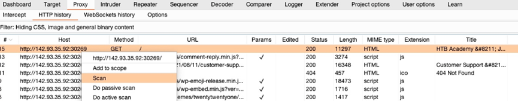

② 也可以在Dashboard里点New Scan来对一系列targets配置新的扫描。
③ scope
Target Scope 可以自定义target然后在所有burp功能里去使用，也可以在只保存scope里的资源
在Target>Site map可以显示所有通过proxy的directories和files，在这里选中然后右键并Add to scope：
 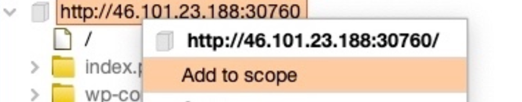

注：添加第一个item到scope时，可以勾选将功能限制在scope里，忽略scope外的所有items
也可以排除一些items如危险或可能结束session（如注销功能），可以右键in-scope item然后选 Remove from scope。最后也可以在Target>Scope查看详情、用正则来添加/排除：
 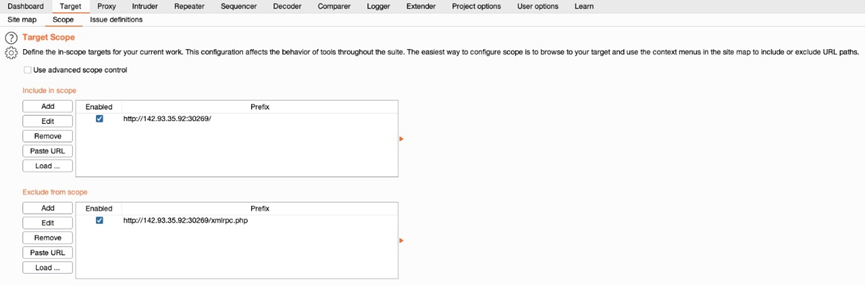

#### 2. Crawler

Scope设好后，在dashboard点New Scan来配置，这些会自动应用在scope里：
 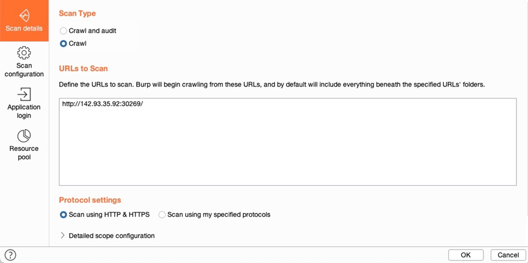

① 有两个选项，Crawl and Audit 和Crawl。
Crawl指的是access所有在pages里有的links、forms，且测试这些requests来bulid一个综合的map of website。最后显示a map of target，能看到所有可访问的数据。
如果选择Crawl and Audit，则是Crawl后再运行scanner
注：Crawl scan只map指定页面的links和这些links对应的页面，不会做fuzz scan来发现未提到的pages。如果需要做这种dirbuster 或ffuf ，可以用Burp Intruder 或Content Discovery
② 这里选用Crawl 如何点Scan configuration。
点new来新建custom config如crawl速度和限制、是否尝试登录forms等。方便起见也可以选择预设好的Select from library：
 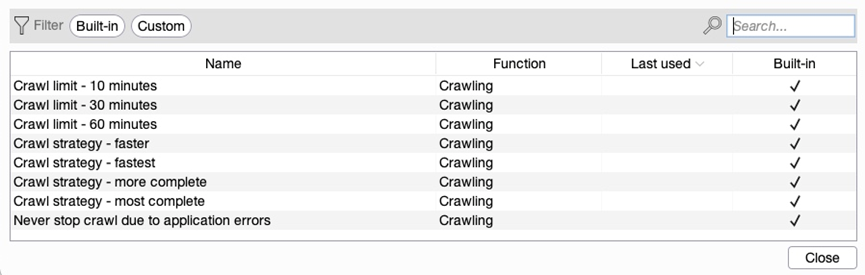

可以选择Crawl strategy – fastest
③ Application login
该tab可以添加一系列credentials 来尝试登录所有找到的forms/fields。如果我们有credential，也可以用BP记录在预设浏览器里手动操作的步骤，然后repeat去拿login的session，这样覆盖面更广，很多时候很关键。

然后点ok，可以在Dashboard->Tasks看到scan的过程：
 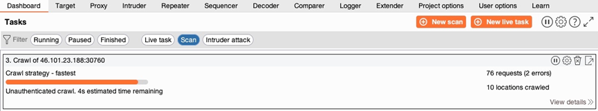

点击View details可查看过多详情，点齿轮按钮可以进一步配置。Scan完后可以去Target>Site map查看更新后的site map:
 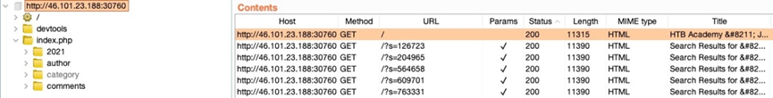

#### 3. Passive Scanner

上述site map做好后就可以开始scan了。上面选Crawl and Audit后，Burp会执行两种scans：Passive Vulnerability Scan和Active Vulnerability Scan.

① 被动扫描不发送任何数据，只分析scope里页面page的源码，对于如missing HTML tags、可能的DOM-based XSS可以很快分析，但是因为不发送request所以发现的漏洞没有经过验证，所以最后结果会给出Confidence 的level，可以用这个排序。
② 具体操作就是选择Target>Site map里的target或History的request，右键然后选择Do passive scan或Passively scan this target，然后可以在Dashboard 看到已经开始，完成后点View Details，然后点Issueactivity看确定的漏洞：
 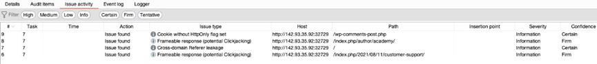

③ 当然也可以在dashboard看Issue activity，有潜在漏洞的severity、confidence。
一般来说可以看High severity 和Certain confidence的漏洞，但是如果很敏感的web app应该看所有的潜在漏洞

#### 4. Active Scanner

①
这是Burp Scanner最强的部分：
· 用Crawl和web fuzzer(like dirbuster/fuff)来发现所有可能的pages
· 也会运行在所有发现的页面上做Passive Scan
· 对Passive Scan发现的所有漏洞check并发request来verify
· 做js分析来进一步挖漏洞
· Fuzz各种发现的注入点、参数来找像xss、Command Injection, SQL Injection等等漏洞
Burp Active scanner在该领域认可度高，可以经常更新这个工具，因为维护团队会把他们新找到的漏洞加进去。
②
操作步骤和Passive Scanner类型，另外还可以在scope里点Dashboard->New Scan来配置active scan，如果选Crawl and Audit就会执行前面所有选项。
也可以配置Crawl和Audit，前者说过了，后者配置可以选择扫描漏洞的类型（默认是所有）等等。当然也可以Select from library选择预设config，这里为了得到后端控制权选择Audit checks - critical issues only这个选项，也可以添加像Crwal提到的login details。

③ 开始
点ok开始scan，在这里可以看到：
 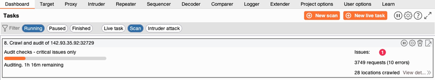

具体的requests可以点 View details->Logger 或Burp的Logger 看到：
 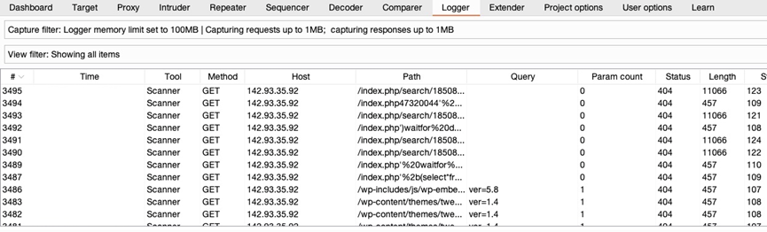

④ 结果
Scan结束后在Dashboard ->Issue activity看到结果并可以filter，这里选中High 和Certain ：
 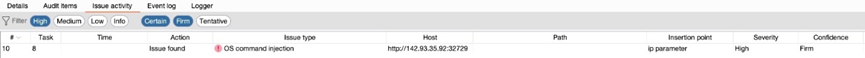

看到了OS command injection漏洞，Firm表示很可能存在，可以点击然后看advisory 、request和response：
 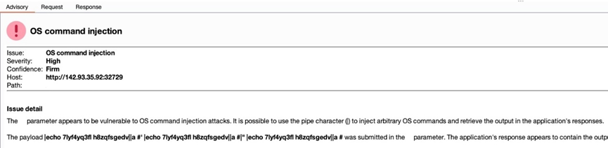

#### 5. Reporting

所有scans结束后可以在Target>Site map的target上右键然后选Issue>Report issues for this host，可以选择我们需要的信息并导出报告，如下：
 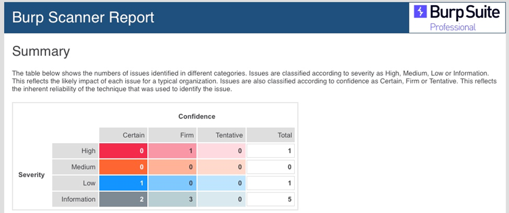

同时也可以显示proof-of-concept来说明怎么利用漏洞并修复，

## 三、ZAP Scanner

和Burp里的类似

#### 1.Spider

和Burp里的Crawler类似，可以在History里的request上右键选Attack>Spider，或在内置浏览器HUD的右侧第二个Spider图标：
 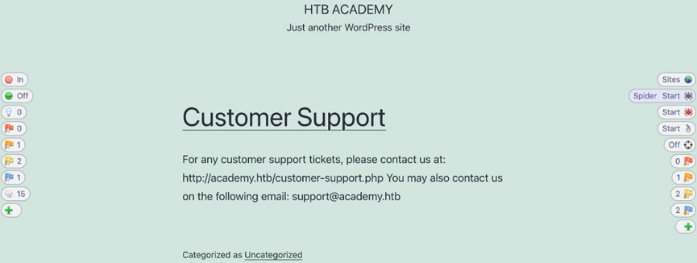

注：ZAP同样有scope的概念，点击Spider后会提示是否把该网站加入scope，同意即可。另外有些版本浏览器可能不支持该功能

在弹出的窗口点击Start ，和Crawler类似，Spider会开始spider website，可在HUD的Spider按钮或ZAP主UI里看到过程。scan完成后在主UI的Sites 或HUD右边第一个button看到结果的tree-list：
 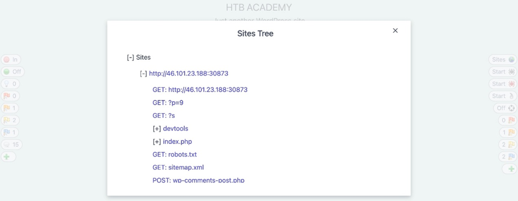

注：还有一种scan叫 Ajax Spider，区别在于可以发现JavaScript AJAX requests方式的links，他们可以在page加载后运行，但scan时间

#### 2. Passive Scanner

在上一环节spider时就会自动做passive scanner来检测如missing security headers 、DOM-based XSS等漏洞。在HUD中左侧显示当前页面找到的issues并alert，右侧显示所有页面的alerts：
 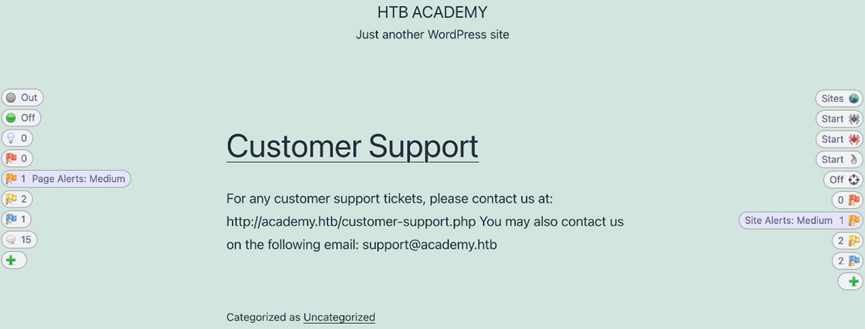

也可在主UI的Alerts 里找到并看详情：
 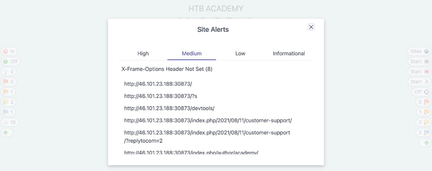

#### 3. Active Scanner

① site’s tree建立后可以点HUD右侧的 Active Scan对所有identified pages来active scan：
 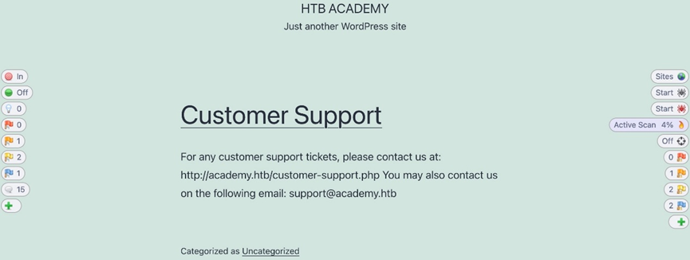

如果还没有在web app上运行Spider，ZAP会先自动运行来建立site tree。Active Scan开始后，和Spider一样可以看到过程。
Active Scanner会测试所有可能的点，所有时间长。运行时可以在HUD看到alerts在不断变多，也可以在主UI查看details：
 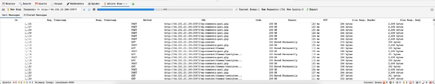

② scan完成后可以点击查看details，按等级排序High alerts最重要，点击High Alerts查看：
 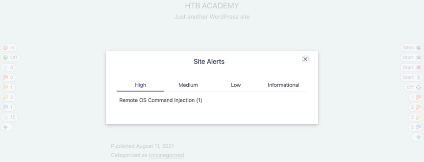

点击查看怎么复现、打补丁：
 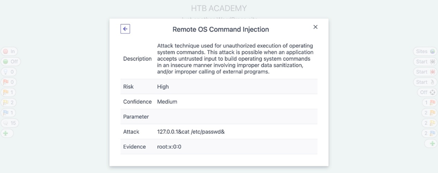

在alert 的details窗口也可以点击url来看具体request和response，然后ZAP HUD 或ZAP Request Editor来repeat：
 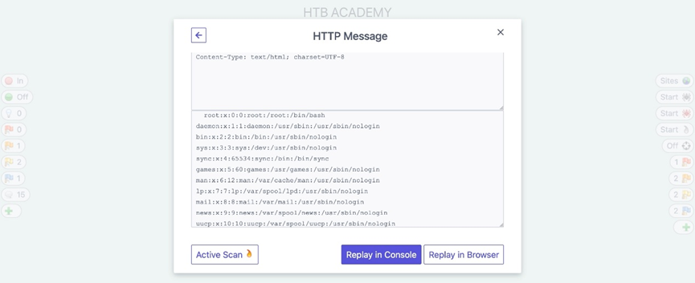

#### 4. Reporting

最后可以生成所有漏洞的报告，点Report>Generate HTML Report：
 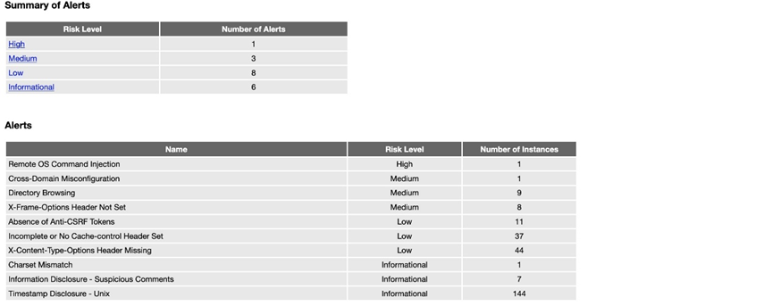

当然也可以用其他格式如 XML 或 Markdown。
可以完成scan后导出自行查看，方便整理

## 四、Extensions

Burp和ZAP有各自的extension comunnity，功能如解码、美化代码等

#### 1. BApp Store

① 点Extender ->BApp Store就可以看到，可以点Popularity 然后按Popularity 排序：
 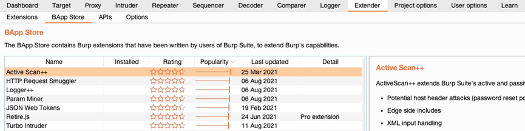

注：一些extension是Pro only，不过大部分都是free
② 以安装Decoder Improved举例：
 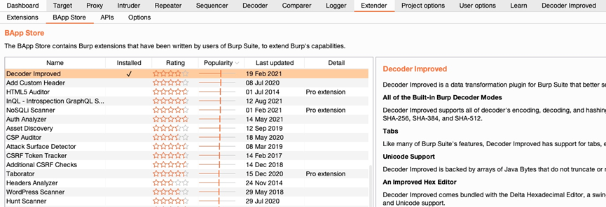

注：有些extension需要先安装requirements ，然后才能安装
安装后可以看到新tab，每个extension功能不同可以在Bapp或github看说明。这里是多了很多encoder，如md5：
 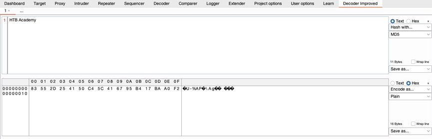

③ 以下是其他工具举例：
 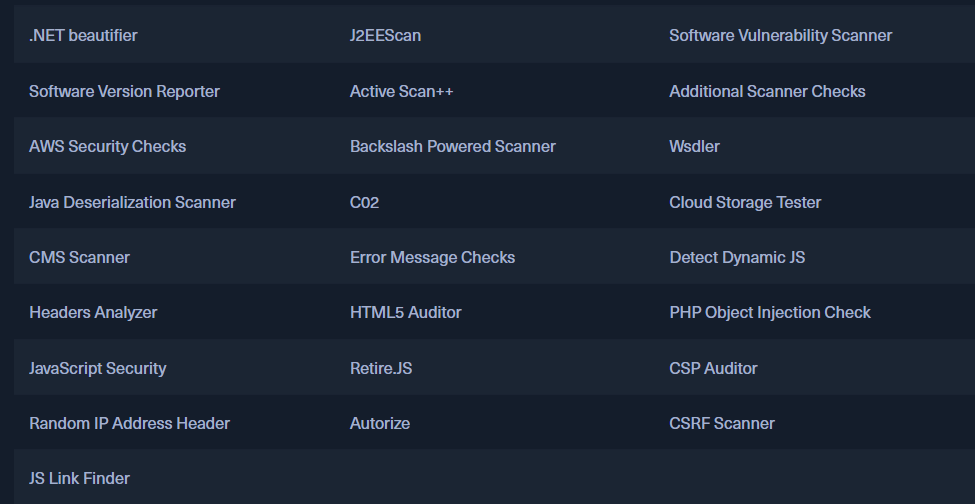

#### 2. ZAP Marketplace

在Manage Add-ons->Marketplace：
 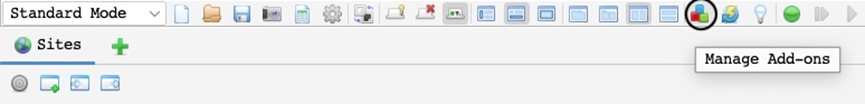

这里可以看到很多 add-ons，其中Status又分为Release（运行稳定）和Beta/Alpha（不是特别完善可以运行中出现小问题） ，如可以往fuzzer里加wordlist的FuzzDB Files 和 FuzzDB Offensive：
 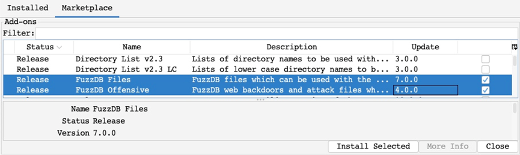

假设我们要在我们之前做的exercises 中执行Command Injectionfuzzingattack，我们就可以用File Fuzzers，里面包括OS Command Injection wordlist，在fuzzdb>attack>os-cmd-execution，执行如下：
 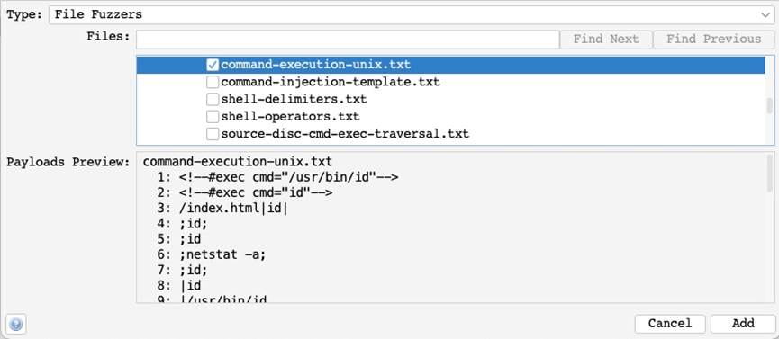

同时也能对抗WAF：
 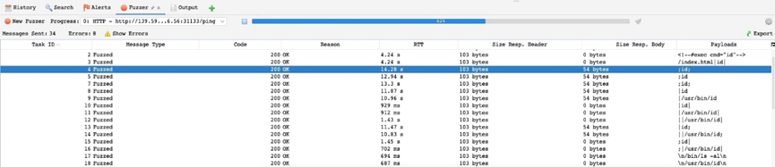

module大纲：
 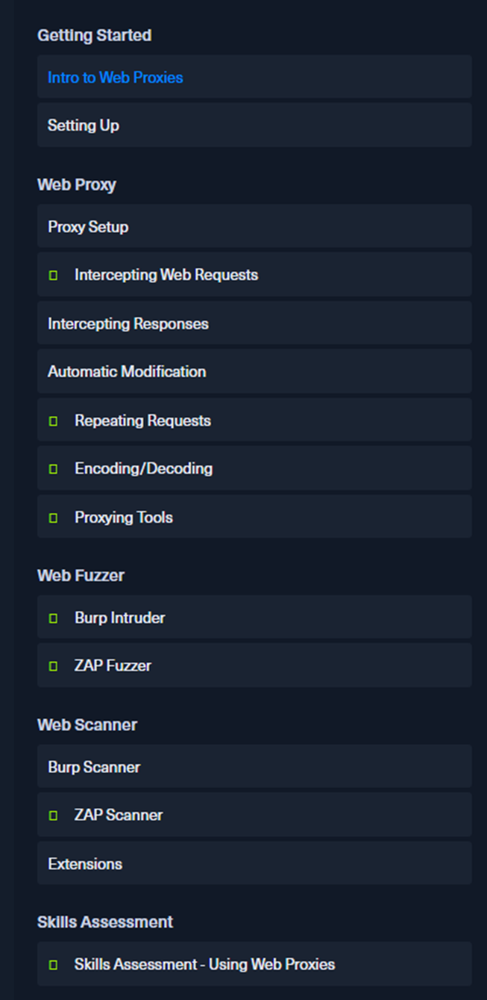

（有问题随时在评论区或私信留言，两天内回复）