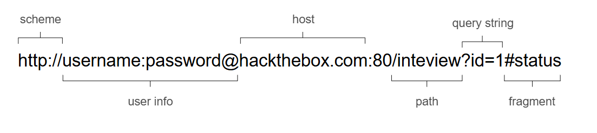
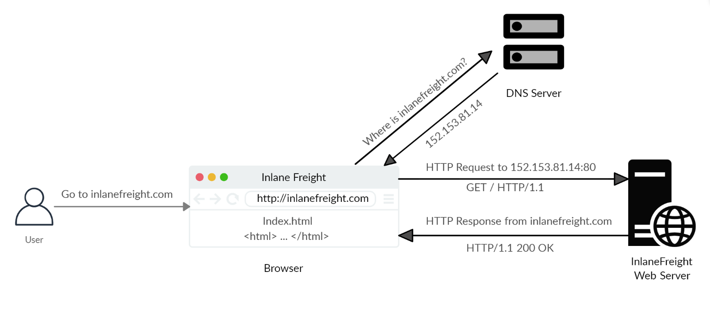
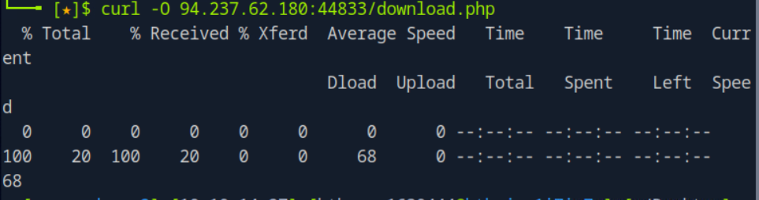
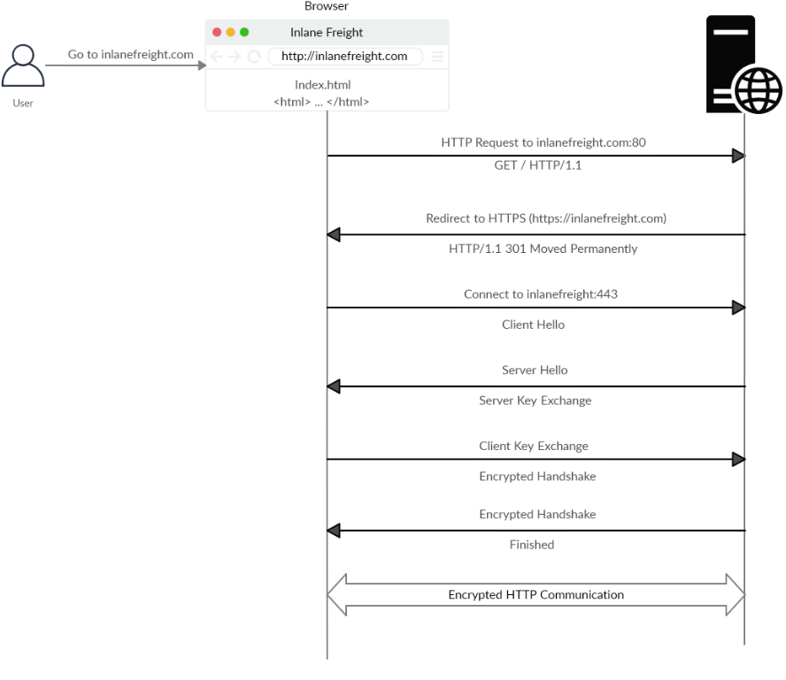
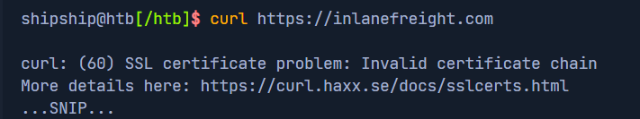
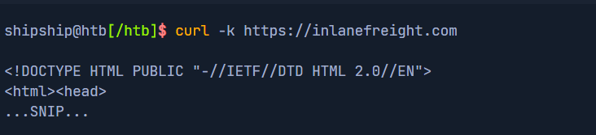
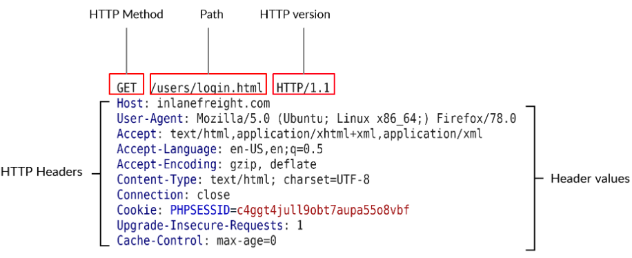

# htb academy笔记-module-web requests（一）

> 原创 已于 2025-02-19 09:50:19 修改 · 404 阅读 · 4 · 4 · CC 4.0 BY-SA版权 版权声明：本文为博主原创文章，遵循 CC 4.0 BY-SA 版权协议，转载请附上原文出处链接和本声明。
> 文章链接：https://blog.csdn.net/weixin_51439723/article/details/145520223

## 一、http

#### 1.url中各个部分：

 

其中user info我没见到过，最后用 @ 和host分隔开，如果url中有这部分可用于身份认证

#### 2.访问url的过程

 

在输入url访问后，浏览器先查看本地

```
/etc/hosts
```

里有没有该url的记录
①若有
浏览器拿到ip后访问server，获取资源
②没有
浏览器带着域名访问dns server，从它那里拿到ip后r浏览器再访问server，获取资源

#### 3.curl的使用

curl是通过命令行来访问http资源的工具，在写脚本或者实现自动化时很有用，同时也支持其他协议

其中

```c
curl example.com
```

会直接显示网页的源代码

```c
curl -O example.com/download.php
```

 

会把download.php这个文件下载到本地
也可以用 -o 将文件下载后再重命名

如果不需要以上下载进度，可以用 -s

```c
curl -O -s example.com/download.php
```

## 二、https

#### 1.即使使用https也可能泄露的信息

测信道：如果client和dns server通信使用http，因为其使用明文直接传输，则会泄露client端要访问的url

所以需要使用加密过的https dns （如8.8.8.8或1.1.1.1），或者使用vpn

#### 2.https流程

 

①若我们用http直接访问只使用https的url
②server会返回301 moved permanently状态码，向client浏览器发送重定向到https的地址，
③这时浏览器重新访问接收到的地址，并发出"https hello"

④server接收到"https hello"后，再向client同时发送"https hello"和"key exchange"

⑤client向server发送"key exchange"

⑥server向client发送信息确认加密正常运行，完成握手

注：有一种中间人攻击可以让https降为http，即设置一个服务器来接收并发送所有来自服务器的流量，但是现在的浏览器已经可以很好地防护这种攻击

#### 3.curl使用https

一般来说curl可以处理好使用https的证书等信息，但如果访问一个web应用发现其SSL证书非法或过期会报错以阻止前文提到的中间人攻击：
 

有时候在访问测试web应用时证书尚未配置，这时如果想正常使用curl，可以用参数-k来跳过对证书的合法性检测：
 

## 三、HTTPRequestsand Responses

#### 1.request 和 response的第一行格式

request:
 

method + path + http version （不同部分均用空格分开）

其中
①http1.x 是以明文传输，并用空行分隔开不同区域(如header和body)和requests
②http 2.x是以二进制传输，其中内容为字典形式，如{a:“ggshdi”}

response:
 

http version + response code（同上）

#### 2.cur的-v参数

用-v后可以显示request和response的详细信息

 

用-vvv可以获得最详细的信息

#### 3.浏览器的网页开发工具

在网络模块，可以看到Request and Response

如下面可以看到服务器端的apache版本

 

（有问题随时在评论区或私信留言，两天内回复）

下一篇：
[htb academy笔记-module-web requests（二）](https://blog.csdn.net/weixin_51439723/article/details/145637229) 