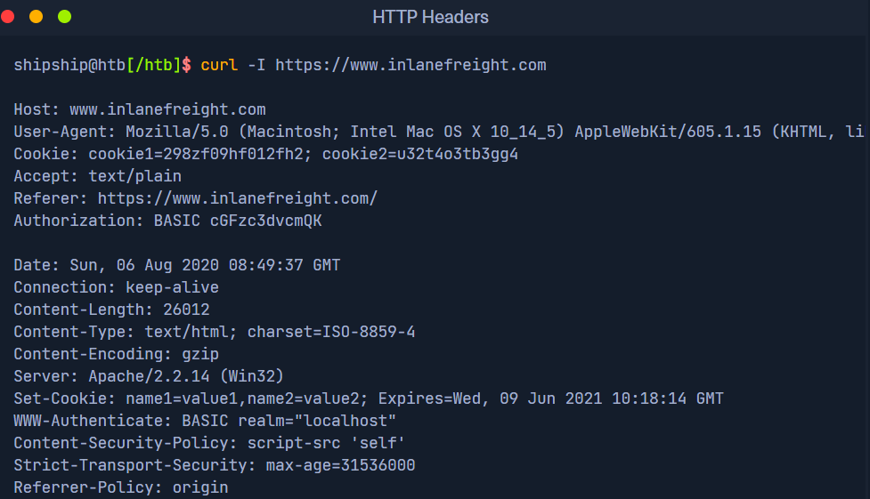
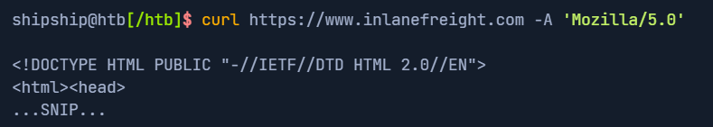

# htb academy笔记-module-web requests（二）

> 原创 已于 2025-02-26 10:42:06 修改 · 481 阅读 · 4 · 4 · CC 4.0 BY-SA版权 版权声明：本文为博主原创文章，遵循 CC 4.0 BY-SA 版权协议，转载请附上原文出处链接和本声明。
> 文章链接：https://blog.csdn.net/weixin_51439723/article/details/145637229

上一篇：
[htb academy笔记-module-web requests（一）](https://blog.csdn.net/weixin_51439723/article/details/145637229) 

## 一-1、headers

此section列举常见headers，另外还可能有不常见及自定义的headers

#### 1.general headers

request和response都可以使用，且用来描述message通信过程而不是其内容的headers
①date
message发送的时间，通常会转化为UTC时区的格式
②connection
有close和keep-alive两种值，close表明message传输完成后该连接将会关闭，而keep-alive表明该连接会继续保持以便可能会接收数据等

#### 2.entity headers

和general headers类似，区别是它描述其内容而不是通信过程，在response、用PUT或POST的request中使用
①content-type和media-type
它们很相似，前者描述message传输的资源且其值自动生成，后者描述数据，都有charset字段用来描述entity的编码方式如UTF-8
举例：

```
Content-Type: text/html
Media-Type: application/pdf
```

②boundary
同一个message里数据比较多时的分隔符，比如entity里有比较多的表单数据，可以用–b4e4fbd93540分隔开
举例：

```
boundary="b4e4fbd93540"	
```

③content-length
告诉server从body开始的内容（即entity）有多长，自动生成

④content-encoding
message里的数据可能被多次转换，该字段描述其编码方式，比如有时候数据很大需要被压缩

举例：

```
content-encoding: /gzip
```

#### 3. request headers

只描述request，不会用来描述message内容

①host
可以是域名也可以是ip
一些服务器中部署有多个website资源时，可能存在访问旁站风险：修改该host为其变种或者直接枚举来访问其他host

②user-agent和referer
referer表示这个message的来源，如从goole搜索结果中跳转去访问另一个网页，referer的值就是google.com

③accept
表示client可以理解的media type, 有多个时用, 分隔开
举例：

```
accept: */*
```

表示接受所有类型media type

④cookie
作为identifier保存在client和server, cookie在每个request中穿给server来保持client的访问；也有其他用途如session跟踪或保存用户的其他信息；可有多个cookie，用分号分隔
⑤authorization
另一种identifier在每个request中被server检索，但只保存在client，认证成功后server会返回唯一的一个token，因web server和应用使用类型的不同认证(authentification)方式也有多种
举例：

```c
Authorization: BASIC cGFzc3dvcmQK
```

#### 4.response headers

只描述response，不会用来描述message内容；一些特定headers如age, location和server等用来提供更多response的正文
①set-cookie
有client identification需要的cookie, 浏览器解析并存储该cookie，格式和request中的一样
举例：

```c
Set-Cookie: PHPSESSID=b4e4fbd93540
```

②www-authenticate
告诉client认证(authentification)的类型
举例：

```c
WWW-Authenticate: BASIC realm="localhost"
```

#### 5.security headers

后来因为安全需要才有的，server来指定然后client遵守的安全相关rules和policies
①content-security-policy
指定外部访问该website的policy，可以是js代码或者脚本资源。该header让浏览器只接收可信域名的资源，可以防止xss攻击
举例：

```c
Content-Security-Policy: script-src 'self'
```

②strict-transport-security
防止浏览器用明文的http访问website，强制所有通信用https。可以防止嗅探流量、获取敏感信息
举例：

```c
Strict-Transport-Security: max-age=31536000
```

③referrer-policy
指定浏览器是否能有referer header的值，可以防止访问website时泄露敏感url和其他信息
举例：

```c
Referrer-Policy: origin
```

## 一-2、curl对header的操作

①-I, -i
加上-I可以只显示response的headers, 而-i显示response的headers和body。
区别在于-I用HEAD方法发送request，而-i，可以指定request的内容并且显示headers
 

②-A可以指定user-agent

 

## 二、HTTP Methods and Codes

#### 1. request methods

以下是常用method
①GET
用

```c
?a=b
```

来传输数据
②POST
可以在request headers后添加数据
③HEAD
获取 使用GET request后返回的headers而不是body，通常用来在下载resources前检查response length
④PUT
在server上增加新的resources，如果不加限制会导致恶意resources上传
⑤DELETE
删除web server上的resources，如果没有适当防护，可能会因为删除重要文件导致dos攻击
⑥OPTIONS
返回关于server的信息，比如server支持什么method
⑦PATCH
在指定位置对resource的配置修改

注：大多数web应用用GET和POSTmethod，但如果使用REST APIs就需要使用PUT和DELETE来更新、删除API endpoint里的数据

#### 2.response codes

①1xx
只提供信息，不影响request的过程
②2xx
request成功
③3xx
server重定向
④4xx
表明client的request不合理，如request格式错误或要访问不存在的resource
⑤5xx
server自身的问题

#### 3.常见respond codes

①200 OK
②302 Found
重定向到另一个url
③400Bad Request
request格式错误
④403 Forbidden
没有权限，或者检测到client的输入有风险也可返回该code
⑤404 Not Found
指定的resource不存在
⑥500 Internal Server Error
server不能处理该request

注：此外一些servers和providers如Cloudflare、AWS等也有定制的response codes

（有问题随时在评论区或私信留言，两天内回复）

下一篇：
[htb academy笔记-module-web requests（三）](https://blog.csdn.net/weixin_51439723/article/details/145733412) 