# htb academy笔记-module-web requests（三）

> 原创 已于 2025-03-05 09:06:56 修改 · 公开 · 371 阅读 · 2 · 1 · CC 4.0 BY-SA版权 版权声明：本文为博主原创文章，遵循 CC 4.0 BY-SA 版权协议，转载请附上原文出处链接和本声明。
> 文章链接：https://blog.csdn.net/weixin_51439723/article/details/145733412

上一篇：
[htb academy笔记-module-web requests（二）](https://blog.csdn.net/weixin_51439723/article/details/145637229) 

## 一、GET

浏览器访问url时的第一个request都是用GET的method，在接收初始page后再可能用其他不同的method来继续这个过程

#### 1.HTTPBasic Auth(authentication)

以下是用HTTPBasicAuth的一个实例：
即htb academy笔记-module-web requests（一）中的user info
①url里输入Auth信息
 

username:password@URL
当然也可以用curl这么做
②浏览器访问
 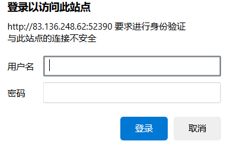

用浏览器访问时需要输入username和password，且是在http(server)层面而不是web application层面，可以保护特定的page\directory

③curl -u访问
 

空行分隔开了response的headers和body，WWW-Authenticate header里面的Basic realm="Access denied"显示使用了basic HTTP auth，可以用-u flag来输入credential
 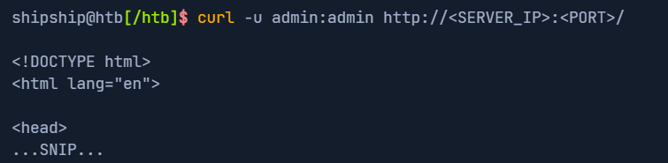

#### 2.HTTP Authorization Header

①用-v查看上述curl命令
 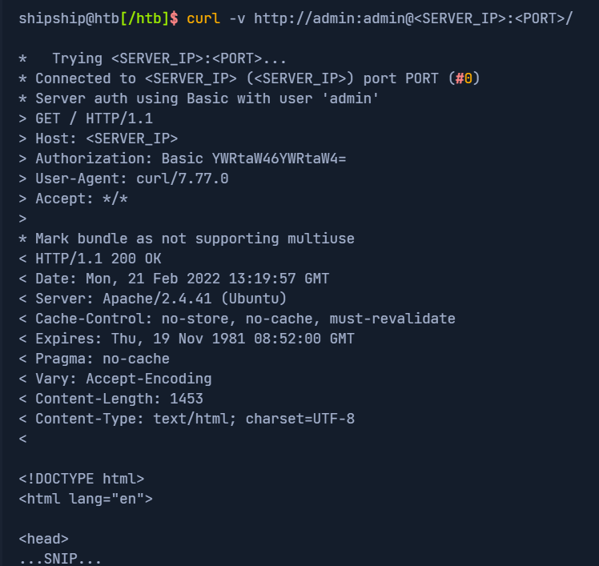

可以看到Authorization的值中有base64加密的YWRtaW46YWRtaW4=，解密就是admin:admin，这里如果用不同于Basic http Auth的其他authentication如JWT，其值则会变成对应的密文

②可以用-H手动修改headers的值
 

只有修改到上述值时才会通过

③更常见的authentication方式
通过前端的表单来抓取数据，然后用POST传输server，authentication通过后返回一个cookie来维持authentication

#### 3.GET Parameters

①devtools里面左上角有个清除功能
相当于linux命令的clear
之后在搜索栏里输入并回车，可以看到有新的request发送到后端
 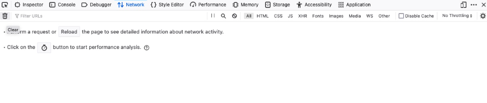

②devtools的Copy>Copy as cURL
查看改request发现，url里面用?search=le向search.php传输数据，我们也可以用curl模拟
先在request上选择 Copy>Copy as cURL，然后把内容粘贴到curl里面
 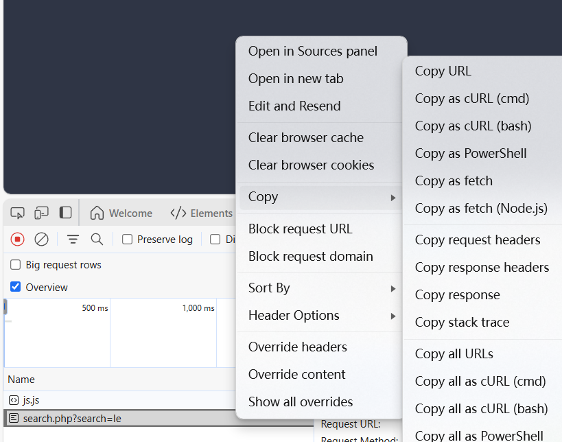

最后会有同样的response
【exercise】
③devtools的Copy>Copy as Fetch
如上图
也可以用上述选项用JavaScript Fetch library复制request
 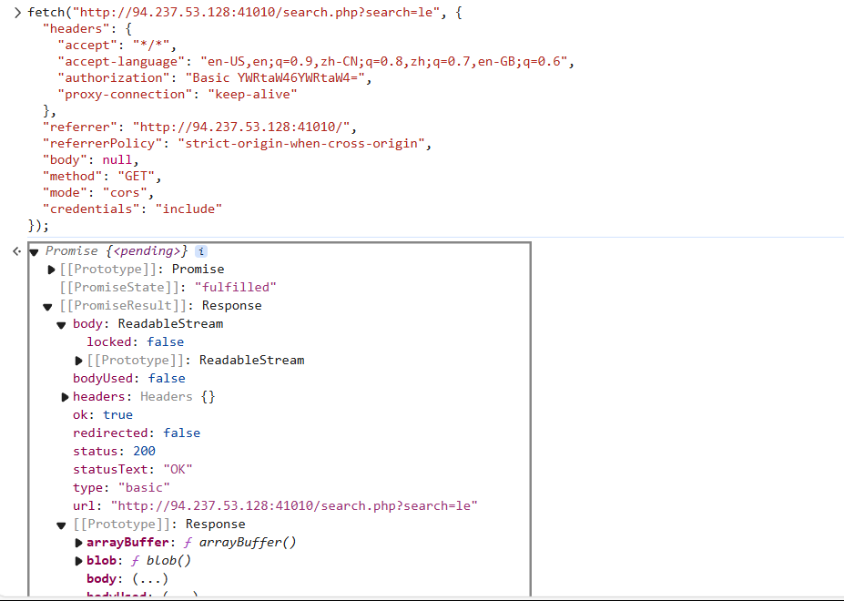

然后在console里面粘贴执行，就会发送同样的request（方框以上是复制的内容）

## 二、

#### 1. POST方法的三个优势

① 避免日志(log)记录
因为如果像GET请求上传文件那样把文件信息作为url的一部分记录下来，server那边因为POST经常传大文件效率会很低，所以POST不会这样
② 减少编码
url里面的字符需要来回转换，但是POST body可以通过二进制传输无此问题，只有分隔符需要编码
③ Url character传输上限
各不相同，一般来说url最多只能传输2000个characters

#### 2. Login Forms

类似GET中的例子，我们在表单中输入值并观察流量
① 用filter筛选server的ip
 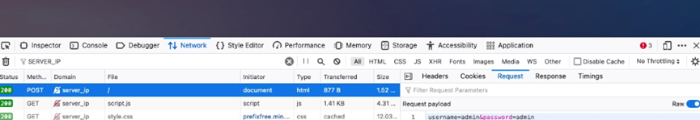

就可找到发送给该ip的request
② 用Curl的-X发送POST
-X POST可以指定为POST方式发送，-d 可以添加POST中的内容

 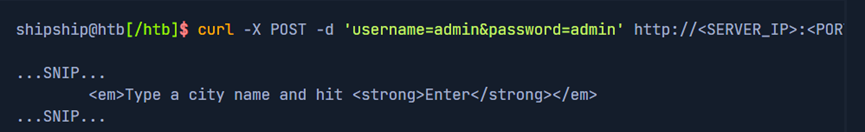

注：很多时候登录成功后会跳转到其他页面，如果用curl可以用 -L 跟随跳转

#### 2. Authenticated Cookies

① 前文提到过，POST认证通过后会获得一个cookie来保持登陆状态，不需要每次操作都登录一次
 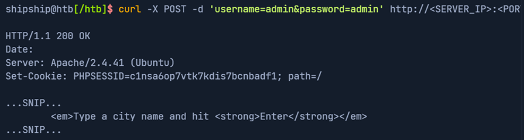

② curl验证
直接用 -b (设置cookie的flag)带着之前给我们的cookie然后访问
 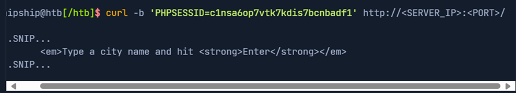

可以看到直接通过验证
另外也可以用如下方法设置该cookie：
 

③ 浏览器验证
注销登录然后把之前返回的cookie放进去
 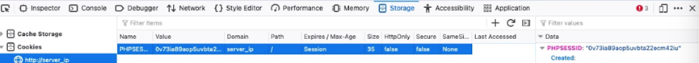

再刷新即可直接登录成功

#### 3. JSON Data

搜索后可以看到request发送了Json数据
 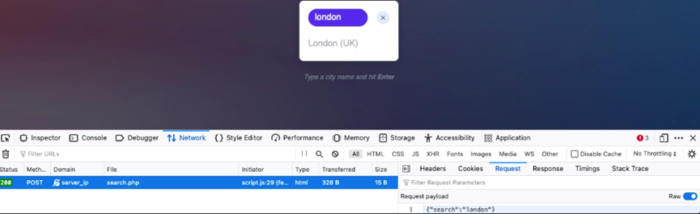

① 用curl复现该过程
先用 Copy>Copy Request Headers 检查
发现request header中有Content-Type: application/json
即双方传送json数据

再用curl把cookie和Content-Type都发送出去

```c
curl -X POST -d '{"search":"london"}' -b 'PHPSESSID=c1nsa6op7vtk7kdis7bcnbadf1' -H 'Content-Type: application/json' http://<SERVER_IP>:<PORT>/search.php
```

 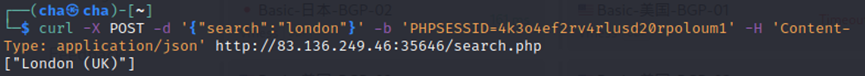

这样就只需要用命令行而不需要和前端交互了
② 用devtools的Fetch来复现
和前文一样
 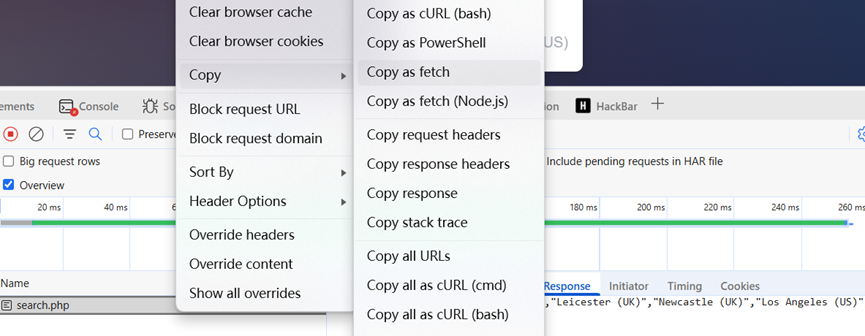

然后粘贴到console回车
 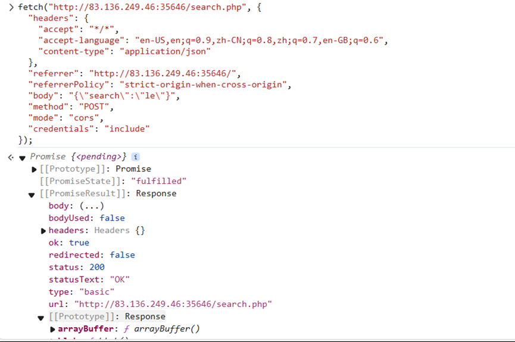

## 三、CRUD API

即Create, Read, Update, Delete，做增删改查四种操作
 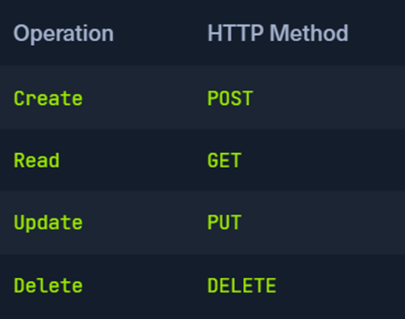

#### 1. Create

该api实现增entry：

```c
[!bash!]$ curl -X POST http://<SERVER_IP>:<PORT>/api.php/city/ -d '{"city_name":"HTB_City", "country_name":"HTB"}' -H 'Content-Type: application/json'
```

检查是否添加成功

 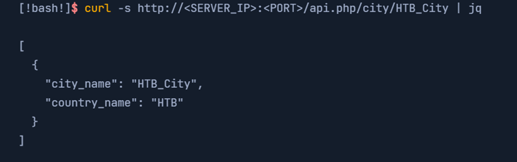

#### 2. Read

该api中用如下url实现查找：
 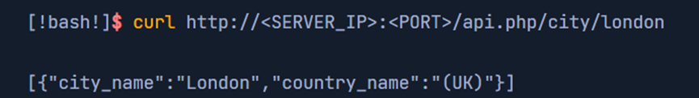

可以用jq将输出重新排列，且这里如果不想除非curl的进度条显示，需要用curl的-s (即slient)
 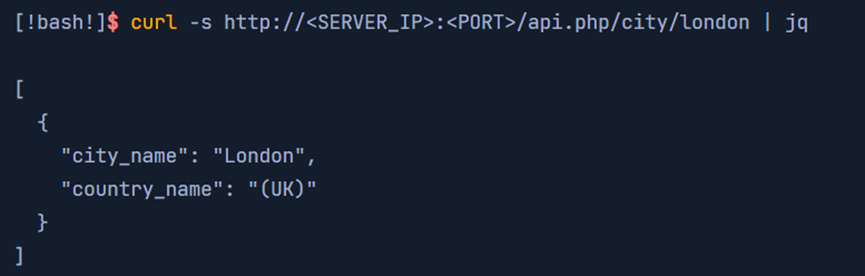

该api中如果查找空值可以查看所有entry(条目)：
 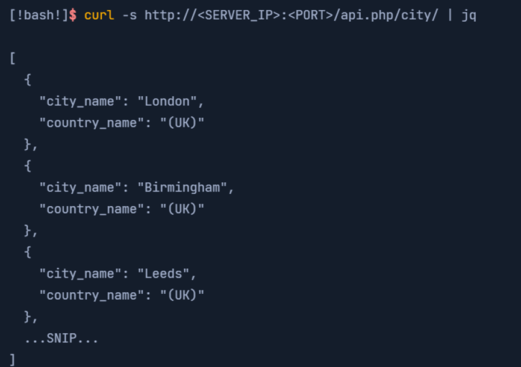

#### 3. Update

① 关于使用的method：
除了上述表格的method，也可用PATCH method来update。区别在于PATCHupdate部分entry，而PUT是整个entry。另外可用OPTIONS method来查看上述两种method哪个可以对该server使用，然后使用对应的method
② 该api中和create非常相似，区别在于需要指定修改的entry

```c
[!bash!]$ curl -X PUT http://<SERVER_IP>:<PORT>/api.php/city/london -d '{"city_name":"New_HTB_City", "country_name":"HTB"}' -H 'Content-Type: application/json'
```

确认如下：
 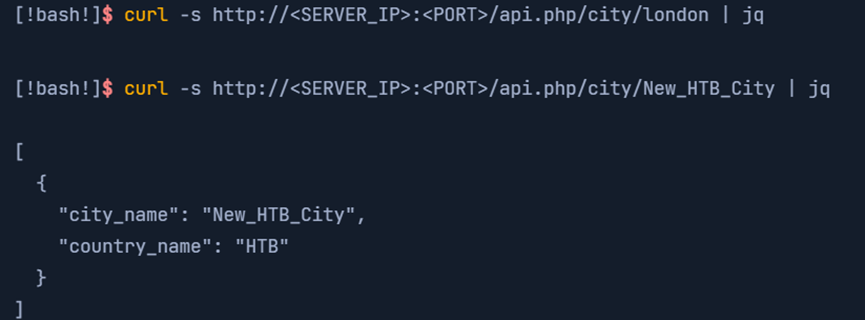

注：一些APIs中update指定的entry如果不存在会创建一个新的，相当于create

#### 4. Delete

操作和read相似，如下：

 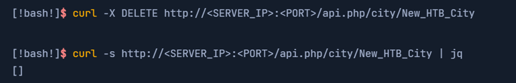

（有问题随时在评论区或私信留言，两天内回复）

下一篇：
[htb academy笔记-module-Introduction to Web Applications（一）](https://blog.csdn.net/weixin_51439723/article/details/145877992) 